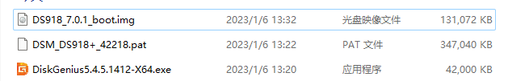
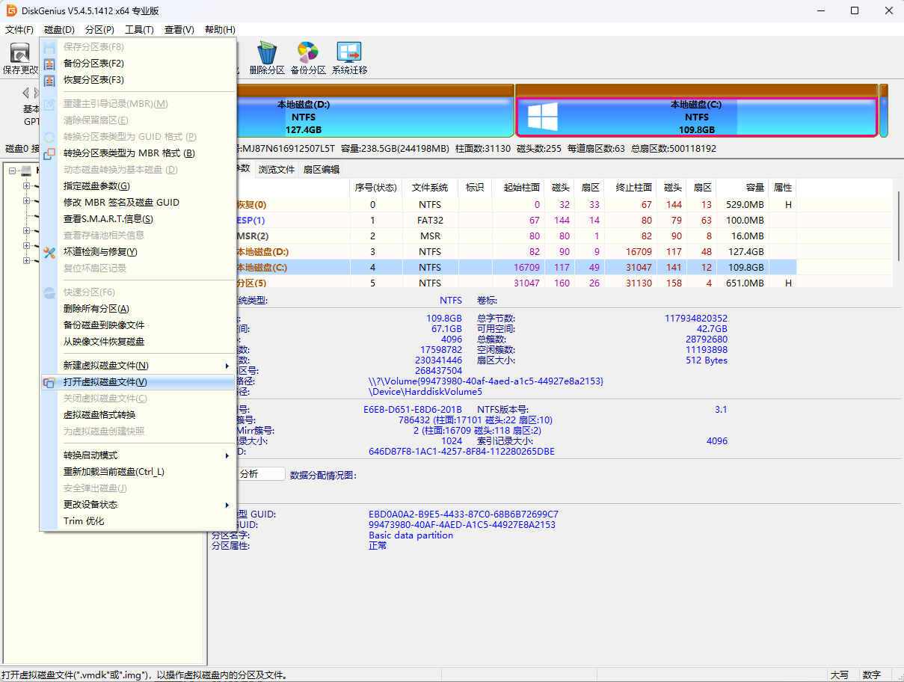
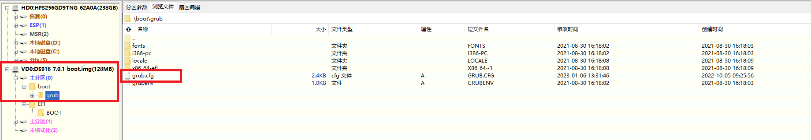
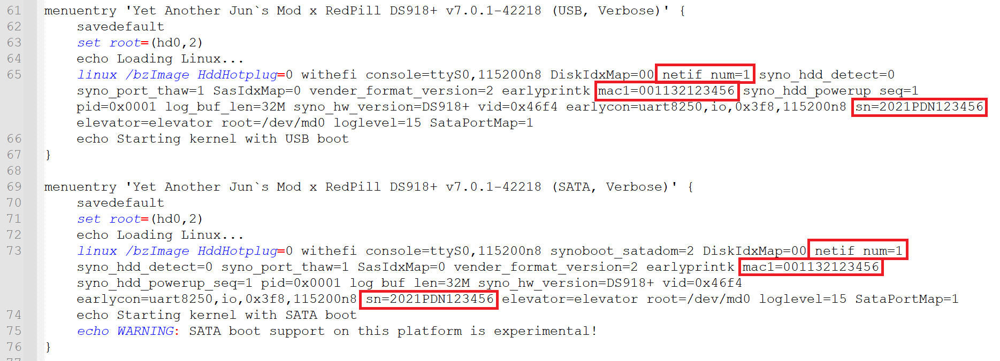
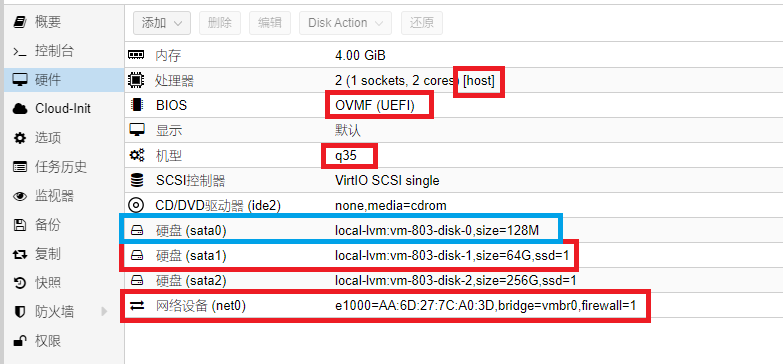
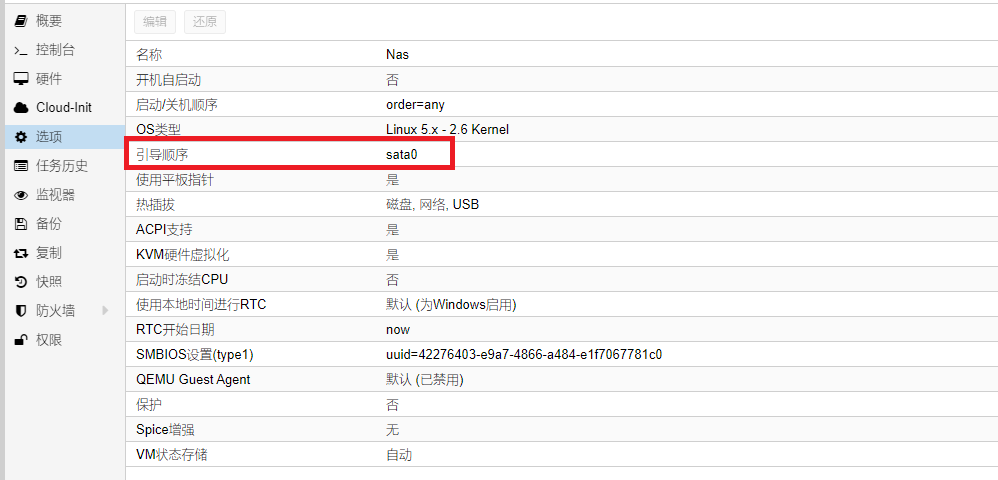
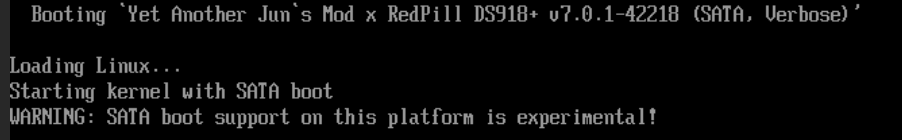

# PVE安装黑群晖

这几天折腾 PVE 和 NAS 十分上瘾，测试了好多 NAS 系统感觉都很不好，说实话还不如自己用原生的 Linux 搭建一个 Samba 服务用的方便，可能是我太菜了，好多功能不会用，也不会修。之所以一直没有尝试会群晖是因为感觉折腾起来比较麻烦，并且不想用破解的东西。但是昨天在群里都说黑群晖好用，今天也决心尝试一下，发现其实很简单。

## 安装系统

我是用的 PVE 虚拟机，所以应该没有硬件上的问题，我觉得这也是比较容易的原因之一，如果硬件不支持真的很难受。如果你的物理硬件不支持，我觉得在物理机装 PVE ，然后套娃黑群晖应该是一个比较简单的方法，虽说有性能损耗，但是起码能装上。

### 准备资源

首先，我们需要准备三个文件——引导文件、群晖系统和 DiskGenius，我已经将三个文件打包上传到网盘了，可以点击[这里](https://aki.teracloud.jp/share/11b11bdf88f4a432)下载。



我目前的最新版本差不多应该是 7.x，如果你想安装其他版本，我觉得只要找到对应版本的引导文件就可以，系统包可以在群晖官网下载。

### 修改镜像文件

**注意：**如果你是从我的网盘下载的文件，已经修改好了，你可以跳过本步骤直接使用，不过还是建议看一看。

打开刚刚压缩包里的 DiskGenius 软件，选择磁盘->打开虚拟磁盘文件，选择我们刚刚解压出来的 DS918_7.0.1_boot.img 这个文件。



然后找到如图所示的位置，右击 grub.cfg 这个文件，复制到桌面。



然后使用 notePad++ 打开，或者直接使用记事本。



修改如图所示的位置，其中 netif_num=1 表示网卡数量，如果你向给连个网卡可以设置为 2，mac1 是网卡 1 的 mac 地址，这里好像不用变，默认还有一个 mac2 ，因该是第二块网卡的 mac 地址，如果只有一个网卡，直接删了就行。sn 码是正版的授权码，设置为：`2021PDN123456`，如果有正版的授权码可以洗白。

全部编辑好后将文件拖回到 DiskGenius 打开的镜像中，替换原来的文件，点击左上角的保存更改并关闭软件即可。

### 安装虚拟机

如果不会使用 PVE 请先学习使用 PVE！！！

由于我已经安装好了，就不演示了，你自己创建一个虚拟机然后按照我的配置对应的设置好就可以。



处理器、BISO、机型直接选就好，蓝色标记的磁盘在下一步添加，如果你是 SSD 硬盘，sata1 的磁盘要在高级设置里打开 SSD 仿真。网卡模型选择 Intel E1000。



引导顺序除了镜像所在的磁盘（也就是上边那个蓝色的）全部取消勾选。

### 添加引导磁盘

通过 ssh 登陆 PVE，选择合适目录，将刚刚修改的镜像文件上传上来。通过如下命令设置给虚拟机。

```shell
qm importdisk 803 DS918_7.img local-lvm
```

其中 803 是你的虚拟机 ID，DS918_7.img 是你的镜像文件名称，local-lvm 是镜像的存储池，根据自己的情况修改。

执行完之后在虚拟机的硬件界面应该可以看到一个 128MB 的磁盘，也就是我上边那个蓝色的，然后去引导顺序哪里去勾选他就可以（只勾选他一个）。

所有步骤完成后检查配置，准备启动。

### 启动会群晖

点击启动后查看控制台信息，如果出现下图信息表示成功。他会卡在这里不动。



最后在浏览器地址栏输入输入（http://find.synology.com/），他会自动搜索同一局域网下的群晖，如果能够找到就正常安装就可以了，如果你操作比较快，刚刚启动虚拟机就查找很可能找不到，等几分钟再试试就行了，如果一直找不到，那就不对了。

系统的安装初始化过程我就不写了，比较简单。

### 总结

其实很简单，就是根据自己的情况修改引导文件，创建虚拟机，然后挂载上去就行了。如果怕玩坏了可以先将刚刚装好系统的虚拟机克隆一份，以后直接克隆就可以。或者谁装好了直接拷贝给你一份。

## 安装软件
