Hadoop

## Hadoop概念

### Hadoop是什么

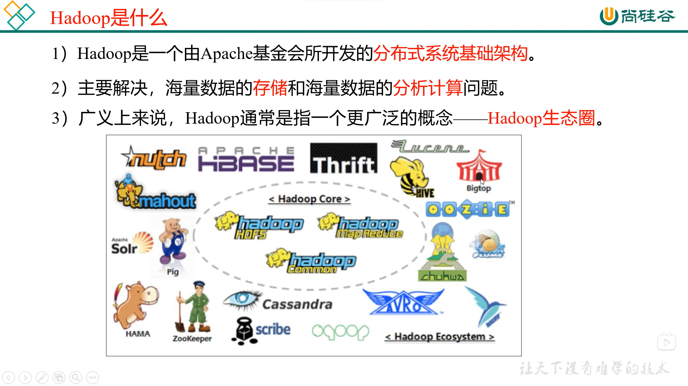

### Hadoop发展史


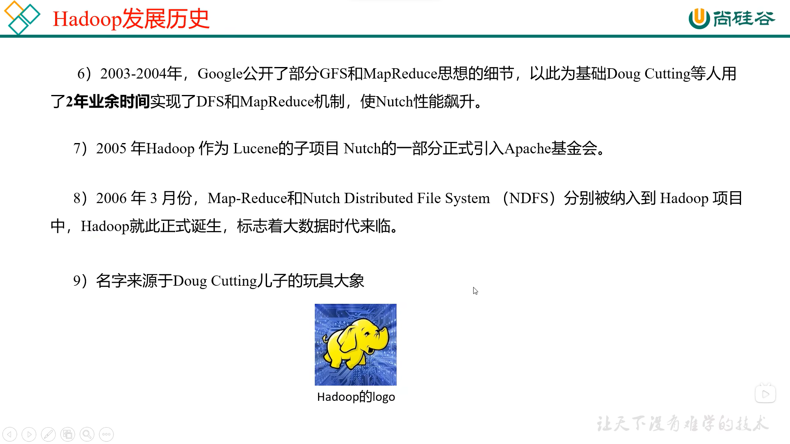


### Hadoop的三大发行版

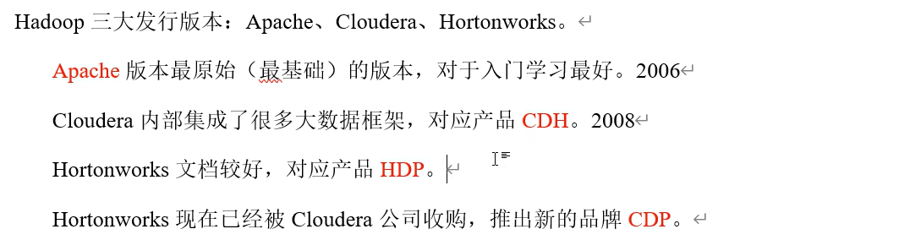

### Hadoop的优势

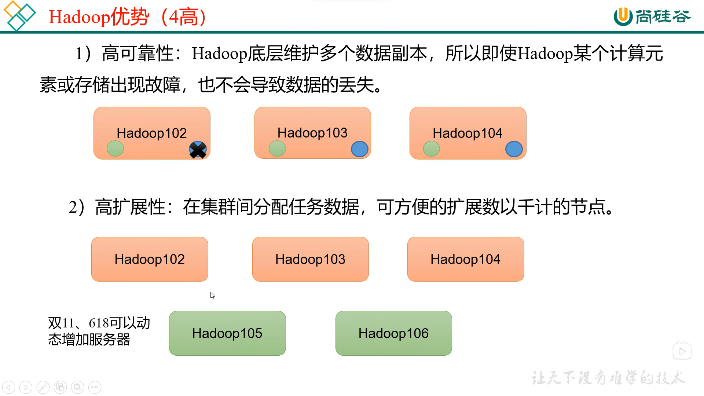

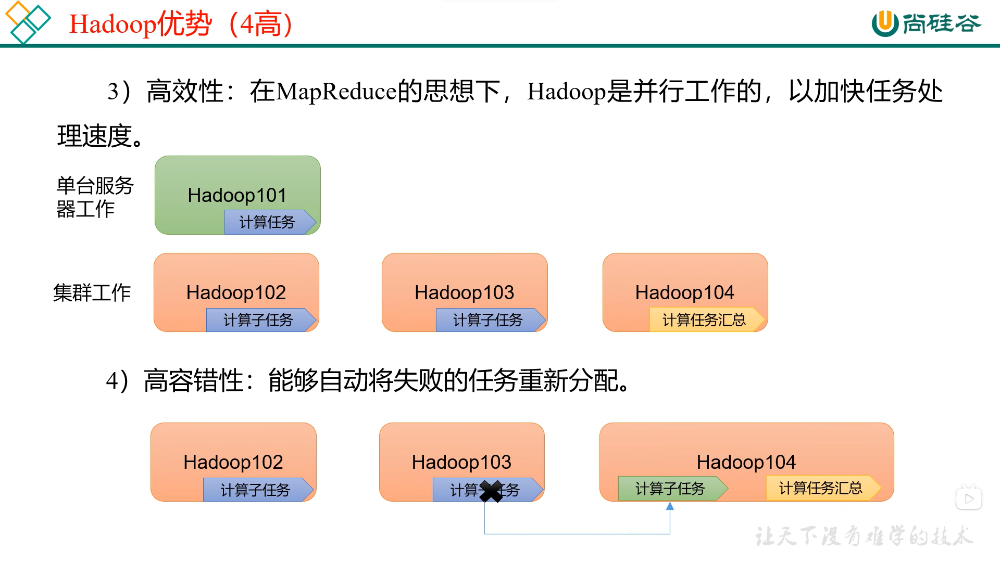

### Hadoop的组成（面试重点）

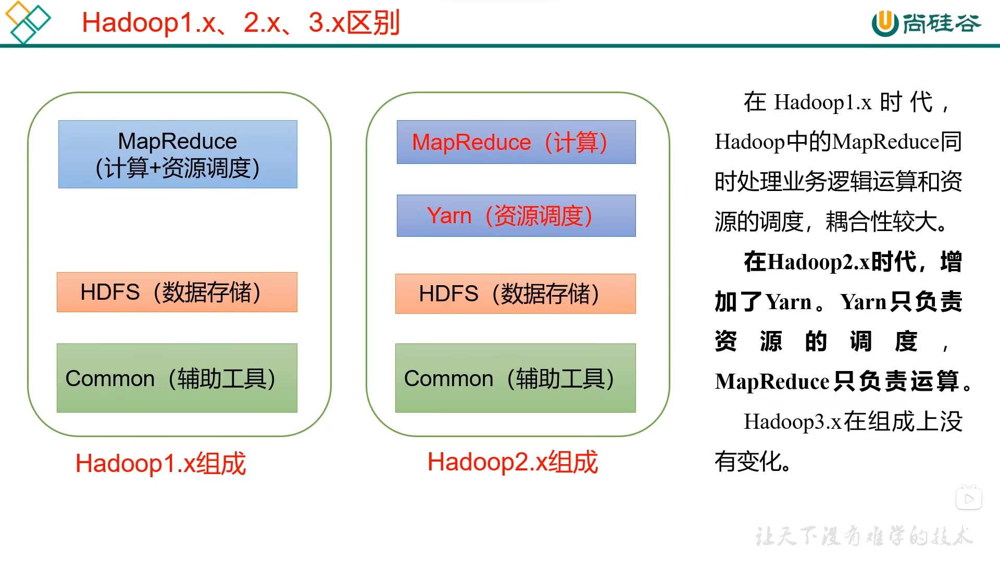

#### HDFS概述

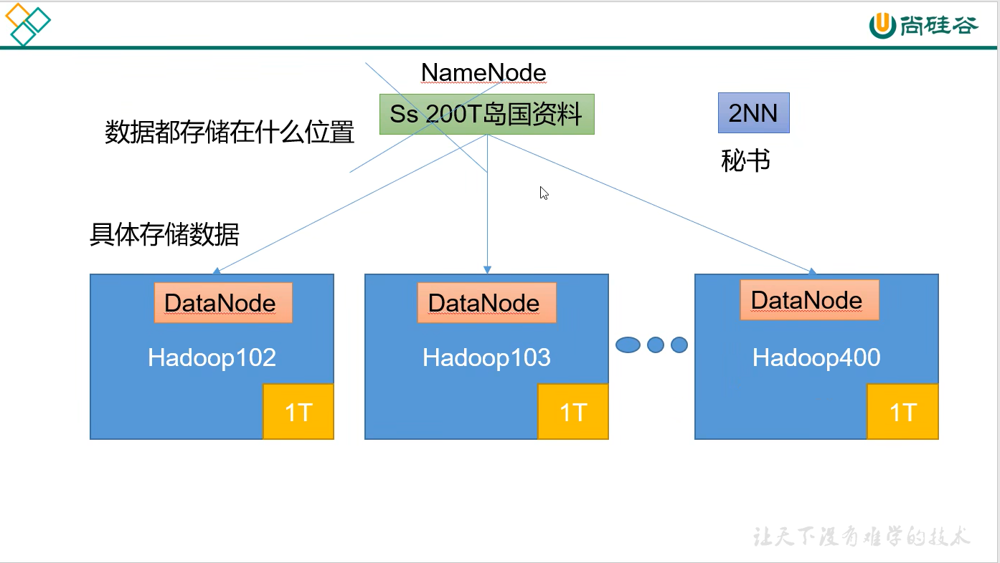


#### YARN资源调度

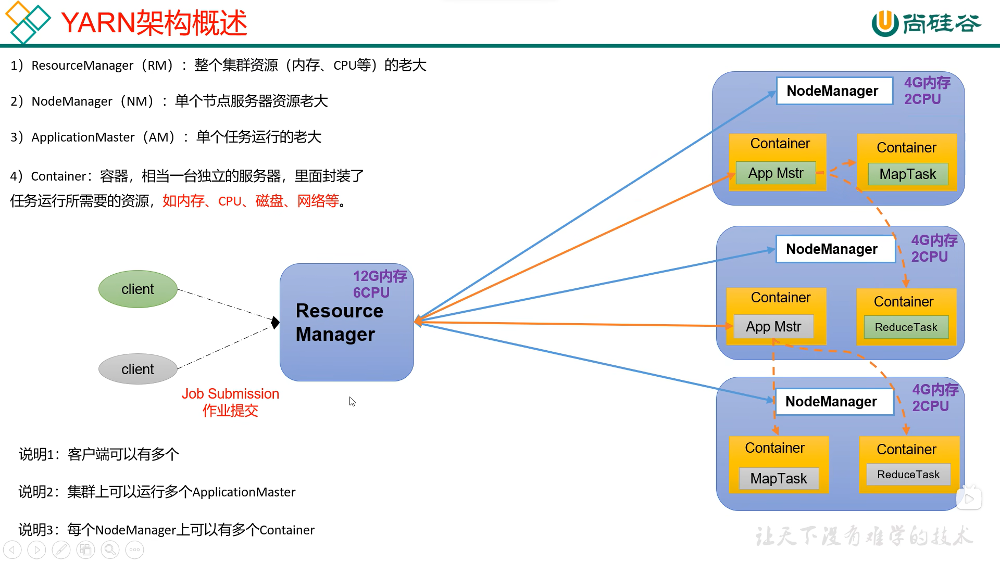

一个container需要1-8G内存，至少1个CPU。

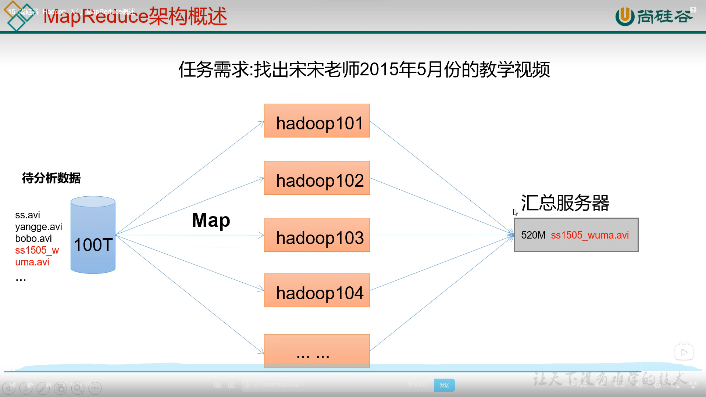

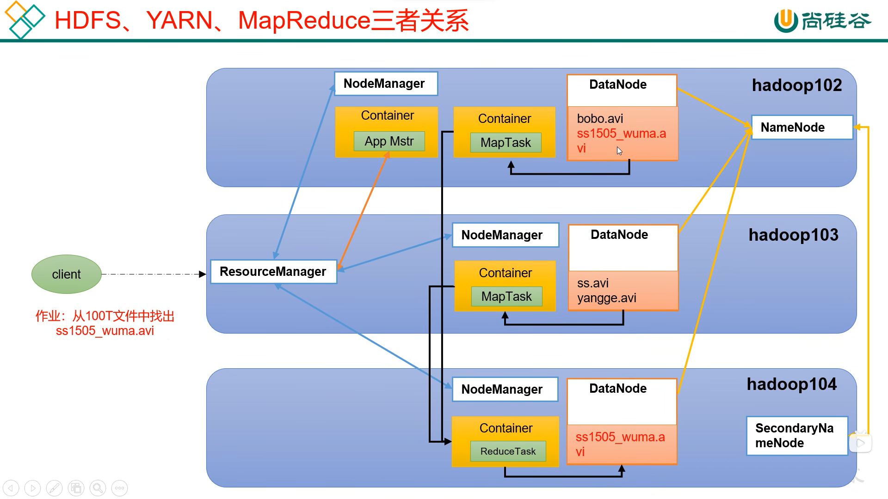

### 大数据技术生态体系

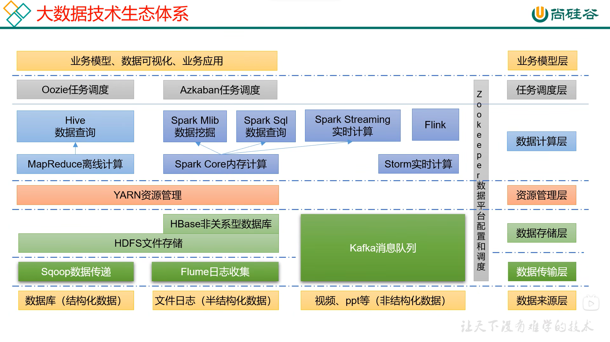

### 推荐系统案例

## 环境搭建

### 模板虚拟机准备

安装一个虚拟机，我是在 PVE 中安装的 openSUSE 虚拟机。

配置

- CPU:：2
- 内存：4G
- 磁盘：64G

内存和磁盘不要太小，因为每一个 yarn 任务默认需要 1G 的内存，大一点方便使用。

创建一个普通用户，不建议使用 root 用户对 Hadoop 集群进行操作，所以安装环境就使用非 root 用户，避免出现权限问题。

#### 安装JDK、Hadoop

安装 JDK-11 和 Hadoop-3.1.3，并配置环境变量。

```shell
> cat /etc/profile.d/my_env.sh 
export JAVA_HOME=/home/zh/bin/jdk-11
export Hadoop_HOME=/home/zh/bin/Hadoop-3.1.3
export PATH=$PATH:$JAVA_HOME/bin:$Hadoop_HOME/bin:$Hadoop_HOME/sbin
```

Hadoop 也要配置对应的 home 目录，并且，建议同时配置 sbin 目录，方便使用。

环境变量的配置并不是直接在 `/etc/profile` 文件，SUSE 对 `/etc/profile` 的声明如下：

```shell
# PLEASE DO NOT CHANGE /etc/profile. There are chances that your changes
# will be lost during system upgrades. Instead use /etc/profile.local for
# your local settings, favourite global aliases, VISUAL and EDITOR
# variables, etc ...
```

意思就是说如果系统升级将会重新配置该文件，会导致自定义配置失效，该文件会自动添加 `/etc/profile.d` 下的文件，所以应该在 `/etc/profile.d` 下创建新的文件来自定义环境变量。

#### 其他配置

网络 ip 地址为：192.168.1.102，hostname 为：Hadoop102，**并关闭防火墙**。

配置 hosts 文件：

| hostname |   Hadoop102   |   Hadoop103   |   Hadoop104   |
| :------: | :-----------: | :-----------: | :-----------: |
|    ip    | 192.168.1.102 | 192.168.1.103 | 192.168.1.104 |

配置 ssh 的免密登陆，首先生成密钥和公钥。

```shell
> ssh-keygen
Generating public/private rsa key pair.
Enter file in which to save the key (/home/zh/.ssh/id_rsa): 
Enter passphrase (empty for no passphrase): 
Enter same passphrase again: 
Your identification has been saved in /home/zh/.ssh/id_rsa
Your public key has been saved in /home/zh/.ssh/id_rsa.pub
The key fingerprint is:
SHA256:zfwWw2j9jOv10NlzFDrcsD5ezDKeFT4LBjPFdnYvfxA zh@Hadoop102
The key's randomart image is:
+---[RSA 3072]----+
|                 |
|            .    |
|             =E+.|
|         + ++ B.+|
|        S *+==ooo|
|         . .=*=*+|
|            +B=X*|
|           .+oOo*|
|           .o+ ..|
+----[SHA256]-----+
```

生成密钥和公钥之后将公钥上传到需要免密登陆的服务器上，因为这是模板虚拟机，所以上传给自己就可以，克隆后就可以使用了。

```shell
> ssh-copy-id 192.168.1.102
/usr/bin/ssh-copy-id: INFO: Source of key(s) to be installed: "/home/zh/.ssh/id_rsa.pub"
The authenticity of host '192.168.1.102 (192.168.1.102)' can't be established.
ECDSA key fingerprint is SHA256:rfMm+vaeZgiQUFcODiLhKgO3Gs31sZHyordqn8+n6e0.
Are you sure you want to continue connecting (yes/no/[fingerprint])? yes
/usr/bin/ssh-copy-id: INFO: attempting to log in with the new key(s), to filter out any that are already installed
/usr/bin/ssh-copy-id: INFO: 1 key(s) remain to be installed -- if you are prompted now it is to install the new keys
Password: 

Number of key(s) added: 1

Now try logging into the machine, with:   "ssh '192.168.1.102'"
and check to make sure that only the key(s) you wanted were added.
```

通过上述的命令会自动将刚刚生成的公钥拷贝到目标服务器的同用户名的 .ssh 文件夹下，这样以后就可以通过 **ssh hostname** 的方式登陆目标服务器的同用户名账户了。

在集群中进行文件的传输有连个常用的命令，分别是 scp 和 rsync，用法如下：

```shell
# 文件拷贝命令，从本地到远程服务器，可以将连个部分调过来，从远程到本地
scp 源地址 用户名@hostname:目标地址

# 文件同步工具，可以只复制最新更改的文件，同样可以调换两个地址
rsync 源地址 用户名@hostname:目标地址
```

因为集群需要经常进行配置的分发，并不需要对所有文件进行全部复制，只要更新变化的文件就可以，可以用以下的脚本方便使用。

```shell
#!/bin/bash
if [ $# -lt 1 ];then
        echo "args errors!"
        exit
fi

for Hadoop in Hadoop102 Hadoop103 Hadoop104;do
        for f in $@;do
                if [ -d $f ];then
                        ssh $Hadoop mkdir -p $(pwd)/$f
                        rsync -av $f $Hadoop:$(pwd)/$f
                else
                        echo $f not exists
                fi
        done
done
```

感觉上边的脚本并不完美，但是我也不会改 ^ _ ^ 。

#### 测试

首先检查 java 和 Hadoop 环境变量是否有效，然后检查网络配置并测试网络是否连同。

最后通过以下演示执行 Hadoop 的 workdCount 程序检查 Hadoop 是否能够工作。首先创建一个文件夹用来存放输入的文件，并且在其中新建一个文本文件输入些单词，使用空格分开。

```shell
> mkdir wcinput
> vim wcinput/word.txt
zh dahai
cls zh
zh ada
dahai zh ada cls
```

执行 Hadoop 的 wordcount 程序测试 Hadoop 是否能够正常工作。

```shell
> Hadoop jar bin/Hadoop-3.1.3/share/Hadoop/mapreduce/Hadoop-mapreduce-examples-3.1.3.jar wordcount wcinput wcoutput
2023-01-04 20:53:36,863 INFO impl.MetricsConfig: loaded properties from Hadoop-metrics2.properties
2023-01-04 20:53:36,918 INFO impl.MetricsSystemImpl: Scheduled Metric snapshot period at 10 second(s).
2023-01-04 20:53:36,918 INFO impl.MetricsSystemImpl: JobTracker metrics system started
2023-01-04 20:53:36,997 INFO input.FileInputFormat: Total input files to process : 1
......
2023-01-04 20:53:38,205 INFO mapreduce.Job:  map 100% reduce 100%
2023-01-04 20:53:38,206 INFO mapreduce.Job: Job job_local689621915_0001 completed successfully
2023-01-04 20:53:38,213 INFO mapreduce.Job: Counters: 30
......
```

如果上述执行没有报错，说明程序执行成功，输出路径下生成的 _SUCCESS  没有任何内容，表示程序成功，part-r-00000 文件用来存放输出结果。


```shell
> ls
bin  wcinput  wcoutput

> cd wcoutput
part-r-00000  _SUCCESS

> cat part-r-00000 
ada     2
cls     2
dahai   2
zh      4
```

如果上述测试全部通过则说明目前配置没有问题，可以进行下一步操作。如果重新执行 wordcount 程序请删除输出目录，如果不删除第二次执行将会报输出路径已存在的错误。

### 集群配置

#### 克隆虚拟机

将上边配置好的模板虚拟机克隆两份，最后一共得到三个虚拟机，分别修改 hostname 和 ip 地址。

修改完成之后测试是否可以相互免密登陆，是否可以进行配置的分发。

#### Hadoop 运行模式

##### 本地模式

数据存储在Linux本地。只是在测试时**偶尔**用一下。

##### 伪分布式

虽然只有一个节点，但是数据是存储在HDFS的。没钱或者数据量不大的公司。

##### 完全分布式集群（开发重点）

有多台服务器同时进行服务。在企业中大量使用。

#### 节点配置

##### Hadoop 常见命令

Hadoop 的常用命令存在两个文件夹下，常见的命令及说明如下:

- Hadoop：用于管理HDFS文件系统的命令，包括创建目录、上传、下载、删除等。
- hdfs：用于管理HDFS服务的命令，包括启动、停止、查看状态等。
- yarn：用于管理YARN资源调度的命令，包括提交、查看作业状态等。
- mapred：用于管理MapReduce作业的命令，包括提交、查看作业状态等。
- start/stop-dfs/yarn：用来启动/停止 dfs/yarn 集群。
- start/stop-dfs/yarn-demons：用来单节点启动/停止 dfs/yarn。
- mr-jobhistory-daemon：用来启动历史任务服务器。

##### 集群规划

 Hadoop 是集群运行的系统，并且分为许多部分，通过配置使得不同的节点运行不同的服务，但是设计集群时最好遵从以下的规范：

- NameNode、ResourceManager 和 SecondNameNode 不要再同一台服务器，因为这些管理服务都需要占用资源，所以尽量不要在同一台服务器同时部署，防止单台压力过大。
- NameNode 和 SecondNameNode 不要再同一台服务器，首先是因为这两个服务都占用资源，并且 SecondNameNode 是辅助 NameNode 的，如果装态同一台服务器，两个会同时宕机。

综合上述规范，最终的各节点服务如下：

|      |       Hadoop102        |             Hadoop103             |          Hadoop104           |
| :--: | :--------------------: | :-------------------------------: | :--------------------------: |
| HDFS | **NameNode**；DataNode |             DataNode              | **SecondNameNode**；DataNode |
| YARN |      NodeManager       | **ResourcesManager**；NodeManager |         NodeManager          |

##### Hadoop 配置文件

Hadoop 的配置方式有四种：默认配置、手动配置、程序配置文件、程序中配置，优先级依次递增，在这里先介绍前两种配置方式。

Hadoop 的各个组件如果没有进行手动配置的属性将进行默认配置，如果想要查看默认配置可以在 `$Hadoop_HOME/share/Hadoop` 下找到 common、hdfs、yarn 三个文件夹，里边有对应的 jar 文件，解压即可看到默认的配置文件。

手动的配置文件在 `$Hadoop_HOME/etc/Hadoop` 下，常用的有四个配置文件：

- core-site.xml：包含Hadoop核心组件（如HDFS和YARN）的公共配置信息。
- hdfs-site.xml：包含HDFS组件的特定配置信息。
- yarn-site.xml：包含YARN组件的特定配置信息。
- mapred-site.xml：包含MapReduce组件的特定配置信息。


##### core-site.xml

```xml
<configuration>
	<!--配置 NameNode 地址-->
	<property>
		<name>fs.defaultFS</name>
		<value>hdfs://Hadoop102:8020</value>
	</property>
	<!--配置 data 的存储路径-->
	<property>
		<name>Hadoop.tmp.dir</name>
		<value>/home/zh/Hadoop_data</value>
	</property>
</configuration>
```

##### hdfs-site.xml

```xml
<configuration>
	<property>
		<!--配置 NameNode 对管理员访问的 web 地址和端口号-->
		<name>dfs.namemode.http-address</name>
		<value>Hadoop102:9870</value>
	</property>
	<property>
		<!--配置 SecondNameNode 对管理员访问的 web 地址和端口号-->
		<name>dfs.namenode.secondary.http-address</name>
		<value>Hadoop104:9868</value>
	</property>
</configuration>
```

##### yarn-site.xml

```xml
<configuration>
	<property>
		<!--指定 mapreduce 走 shuffle-->
		<name>yarn.nodemanager.aux-services</name>
		<value>mapreduce_shuffle</value>
	</property>
	<property>
		<!--指定 resourcemanager 服务器-->
		<name>yarn.resourcemanager.hostname</name>
		<value>Hadoop103</value>
	</property>
	<property>
		<!--环境变量的继承-->
		<!--听说这个是一个 3.1.3 的 bug，后续版本不需要在配置这个-->
		<name>yarn.nodemanager.env-whitelist</name>
		<value>JAVA_HOME,Hadoop_COMMON_HOME,Hadoop_HDFS_HOME,Hadoop_CONF_DIR,CLASSPATH_PREPEND_DISTCACHE,Hadoop_YARN_HOME,Hadoop_MAPRED_HOME</value>
	</property>
</configuration>
```

##### mapperd_site.xml

```xml
<configuration>
	<!--指定 mapperreduce 程序运行在 YARN 上-->
	<property>
		<name>mapreduce.framework.name</name>
		<value>yarn</value>
	</property>
</configuration>
```

##### works

配置集群服务器的 hostname。**注意：**这里不能有空格和空行

```shell
Hadoop102
Hadoop103
Hadoop104
```

### 启动集群

#### 初始化 NameNode 储存空间

在 NameNode 第一次使用之前需要对储存空间（配置的文件夹）进行初始化操作，相当于新硬盘使用之前需要进行格式化分区一样。如果没有报错表示初始化成功。只需要对 NameNode 服务器进行初始化操作。

```shell
> hdfs namenode -fromat
/************************************************************
STARTUP_MSG: Starting NameNode
STARTUP_MSG:   host = Hadoop102/192.168.1.102
STARTUP_MSG:   args = [-format]
STARTUP_MSG:   version = 3.1.3
......
/************************************************************
SHUTDOWN_MSG: Shutting down NameNode at Hadoop102/192.168.1.102
************************************************************/
```

初始化完成之后将你配置的 hdfs 的存储目录下生成一些文件，会在 `dfs/name/current` 文件夹下生成 fsimage 和 editor 文件，用来保存上传的文件的信息，具体的功能将在后续讲解。

除了用来存放文件信息的目录之外，还会再 `dfs/data/current/VERSION` 中生成文件本次初始化的文件系统的 ID（datanodeUuid），只有文件系统 ID 相同的 namenode 和 datanode 节点才能共同工作组成集群，如果 ID 不一样将不能组成集群，这样设计可以防止文由于文件系统的内容不匹配（比如一台服务器重新初始化了工作空间，但是其他服务器还有历史数据）造成文件损坏。

```shell
> cat VERSION 
#Sun Jan 08 17:35:17 CST 2023
datanodeUuid=b5867d24-c7d5-4e54-abfb-44c8fa230f55
storageType=DATA_NODE
cTime=0
clusterID=CID-ce27dce7-0766-4fec-b536-b0965cf23a2d
layoutVersion=-57
storageID=DS-156883f6-ce5b-44de-99f0-f7f26fbe6561
```

#### 启动

```shell
> start-dfs.sh 
Starting namenodes on [Hadoop102]
Starting datanodes
Hadoop104: WARNING: /home/zh/bin/Hadoop-3.1.3/logs does not exist. Creating.
Hadoop103: WARNING: /home/zh/bin/Hadoop-3.1.3/logs does not exist. Creating.
Starting secondary namenodes [Hadoop104]

> jps
30344 DataNode
30666 Jps
30173 NameNode
```

集群启动成功之后分别在不同的服务器执行 jps 命令，并于集群的规划做对比，看是否启动成功。

在浏览器输入 http://192.168.1.102:9870/ 可以看到刚刚配置的管理员 web 页面。

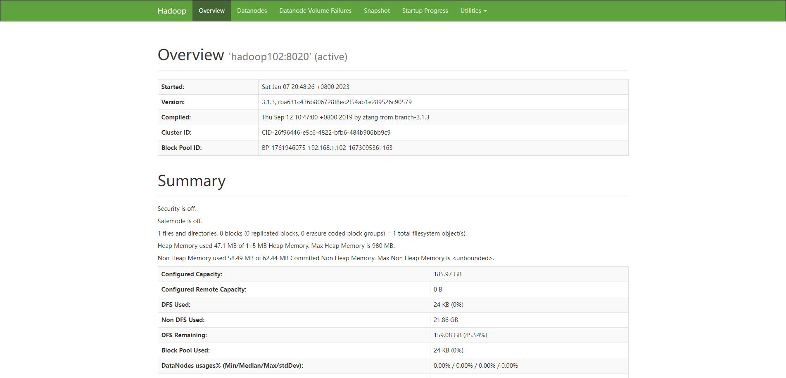

另外 YARN 也提供一个 web 访问页面（http://192.168.1.103:8088/cluster），可以看到正在运行的任务的详细信息。

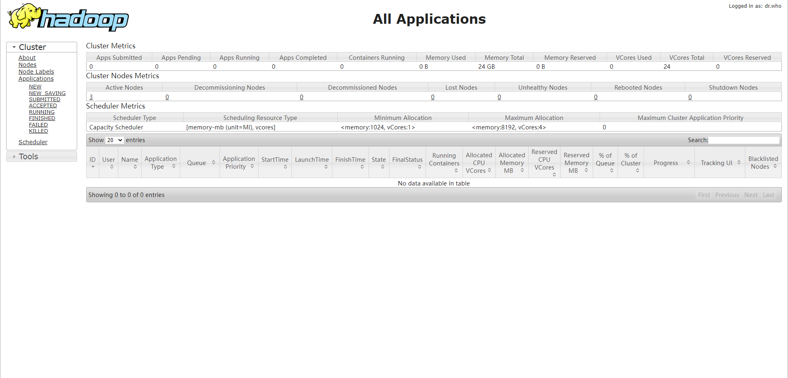

### 简单测试

#### 创建文件夹

对于 Hadoop 的文件系统，我们可以通过命令行的方式进行创建，删除，移动等常见的文件操作。我们可以通过下边的命令在 Hadoop 中创建一个文件夹：

```shell
> Hadoop fs -mkdir /wcinput
```

执行完毕之后，我们可以在 Hadoop web 管理页面的 `Utilities>Browse the file ssystem` 中看到刚刚创建的文件夹。

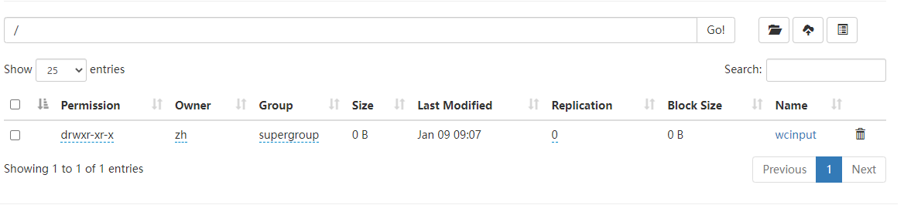

#### 文件上传

创建完文件夹之后，我们可以通过命令行的方式将本地的文件上传到改文件夹中。

```shell
> Hadoop fs -put wcinput/word.txt /wcinput
```

上传完成后，打开 HDFS 的 web 页面，我们进入 /wcinput 文件夹可以看到刚刚的文件夹，可以点击看到文件的详情，可以预览和下载。如果点击完下载提示页面打不开，请配置主机的 host 文件，设置各个服务器 hostname 对应的 ip 地址。

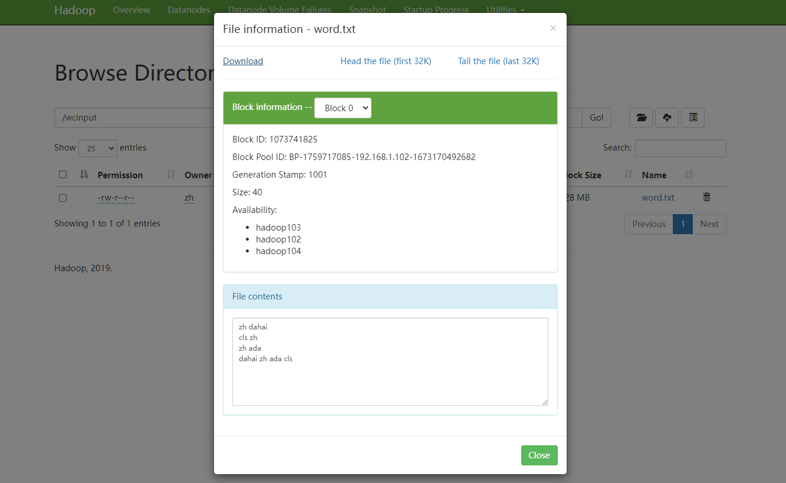

上传到集群的文件将会保存到配置的目录的 data 文件夹下，并且文件会被分块，小文件可能只占用一个文件快，大的文件会被切割成多个文件快进行存储。除此之外，同一个文件还会被存储在多个服务器上，以保证文件的可靠性。

#### 集群版 wordcount

上边执行的 wordcount 程序是在本地模式下运行的，并没有使用集群，只是用来进行简单的测试。wordcount 程序同样能够运行在集群上由 yarn 调度。可以执行同样的命令来执行，但是要将输入输出目录换成集群的目录，具体命令如下：

```shell
> Hadoop jar bin/Hadoop-3.1.3/share/Hadoop/mapreduce/Hadoop-mapreduce-examples-3.1.3.jar wordcount /wcinput /wcoutput
2023-01-09 09:47:02,420 INFO client.RMProxy: Connecting to ResourceManager at Hadoop103/192.168.1.103:8032
2023-01-09 09:47:02,597 INFO mapreduce.JobResourceUploader: Disabling Erasure Coding for path: /tmp/Hadoop-yarn/staging/zh/.staging/job_1673225993091_0001
2023-01-09 09:47:02,656 INFO sasl.SaslDataTransferClient: SASL encryption trust check: localHostTrusted = false, remoteHostTrusted = false
2023-01-09 09:47:02,745 INFO input.FileInputFormat: Total input files to process : 1
2023-01-09 09:47:02,762 INFO sasl.SaslDataTransferClient: SASL encryption trust check: localHostTrusted = false, remoteHostTrusted = false
2023-01-09 09:47:02,797 INFO sasl.SaslDataTransferClient: SASL encryption trust check: localHostTrusted = false, remoteHostTrusted = false
2023-01-09 09:47:02,818 INFO mapreduce.JobSubmitter: number of splits:1
2023-01-09 09:47:02,958 INFO sasl.SaslDataTransferClient: SASL encryption trust check: localHostTrusted = false, remoteHostTrusted = false
2023-01-09 09:47:02,990 INFO mapreduce.JobSubmitter: Submitting tokens for job: job_1673225993091_0001
2023-01-09 09:47:02,991 INFO mapreduce.JobSubmitter: Executing with tokens: []
2023-01-09 09:47:03,097 INFO conf.Configuration: resource-types.xml not found
2023-01-09 09:47:03,097 INFO resource.ResourceUtils: Unable to find 'resource-types.xml'.
2023-01-09 09:47:03,191 INFO impl.YarnClientImpl: Submitted application application_1673225993091_0001
2023-01-09 09:47:03,210 INFO mapreduce.Job: The url to track the job: http://Hadoop103:8088/proxy/application_1673225993091_0001/
2023-01-09 09:47:03,210 INFO mapreduce.Job: Running job: job_1673225993091_0001
2023-01-09 09:47:08,269 INFO mapreduce.Job: Job job_1673225993091_0001 running in uber mode : false
2023-01-09 09:47:08,270 INFO mapreduce.Job:  map 0% reduce 0%
2023-01-09 09:47:11,295 INFO mapreduce.Job:  map 100% reduce 0%
2023-01-09 09:47:15,310 INFO mapreduce.Job:  map 100% reduce 100%
2023-01-09 09:47:16,319 INFO mapreduce.Job: Job job_1673225993091_0001 completed successfully
2023-01-09 09:47:16,377 INFO mapreduce.Job: Counters: 53
......
```

程序的部分输出如上，在任务运行的时候，可以通过 yarn 的 web 页面查看正在运行的任务的详情，如下入所示：

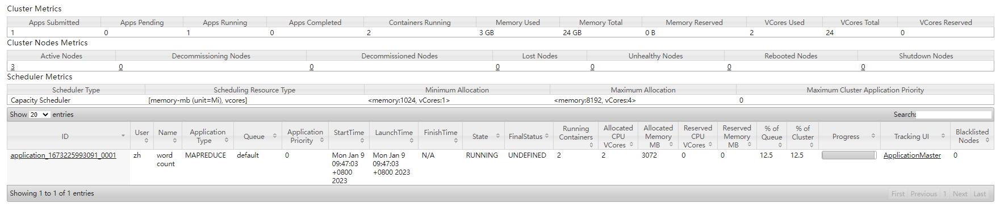

运行结束后，将在 HDFS 系统中产生目标文件夹来存放执行结果，内容与本地运行的结果相同。

### 配置历史服务器

#### 什么是历史服务器

在刚刚 wordcount 的测试中，yarn 的 web 页面并不能显示历史任务，这是因为 yarn 只是复杂而调度，并不会记录历史任务。如果想要能够保存历史任务，可以配置历史任务服务器，它可以在 yarn 运行时将任务的详情记录下来，但是并会不记录任务的运行日志。

#### 配置

可以配置 yarn 来开启历史任务服务器，在 `$Hadoop_HOME/etc/Hadoop/mapred-site.xml` 中添加如下配置：

```xml
<property>
	<!--配置历史服务器端的地址-->
	<name>mapreduce.jobhistory.address</name>
	<value>Hadoop102:10020</value>
</property>
<property>
	<!--配置历史服务器的 web 地址-->
	<name>mapreduce.jobhistory.webapp.address</name>
	<value>Hadoop102:19888</value>
</property>
```

配置完成之后将新的配置信息进行分发。最后重启 yarn 并通过如下命令来启动历史服务器：

```shell
> mapred --daemon start historyserver

> jps
13584 NameNode
13761 DataNode
26708 NodeManager
27657 JobHistoryServer
27722 Jps
```

重新执行刚刚的 wordcount 程序，可以在 yarn 的页面看到最新的任务，就算刷新页面也能够查看任务的详情。

### 配置日志聚集功能

#### 什么是日志聚集

刚刚配置完成了历史任务服务器，但是仍然不能保留任务运行的详细日志，并且整个集群在运行的过程中也会产生各种各样的日志存储在自己的服务器上，日志聚集功能就是将所有服务器的日志聚集在一起，通过 web 向管理人员展示。

#### 配置

在 `$Hadoop_HOME/etc/Hadoop/yarn-site.xml` 中添加如下配置来开启日志聚集功能：

```xml
<property>
    <!--开启日志聚集功能-->
    <name>yarn.log-aggregation-enable</name>
    <value>true</value>
</property>
<property>
    <!--设置历史服务器的地址-->
    <name>yarn.log.server.url</name>
    <value>http://Hadoop102:19888/jobhistory/logs</value>
</property>
<property>
    <!--设置日志保留 7 天-->
    <name>yarn.log.aggregation.retain-seconds</name>
    <value>604800</value>
</property>
```

然后要重启 yarn 和 jobhistory 服务器。

```shell
> mapred --deamon stop jobhistory
> stop-yarn.sh

> mapred --deamon start jobhistory
> start-yarn.sh
```

重启完成之后在运行新的任务将会收集日志，可以通过历史任务服务器的 logs 按钮进行查看。

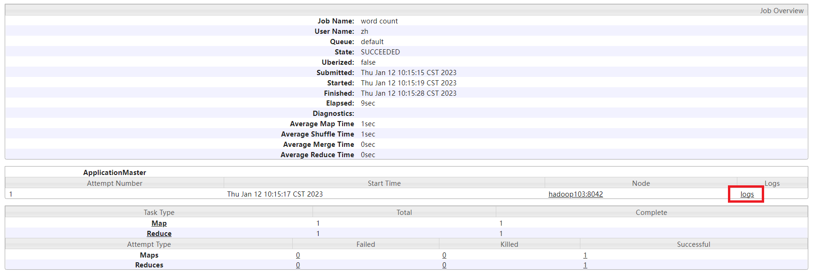

### 各种启动停止方式总结

#### 集群

启动/停止 hdfs/yarn：

```shell
> start/stop-dfs/yarn.sh
```

#### 单节点

```shell
> hdfs --daemon start/stop namenode/datanode/secondnamenode
```

#### 脚本

如果服务器很多，手动重启动单节点很麻烦，可以通过下边的脚本，将一条命令分发给所有服务器执行

```shell
#!/bin/bash

for Hadoop in Hadoop102 Hadoop103 Hadoop104;do
        echo "=======================" $Hadoop "======================="
        ssh $Hadoop $@
done
```

### 常见端口号

|         端口号         | Hadoop2.x |     Hadoop3.x     |
| :--------------------: | :-------: | :---------------: |
|    NameNode内部通信    | 8020/900  | **8020**/900/9820 |
|    NameNode HTTP UI    |   50070   |       9870        |
| MapReduce 查看执行任务 |   8088    |       8088        |
|   历史任务服务器通信   |   19888   |       19888       |

### 时间同步

在集群内部需要进行时间同步，如果集群能够连接外网会自动进行时间同步，如果不能连接外网，需要以一台服务器为准，对其他服务器进行同步。具体的配置过程部分就不写了。

### 常见错误的解决方案

#### DFS web页面报错。

##### 报错信息

> Failed to retrieve data from /webhdfs/v1/?op=LISTSTATUS: Server Error

查看 logs 下的 NameNode 日志文件，报错信息如下：

> 2023-01-07 21:28:38,045 WARN org.eclipse.jetty.servlet.ServletHandler: Error for /webhdfs/v1/
> java.lang.NoClassDefFoundError: javax/activation/DataSource
>         at com.sun.xml.bind.v2.model.impl.RuntimeBuiltinLeafInfoImpl.<clinit>(RuntimeBuiltinLeafInfoImpl.java:457)
>         at com.sun.xml.bind.v2.model.impl.RuntimeTypeInfoSetImpl.<init>(RuntimeTypeInfoSetImpl.java:65)
>         at com.sun.xml.bind.v2.model.impl.RuntimeModelBuilder.createTypeInfoSet(RuntimeModelBuilder.java:133)
>         at com.sun.xml.bind.v2.model.impl.RuntimeModelBuilder.createTypeInfoSet(RuntimeModelBuilder.java:85)
>         at com.sun.xml.bind.v2.model.impl.ModelBuilder.<init>(ModelBuilder.java:156)
>         at com.sun.xml.bind.v2.model.impl.RuntimeModelBuilder.<init>(RuntimeModelBuilder.java:93)
>         at com.sun.xml.bind.v2.runtime.JAXBContextImpl.getTypeInfoSet(JAXBContextImpl.java:473)
>         at com.sun.xml.bind.v2.runtime.JAXBContextImpl.<init>(JAXBContextImpl.java:319)
>         at com.sun.xml.bind.v2.runtime.JAXBContextImpl$JAXBContextBuilder.build(JAXBContextImpl.java:1170)
>         at com.sun.xml.bind.v2.ContextFactory.createContext(ContextFactory.java:145)
>         at com.sun.xml.bind.v2.ContextFactory.createContext(ContextFactory.java:236)

##### 原因

jdk-9 开始弃用了 [`java.activation`](http://openjdk.java.net/jeps/261#EE-modules) 模块，到 jdk-11 完全被删除了，如果 Hadoop 版本比较低并且 jdk 版本高就会找不到依赖而报错。

##### 修复

最简单的办法是降级 jdk 使用，如果是使用 jdk-9 或者 jdk-10 可以在 `$Hadoop_HOME/etc/Hadoop/Hadoop-env.sh` 文件中添加如下配置来启用 `java.activation` 模块。

```shell
export Hadoop_OPTS="${Hadoop_OPTS} --add-modules java.activation "
```

如果使用 jdk-11 及以上的版本，可以手动下载 java.activation 模块的 [jar](https://jcenter.bintray.com/javax/activation/javax.activation-api/1.2.0/javax.activation-api-1.2.0.jar) 包，然后存放在合适的位置，我是在 $Hadoop_HOME/lib 下新建了一个 dfs 的文件夹，表示这是 dfs 的依赖。然后在 \$Hadoop_HOME/etc/Hadoop/Hadoop-env.sh 中将新的文件依赖路径添加进去，最后重启集群即可解决问题。

```shell
export Hadoop_CLASSPATH+="$Hadoop_HOME/lib/dfs/*.jar"
```

#### 部分 DataNode 不启动

##### 报错信息

不会报任何异常，我在日志也没有找到报错信息，但是具体的表现就是总是有一部分 DataNode 节点不启动，在集群信息中也看不到对应的节点，也没有任何异常。

##### 原因

因为 NameNode 会每次初始化系统会生成 ID，如果重复执行过初始化或者在多个服务器上进行初始化，将会造成 ID 不匹配，节点不启动。

##### 修复

关闭集群，清空所有节点上用来保存数据的文件夹和 logs 文件夹，然后重新初始化空间，最后启动集群即可。

## HDFS

### HDFS 简介

#### 优缺点

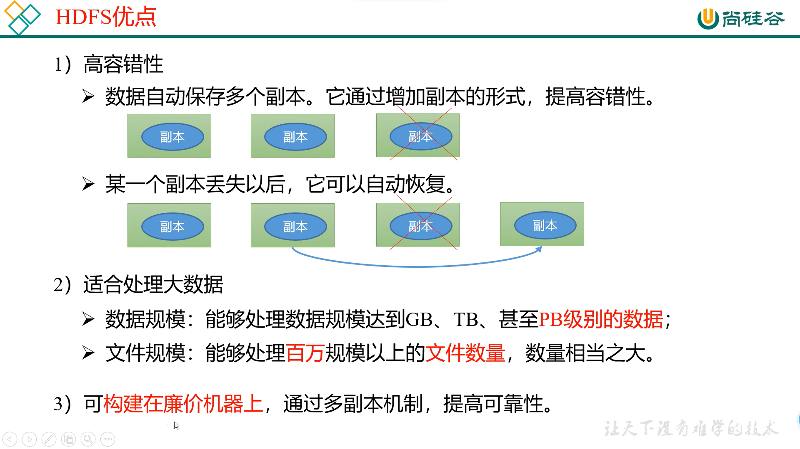

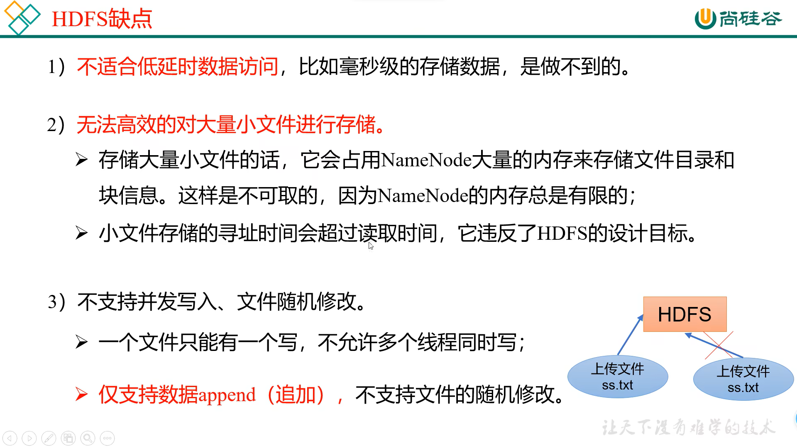

#### HDFS 组成

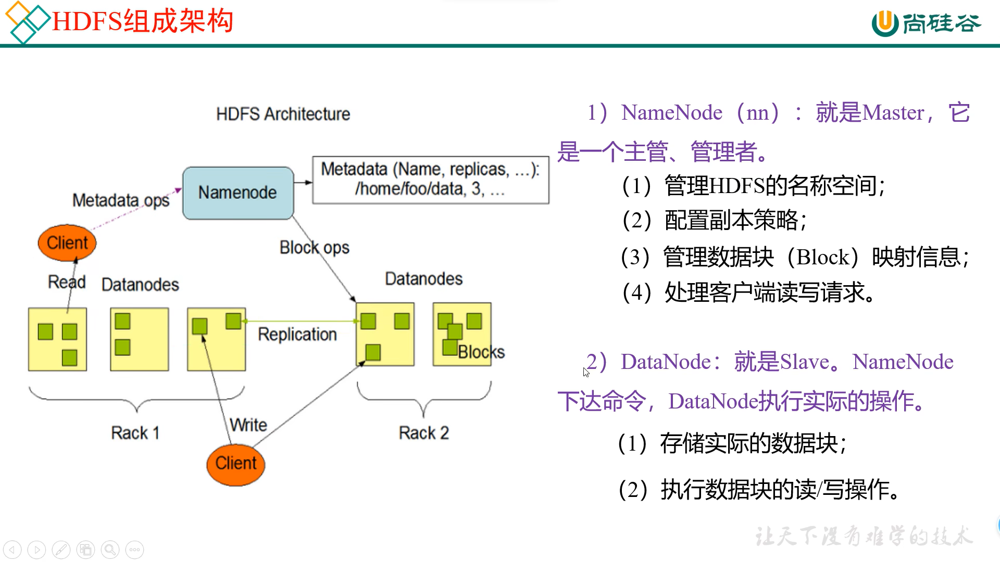

#### 文件块大小

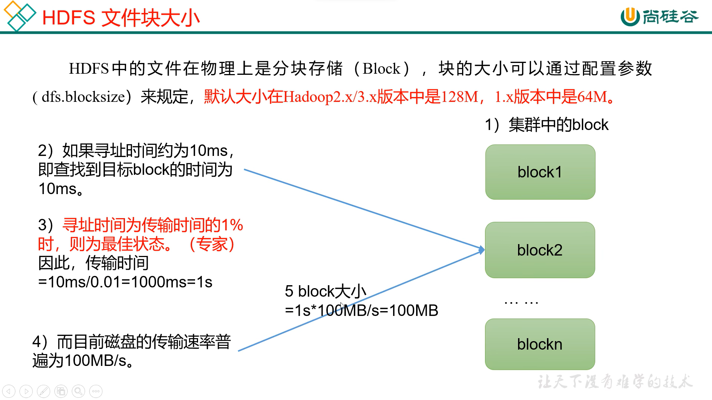

### 命令行操作

```shell
> Hadoop fs
Usage: Hadoop fs [generic options]
......
The general command line syntax is:
command [genericOptions] [commandOptions]
```

```shell
> hdfs fs
Usage: Hadoop fs [generic options]
......
The general command line syntax is:
command [genericOptions] [commandOptions]
```

这两个命令是一样的，会使用一个就可以。我比较喜欢  `Hadoop fs` 。一些常用的参数如下，对于这些参数要熟记，这些命令比较简单，与 linux 命令比较接近，就不进行一一演示了。

```shell
[-appendToFile <localsrc> ... <dst>]
[-cat [-ignoreCrc] <src> ...]
[-chgrp [-R] GROUP PATH...]
[-chmod [-R] <MODE[,MODE]... | OCTALMODE> PATH...]
[-chown [-R] [OWNER][:[GROUP]] PATH...]
[-copyFromLocal [-f] [-p] [-l] [-d] [-t <thread count>] <localsrc> ... <dst>]
[-copyToLocal [-f] [-p] [-ignoreCrc] [-crc] <src> ... <localdst>]
[-count [-q] [-h] [-v] [-t [<storage type>]] [-u] [-x] [-e] <path> ...]
[-cp [-f] [-p | -p[topax]] [-d] <src> ... <dst>]
[-find <path> ... <expression> ...]
[-get [-f] [-p] [-ignoreCrc] [-crc] <src> ... <localdst>]
[-head <file>]
[-help [cmd ...]]
[-ls [-C] [-d] [-h] [-q] [-R] [-t] [-S] [-r] [-u] [-e] [<path> ...]]
[-mkdir [-p] <path> ...]
[-moveFromLocal <localsrc> ... <dst>]
[-moveToLocal <src> <localdst>]
[-mv <src> ... <dst>]
[-put [-f] [-p] [-l] [-d] <localsrc> ... <dst>]
[-rm [-f] [-r|-R] [-skipTrash] [-safely] <src> ...]
[-rmdir [--ignore-fail-on-non-empty] <dir> ...]
[-tail [-f] [-s <sleep interval>] <file>]
```

### API 操作

#### 安装

如果使用 window 进行 Hadoop 的开发工作，需要安装特殊的补丁才能使用，具体的安装过程我就不演示了，大概的流程就是首先下载 Hadoop 的 windows 版，然后配置环境变量，最后使用 winUtils 进行打补丁，winUtils 补丁的版本需要与 Hadoop 的版本相匹配才可以。

#### 创建工程

正常创建一个 maven 工程，然后添加依赖和 log4j 的配置文件。

maven 依赖如下：

```xml
<dependencies>
    <!-- https://mvnrepository.com/artifact/org.apache.Hadoop/Hadoop-client -->
    <dependency>
        <groupId>org.apache.Hadoop</groupId>
        <artifactId>Hadoop-client</artifactId>
        <version>3.3.4</version>
    </dependency>
    <!-- https://mvnrepository.com/artifact/org.apache.Hadoop/Hadoop-common -->
    <dependency>
        <groupId>org.apache.Hadoop</groupId>
        <artifactId>Hadoop-common</artifactId>
        <version>3.3.4</version>
    </dependency>
    <!-- https://mvnrepository.com/artifact/org.apache.logging.log4j/log4j-core -->
    <dependency>
        <groupId>org.slf4j</groupId>
        <artifactId>slf4j-log4j12</artifactId>
        <version>1.7.30</version>
    </dependency>
    <dependency>
        <groupId>junit</groupId>
        <artifactId>junit</artifactId>
        <version>4.13.2</version>
        <scope>compile</scope>
    </dependency>
</dependencies>
```

log4j 的配置文件如下：

```properties
log4j.rootLogger=INFO, stdout
log4j.appender.stdout=org.apache.log4j.ConsoleAppender
log4j.appender.stdout.layout=org.apache.log4j.PatternLayout
log4j.appender.stdout.layout.ConversionPattern=%d %p[%c] - %m%n
log4j.appender.logfile=org.apache.log4j.FileAppender
log4j.appender.logfile.File=target/spring.log
log4j.appender.logfile.layout=org.apache.log4j.PatternLayout
log4j.appender.logfile.layout.ConversionPattern=%d %p [%c] - %m%n
```

#### 代码示例

通用套路：像这种需要对远程服务器进行操作的，一般的操作流程就是先获取连接，然后进行正常的操作，最后关闭连接即可。在执行代码之前一定要保证你的集群是在正常运行的。

##### 导包

在进行 api 操作时，由一些重复的类名，对于新手统一搞错，本节代码使用的包信息如下：

```java
import org.apache.Hadoop.conf.Configuration;
import org.apache.Hadoop.fs.FileSystem;
import org.apache.Hadoop.fs.Path;

import java.net.URI;
```

##### 连接的获取与关闭

```java
public void before() throws Exception {
    URI uri = new URI("hdfs://Hadoop102:8020");
    Configuration configuration = new Configuration();
    fs = FileSystem.get(uri, configuration, "zh");
}
public void after() throws Exception {
    fs.close();
}
```

##### 常见操作

```java
public void mkdir() throws Exception {
    fs.mkdirs(new Path("/api_test"));
}

public void delete() throws Exception {
    fs.delete(new Path("/output"), true);
}

public void upload() throws Exception {
    fs.moveFromLocalFile(new Path("D:\\atar.gz"), new Path("/api_test"));
}

public void download() throws Exception {
    fs.copyToLocalFile(new Path("/api_test/a.tar.gz"), new Path("D:\\a.tar.gz"));
}

public void rename() throws Exception{
    fs.rename(new Path("/api_test/Hadoop-3.3.4.tar.gz"), new Path("/api_test/a.tar.gz"));
}

public void fileDetail() throws IOException {
    RemoteIterator<LocatedFileStatus> statusIterator
        = fs.listFiles(new Path("/api_test"), false);
    while (statusIterator.hasNext()) {
        LocatedFileStatus next = statusIterator.next();
        System.out.println(
            next.getPath() +
            "\t" + next.isDirectory() +
            "\t" + next.getPermission() +
            "\t" + next.getOwner() +
            "\t" + next.getGroup() +
            "\t" + next.getLen() +
            "\t" + next.getModificationTime() +
            "\t" + next.getReplication() +
            "\t" + next.getBlockSize() +
            "\t" + Arrays.toString(next.getBlockLocations())
        );
    }
}

public void isDir() throws IOException {
    FileStatus[] fileStatuses = fs.listStatus(new Path("/api_test"));
    for (FileStatus fileStatus : fileStatuses) {
        System.out.println((fileStatus.isDirectory() ? "" : "不") + "是目录");
    }
}
```

上边的只是些简单的测试，至于同名的其他方法和具体的参数说明可以看一看 API，感觉这些东西都不是很难，主要就是会用这些 API 就可以。

##### 配置优先级

在环境搭建的过程中，我们已经知道了 Hadoop 的两种配置文件：默认配置和自定义配置。其中默认配置在对应的 jar 包中，自定义配置文件在 `$Hadoop_HOME/etc/Hadoop/` 下。

在开发过程中，可以在 resource 文件夹下建立相同的配置文件名进行配置。还可以通过上述示例代码的 Configuration 对象来进行配置。这四种配置方式的优先级为：

```
默认配置 < 服义器上的配置 < 程序 resources 下的配置 < 代码中通过 Configuration 对象的配置
```

### HDFS 读写流程

#### 写流程

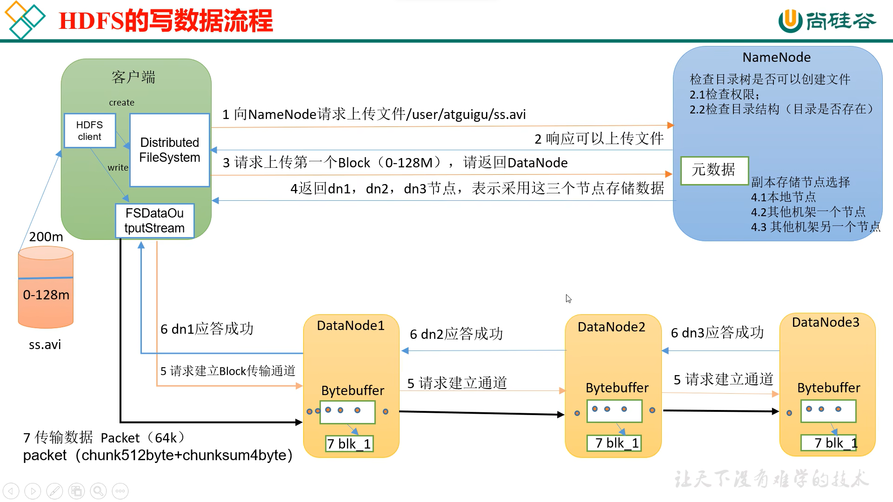

> 1. 首先客户端向 NameNode 请求上传文件，NameNode 进行权限等一系列验证之后相应是否可以上传。
>
> 2. 如果可以上传，客户端将向 NameNode 请求上传第一块数据，NameNode 将选择适当的服务器节点返回，具体的原则方式如下：
>
>    > 1. 本地存储优先
>    > 2. 机架感知，来原则服务器，具体过程下边详细介绍
>    > 3. 根据节点的负载均衡来动态调节
>
> 3. 客户端将和各个服务器节点进行应答，如果应答成功将建立通道（应答和通道都是一条龙，如上图）
>
>    > 1. 首先将文件打包成 512byte 的 chunk，并附加 4byte 的校验信息
>    > 2. 将 chunk 放在缓冲区，缓冲区满 64k 后将进行发送，服务器收到数据包后将进行应答
>    > 3. 发出去的 chunk 将从发送缓冲区转移到应答缓冲区，只有收到应答的包才被删除，如果应答失败将重新发送
>
> 4. 一个 block 发送完成之后将向 NameNode 请求第二个 block 的发送，重复步骤 2 直至结束

##### 机架感知

###### 官方介绍

对于副本节点的选择 Hadoop 通过机架感知来实现，官方的介绍页面可以点击[这里](https://Hadoop.apache.org/docs/r3.1.3/Hadoop-project-dist/Hadoop-hdfs/HdfsDesign.html#Data_Replication)，官方介绍如下：

> ### Replica Placement: The First Baby Steps
>
> The placement of replicas is critical to HDFS reliability and performance. Optimizing replica placement distinguishes HDFS from most other distributed file systems. This is a feature that needs lots of tuning and experience. The purpose of a rack-aware replica placement policy is to improve data reliability, availability, and network bandwidth utilization. The current implementation for the replica placement policy is a first effort in this direction. The short-term goals of implementing this policy are to validate it on production systems, learn more about its behavior, and build a foundation to test and research more sophisticated policies.
>
> Large HDFS instances run on a cluster of computers that commonly spread across many racks. Communication between two nodes in different racks has to go through switches. In most cases, network bandwidth between machines in the same rack is greater than network bandwidth between machines in different racks.
>
> The NameNode determines the rack id each DataNode belongs to via the process outlined in [Hadoop Rack Awareness](https://Hadoop.apache.org/docs/r3.1.3/Hadoop-project-dist/Hadoop-common/RackAwareness.html). A simple but non-optimal policy is to place replicas on unique racks. This prevents losing data when an entire rack fails and allows use of bandwidth from multiple racks when reading data. This policy evenly distributes replicas in the cluster which makes it easy to balance load on component failure. However, this policy increases the cost of writes because a write needs to transfer blocks to multiple racks.
>
> For the common case, when the replication factor is three, `HDFS’s placement policy is to put one replica on the local machine if the writer is on a datanode`, otherwise on a random datanode, `another replica on a node in a different (remote) rack`, and the `last on a different node in the same remote rack`. This policy cuts the inter-rack write traffic which generally improves write performance. The chance of rack failure is far less than that of node failure; this policy does not impact data reliability and availability guarantees. However, it does reduce the aggregate network bandwidth used when reading data since a block is placed in only two unique racks rather than three. With this policy, the replicas of a file do not evenly distribute across the racks. One third of replicas are on one node, two thirds of replicas are on one rack, and the other third are evenly distributed across the remaining racks. This policy improves write performance without compromising data reliability or read performance.
>
> If the replication factor is greater than 3, the placement of the 4th and following replicas are determined randomly while keeping the number of replicas per rack below the upper limit (which is basically `(replicas - 1) / racks + 2`).
>
> Because the NameNode does not allow DataNodes to have multiple replicas of the same block, maximum number of replicas created is the total number of DataNodes at that time.
>
> After the support for [Storage Types and Storage Policies](https://Hadoop.apache.org/docs/r3.1.3/Hadoop-project-dist/Hadoop-hdfs/ArchivalStorage.html) was added to HDFS, the NameNode takes the policy into account for replica placement in addition to the rack awareness described above. The NameNode chooses nodes based on rack awareness at first, then checks that the candidate node have storage required by the policy associated with the file. If the candidate node does not have the storage type, the NameNode looks for another node. If enough nodes to place replicas can not be found in the first path, the NameNode looks for nodes having fallback storage types in the second path.
>
> The current, default replica placement policy described here is a work in progress.
>
> ----
>
> ### Replica Selection
>
> To minimize global bandwidth consumption and read latency, HDFS tries to satisfy a read request from a replica that is closest to the reader. If there exists a replica on the same rack as the reader node, then that replica is preferred to satisfy the read request. If HDFS cluster spans multiple data centers, then a replica that is resident in the local data center is preferred over any remote replica.

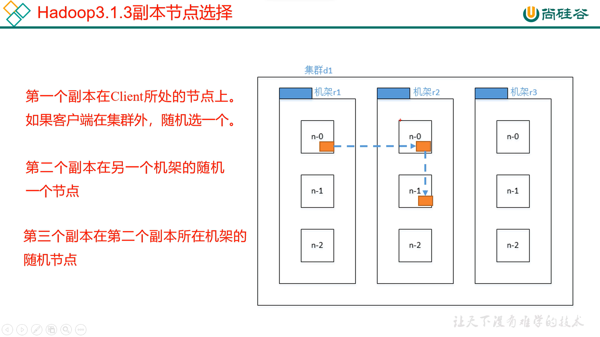

###### 源码分析

源代码可以去 maven 仓库找 Hadoop-dfs 的源码包，然后再 `org.apache.Hadoop.hdfs.server.blockmanagement.BlockPlacementPolicyDefault` 这个类的 `chooseTargetInOrder`  方法

```java
protected Node chooseTargetInOrder(int numOfReplicas, 
                                   Node writer,
                                   final Set<Node> excludedNodes,
                                   final long blocksize,
                                   final int maxNodesPerRack,
                                   final List<DatanodeStorageInfo> results,
                                   final boolean avoidStaleNodes,
                                   final boolean newBlock,
                                   EnumMap<StorageType, Integer> storageTypes)
    throws NotEnoughReplicasException {
    final int numOfResults = results.size();
    if (numOfResults == 0) {
        // 第一个副本，选择本地节点
        DatanodeStorageInfo storageInfo = chooseLocalStorage(
            writer,
            excludedNodes, 
            blocksize, 
            maxNodesPerRack, 
            results, 
            avoidStaleNodes,
            storageTypes, 
            true
        );

        writer =
            (storageInfo != null) ? storageInfo.getDatanodeDescriptor() : null;
        if (--numOfReplicas == 0) {
            return writer;
        }
    }
    // dn0 就是刚刚选择的第一个节点
    final DatanodeDescriptor dn0 = results.get(0).getDatanodeDescriptor();
    if (numOfResults <= 1) {
        // 第二个副本，选择和 dn0 远程的节点
        chooseRemoteRack(
            1, 
            dn0, 
            excludedNodes, 
            blocksize, 
            maxNodesPerRack,
            results, 
            avoidStaleNodes, 
            storageTypes
        );
        if (--numOfReplicas == 0) {
            return writer;
        }
    }
    if (numOfResults <= 2) {
        // dn1 就是刚刚选择的第二个节点
        final DatanodeDescriptor dn1 = results.get(1).getDatanodeDescriptor();
        // 判断刚刚选择的连个是否是同一个机架
        if (clusterMap.isOnSameRack(dn0, dn1)) { // 如果是同一个，最后一个将选择远程机架
            chooseRemoteRack(
                1, 
                dn0, 
                excludedNodes, 
                blocksize, 
                maxNodesPerRack,
                results, 
                avoidStaleNodes, 
                storageTypes
            );
        } else if (newBlock){ // 如果不在同于一个，并且是新块，那就选择和 dn1 相同的机架
            chooseLocalRack(
                dn1, 
                excludedNodes, 
                blocksize, 
                maxNodesPerRack,
                results, 
                avoidStaleNodes, 
                storageTypes
            );
        } else {
            chooseLocalRack(
                writer, 
                excludedNodes, 
                blocksize, 
                maxNodesPerRack,
                results, 
                avoidStaleNodes, 
                storageTypes
            );
        }
        if (--numOfReplicas == 0) {
            return writer;
        }
    }
    chooseRandom(numOfReplicas, NodeBase.ROOT, excludedNodes, blocksize,
                 maxNodesPerRack, results, avoidStaleNodes, storageTypes);
    return writer;
}
```

#### 读流程

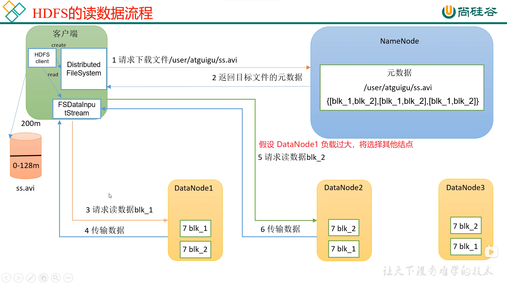

1. 首先客户端向 NameNode 请求文件的下载
2. NameNode 将验证下载的文件是否合法，权限是否正常等信息，如果可以下载将返回目标文件的元数据
3. 客户端创建读数据流，选择最近的节点（也会考虑负载均衡）进行读取
4. 读取完第一块后再读重新选择节点读取下一块，`这里是串行读并不是并行`

### NameNode 和 SecondNameNode

#### NameNode 是如何存储数据的

客户端上传的文件会分块后存储在 DataNode 指定的文件夹中，这一点很容易理解，问题的关键是这些文件的元数据是如何进行存储的呢？

能够用来进行数据存储的只有两种方式：一种是存放再内存中，速度快但是不安全；另一种是存放在磁盘中，速度慢但是安全。Hadoop 这种在线的文件系统如何兼顾快速的安全呢？那就是通过磁盘顺序读写速度比较快的特点，每次来新的文件时，只变更内存中的数据并且将文件的变更记录在 editors 文件中，服务器关机的时候再进行统一的合并。这样就可以即快又安全。

元数据会储存在 NameNode 中，主要分为三个文件 fsimage、editors 和 edits_inprogress 中进行保存，其中 fsimage 是总的元数据，editors 是还没有来得及进行合并的数据，edits_inprogress 是当前正在使用的记录文件。NameNode 和 SeconNameNode 的关系可以做一个比喻：比如你上课听讲需要记笔记，你有一个笔记本（fsimage）、一些演算纸（editors、 edits_inprogress）和一个同桌（SeconNameNode ），现在老师就是客户端，他不停的向你提交知识，但是如果你一直修改你笔记本上的内容就会很慢，跟不上老师的节奏，这个时候你可以先理解知识放在脑子里（更新内存），同时将老师讲的内容顺序的记录在演算纸上（顺序写入到 editors 中），然后等课下再整理到笔记本上（服务器关闭时后合并），但是如果上课讲的内容很多你就要整理很长时间，这个时候你的好同桌就上场了，他会每隔一段时间就将你的笔记本和演算纸拿走帮你整理好再送回来（将 fsimge 和 editors 取走进行合并，这个时候你的演算纸是 edits_inprogress ），这样你就可以很轻松了。具体的流程如下：

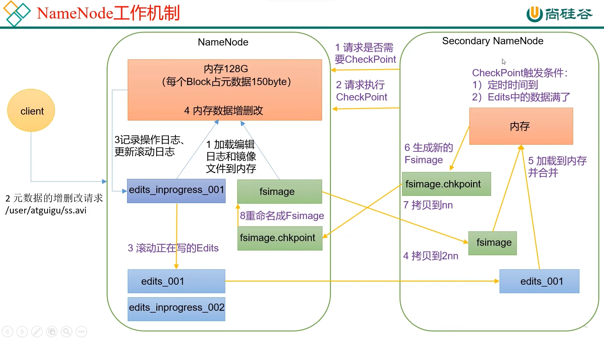

#### 查看 fsimage、editors

fsimge、editors 通过正常的手段是打不开的，可以通过 oiv、oev 命令来转成 XML 格式进行查看，具体的命令如下：

```shell
# oiv/oev -p 文件类型 -i fsimage/editors文件名 -o 输出路径
```

#### 检查点设置

2NN 会每隔一段时间就询问 NN 是否需要进行合并，询问的间隔时间和合并的合并的文件数量可以通过 `hdfs-site.xml` 进行配置，具体的配置代码如下：

```xml
<property>
    <!--只有当文件 editors 中的文件到达指定数量时才进行合并，默认默认 1000000-->
	<name>dfs.namenode.checkpoint.period</name>
    <value>1000000</value>
</property>
<property>
    <!--默认 2NN 一分钟向 NN 询问一次-->
	<name>dfs.namenode.checkpoint.check.period</name>
    <value>60s</value>
</property>
```

2NN 这种方式基本不用，一般都是配置 NN 的高可用。

### DataNode 工作机制

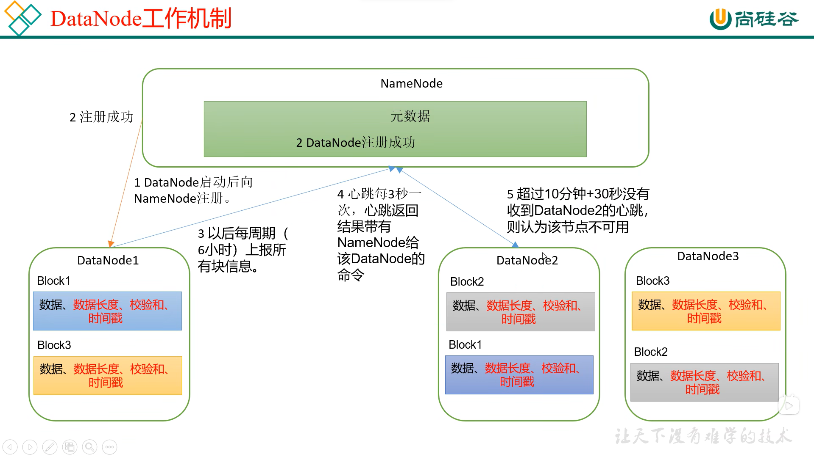

上述的时间可以通过配置文件进行配置，这里就不演示了。在 dataNode 内部会使用 crc32 算法对文件进行校验，来保证数据的准确性。

## MapReduce

### MapReduce 概述

#### 定义

MapReduce 是 Google 提出的一个软件架构，用于大规模数据集的并行运算。概念 Map 和 Reduce ，及他们的主要思想，都是从函数式编程语言借鉴的，还有从矢量编程语言借来的特性。

当前的软件实现是指定一个 Map 函数，用来把一组键值对映射成一组新的键值对，指定并发的 Reduce 函数，用来保证所有映射的键值对中的每一个共享相同的键组。

#### 优势、劣势

优点

> - 易于编程，用户只关心业务逻辑，实现框架接口
> - 良好的扩展性：可以动态增加服务器，解决计算资源不够的问题
> - 高容错性：任何一台挂掉可以将任务转移到其他节点
> - 适合海量数据计算（TB/PB），几千台服务器共同计算

缺点

> - 不擅长试试计算，不能达到毫秒级别
> - 不擅长流式计算 ，Sparkstreaming、Flink
> - 不擅长DAG有向无关环图计算（并非不行）。Spark 擅长

### WordCount 案例

#### MapReduce 编程规范

一般的 MapReduce 程序由 Mapper，Reducer，Driver 组成，但是有的程序也可能没有 Reducer。对于一个任务首先会分配给多个服务器（小的话也可能是一个），每个服务器来执行 Mapper 程序，然后将执行后的结果交给 Reducer 程序来进行汇总。

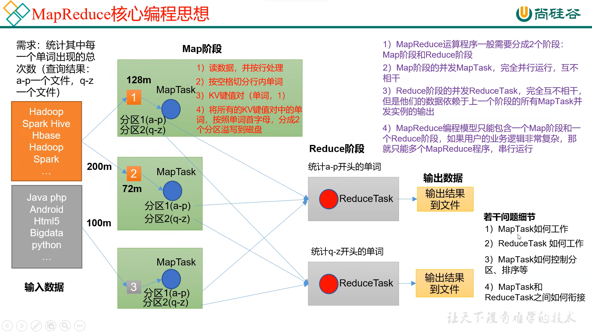

WordCount 的大致流程如下：

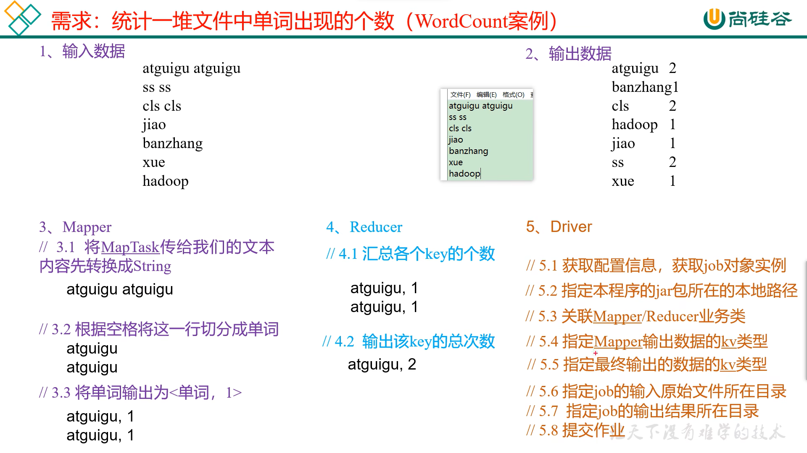

#### Mapper

通过继承 `org.apache.Hadoop.mapreduce.Mapper` 来实现自己的程序（在编写代码时，一定要`注意导包`），首先看一下 Mapper 类的各个方法及官方的说明：

```java
public class Mapper<KEYIN, VALUEIN, KEYOUT, VALUEOUT> {

    /**
   * The <code>Context</code> passed on to the {@link Mapper} implementations.
   */
    public abstract class Context
        implements MapContext<KEYIN,VALUEIN,KEYOUT,VALUEOUT> {
    }

    /**
   * Called once at the beginning of the task.
   */
    protected void setup(Context context
                        ) throws IOException, InterruptedException {
        // NOTHING
    }

    /**
   * Called once for each key/value pair in the input split. Most applications
   * should override this, but the default is the identity function.
   */
    protected void map(KEYIN key, VALUEIN value, 
                       Context context) throws IOException, InterruptedException {
        context.write((KEYOUT) key, (VALUEOUT) value);
    }

    /**
   * Called once at the end of the task.
   */
    protected void cleanup(Context context
                          ) throws IOException, InterruptedException {
        // NOTHING
    }

    /**
   * Expert users can override this method for more complete control over the
   * execution of the Mapper.
   * @param context
   * @throws IOException
   */
    public void run(Context context) throws IOException, InterruptedException {
        setup(context);
        try {
            while (context.nextKeyValue()) {
                map(context.getCurrentKey(), context.getCurrentValue(), context);
            }
        } finally {
            cleanup(context);
        }
    }
}
```

`org.apache.Hadoop.mapreduce.Mapper` 声明了一个 Mapper 可能用到的几个方法，值得注意的是 `map` 方法，他会对每一个 **Key/Value** 都执行一次。在我们的示例中，会将每一行的文本都执行一次 map 方法。WordCount 程序的 Mapper 类如下：

```java
package top.cafebabe202.study.Hadoop.mapreduce;

import org.apache.Hadoop.io.IntWritable;
import org.apache.Hadoop.io.LongWritable;
import org.apache.Hadoop.io.Text;
import org.apache.Hadoop.mapreduce.Mapper;

import java.io.IOException;

// 继承 Mapper 类型。四个泛型，是输入输出的 KV 类型
public class WordCountMapper extends Mapper<LongWritable, Text, Text, IntWritable> {

    // 创建两个变量，用于将本 map 的信息输出，写成公共变量可以减少对象的创建，提高性能
    // 因为每次写出的时候都是将对象进行序列化，写出之后并不会依赖原对象，所以可以使用同一个对象
    private final Text outK = new Text();
    private final IntWritable outV = new IntWritable(1);

    /**
     * @param key     在数据块中的字节偏移量
     * @param value   该 Map 的输入值，我觉得应该也可以是二进制流吧，不能只能处理文本数据吧，我觉得这个 value 每次的值应该按照类型进行分割吧，Text 类型是按照行划分的，不知道二进制数据分怎么划分
     * @param context 上下文对象，用于向 reduce 传输数据，也包含该任务相关的配置信息
     */
    @Override
    protected void map(LongWritable key, Text value, Context context) throws IOException, InterruptedException {

        // 这里每次都是传递过来一行文本信息，所以要将一行文本拆分成多个单词
        String[] words = value.toString().split(" ");
        for (String word : words) {
            this.outK.set(word);

            // 每一个单词都是第一次出现，所以每个单词次数都是 1，相同的单词会有多个 key/value 对
            context.write(outK, outV);
        }
    }
}
```

#### Reducer

首先还是先看一下官方的 `org.apache.Hadoop.mapreduce.Reducer` 类：

```java
package org.apache.Hadoop.mapreduce;

public class Reducer<KEYIN,VALUEIN,KEYOUT,VALUEOUT> {

  /**
   * The <code>Context</code> passed on to the {@link Reducer} implementations.
   */
  public abstract class Context 
    implements ReduceContext<KEYIN,VALUEIN,KEYOUT,VALUEOUT> {
  }

  /**
   * Called once at the start of the task.
   */
  protected void setup(Context context
                       ) throws IOException, InterruptedException {
    // NOTHING
  }

  /**
   * This method is called once for each key. Most applications will define
   * their reduce class by overriding this method. The default implementation
   * is an identity function.
   */
  protected void reduce(KEYIN key, Iterable<VALUEIN> values, Context context
                        ) throws IOException, InterruptedException {
    for(VALUEIN value: values) {
      context.write((KEYOUT) key, (VALUEOUT) value);
    }
  }

  /**
   * Called once at the end of the task.
   */
  protected void cleanup(Context context
                         ) throws IOException, InterruptedException {
    // NOTHING
  }

  /**
   * Advanced application writers can use the 
   * {@link #run(org.apache.Hadoop.mapreduce.Reducer.Context)} method to
   * control how the reduce task works.
   */
  public void run(Context context) throws IOException, InterruptedException {
    setup(context);
    try {
      while (context.nextKey()) {
        reduce(context.getCurrentKey(), context.getValues(), context);
        // If a back up store is used, reset it
        Iterator<VALUEIN> iter = context.getValues().iterator();
        if(iter instanceof ReduceContext.ValueIterator) {
          ((ReduceContext.ValueIterator<VALUEIN>)iter).resetBackupStore();        
        }
      }
    } finally {
      cleanup(context);
    }
  }
}
```

同样值得注意的是 `reduce` 方法，他会对每一个 **Key** 执行一次该方法，在我们的示例当中，Mapper 方法的输出类型是 Text/IntWriteable，其中 Key 为单词，在MapperRecuer 执行过程中会将所以的 Key 进行合并作为 Reducer 的输入 Key，将他们的 Value 组成一个集合作为 Reducer  的输入 Value。WordCount 的 Reducer 类如下：

```java
// 四个参数，分别是输入输出的 KV 类型，应该和 Mapper 的输出 KV 类型一样。
public class WordCountReducer extends Reducer<Text, IntWritable, Text, IntWritable> {
    private final IntWritable outV = new IntWritable();

    /**
     * @param text    Mapper 输出的 Key，每个 Key 只传入一次
     * @param values  Mapper 输出中每个 Key 的所有 value 值的集合
     * @param context 上下文对象，用于向 reduce 传输数据，也包含该任务相关的配置信息
     */
    @Override
    public void reduce(Text text, Iterable<IntWritable> values, Context context) throws IOException, InterruptedException {
        int sum = 0;
        for (IntWritable value : values) {
            sum += value.get();
        }
        this.outV.set(sum);
        context.write(text, outV);
    }
}
```

#### Driver

```java
// 任务的总流程，都差不多吧，八股
public class WorkCountDriver {
    public static void main(String[] args) throws IOException, InterruptedException, ClassNotFoundException {
        
        // 创建 job 对象
        Configuration configuration = new Configuration();
        Job job = Job.getInstance(configuration);

        // 设置启动类
        job.setJarByClass(WorkCountDriver.class);

        // 设置 map 和 reduce 类
        job.setMapperClass(WordCountMapper.class);
        job.setReducerClass(WordCountReducer.class);

        // 设置 map 和最终的 K,V 输出类型
        job.setMapOutputKeyClass(Text.class);
        job.setMapOutputValueClass(IntWritable.class);
        job.setOutputKeyClass(Text.class);
        job.setOutputValueClass(IntWritable.class);

        // 设置输出输出路径
        FileInputFormat.setInputPaths(job, new Path("D:\\wordcount"));
        FileOutputFormat.setOutputPath(job, new Path("D:\\wordcountres"));

        //提交任务
        boolean b = job.waitForCompletion(true);
        System.out.println(b ?"Successful":"fail");
        System.exit(b ? 0 : 1);
    }
}
```

#### 执行

首先创建一个输入目录，然后设置输出目录（和执行官方 WordCount 程序一样），然后点击运行按钮。运行结果和执行官方结果一样，这里不过多进行讲解。

### 序列化

#### 为什么不用 Java 序列化

如果想要传输或存储 Java 对象，可以通过实现 Java 的 Serializable 接口来实现序列化，既然 Java 本身就可以实现序列化，那么为什么 Hadoop 还要实现自己的序列化方法呢？

Java 在序列化对象时除了对象的数据信息时还会添加许多额外的信息，例如：校验码、头信息、类的继承关系等一些列内容，这些信息考虑了众多因素。但是 Hadoop 的序列化只是用来在系统内部进行传输，环境相对安全，并不需要过多的信息来保障安全，所以对于 Hadoop 来说 Java 自带的序列化框架过重了，需要自己创建一个轻量化的序列化体系。

#### 如何实现序列化

想要在 Hadoop 中实现序列化，只需要实现 `org.apache.hadoop.io.Writable` 接口即可，具体的要求请看后边的代码中的注释。

#### 示例

下边是手机用户的上网信息（随便写的），每一列的含义已经给定，使用 `\t` 进行分割，网址列可能会缺乏部分信息，现在要求按照手机号进行汇总，输出文件中将包含 4 列，分别是：手机号、上行流量总和、下行流量总和、流量总和。

```
序号	手机号		IP			网址				上行流量	下行流量	状态码
1	15123772126	192.168.1.1	www.baidu.com	191			1230		200
1	15123772122	192.168.1.2					191			1230		200
1	15123772126	192.168.1.1	www.baidu.com	191			1230		200
1	15123772122	192.168.1.2	www.google.com	191			1230		200
1	15123772126	192.168.1.1					191			1230		200
1	15123772126	192.168.1.1	www.baidu.com	191			1230		200
1	15123772126	192.168.1.1	www.baidu.com	191			1230		200
1	15123772122	192.168.1.2	www.baidu.com	191			1230		200
1	15123772126	192.168.1.1	www.baidu.com	191			1230		200
1	15123772126	192.168.1.1	www.baidu.com	191			1230		200
1	15123772126	192.168.1.1					191			1230		200
1	15123772122	192.168.1.2	www.baidu.com	191			1230		200
1	15123772126	192.168.1.1	www.baidu.com	191			1230		200
1	15123772126	192.168.1.1	www.baidu.com	191			1230		200
1	15123772126	192.168.1.1					191			1230		200
1	15123772126	192.168.1.1	www.baidu.com	191			1230		200
```

思路：其实很简单，即将 wordCount 的 value 类型换成自定义的 FlowBean 类型即可。以下是代码示例。

自定义的 FlowBean：

```java
/**
 * 创建一个 FlowBean 类，用来存储每个手机号的信息。
 */
public class FlowBean implements Writable {

    // 定义相关的属性，分别用来存储上行总和、下行总和
    private int upSum;
    private int downSum;

    // 必须要有一个空参构造器
    public FlowBean() {
    }
    
    // 这里省略了 Geter and Setter

    @Override
    public void write(DataOutput out) throws IOException {

        // 写出各个需要进行序列化的属性，这里的顺序可以随意；写出 int 类型使用 writeInt 方法
        out.writeInt(this.upSum);
        out.writeInt(this.downSum);
    }

    @Override
    public void readFields(DataInput in) throws IOException {

        // 读取一个整形；注意这里的顺序，要和上边写出的顺序相同，先写先读
        this.upSum = in.readInt();
        this.downSum = in.readInt();
    }

    @Override
    public String toString() {

        // 在输出到文件的时候将调用 toString 方法，总和是在这里进行计算的
        return this.upSum + "\t" + this.downSum + "\t" + (this.upSum + this.downSum);
    }
}
```

Mapper 类：

```java

public class MyMapper extends Mapper<LongWritable, Text, Text, FlowBean> {

    // 依旧是定义变量，用来写出数据
    private final FlowBean bean;
    private final Text key;

    public MyMapper() {
        this.bean = new FlowBean();
        this.key = new Text();
    }

    // 这里和 wordCount 十分相似，就是将 value 的 IntWrite 类型换成了自己编写的 FlowBean
    @Override
    protected void map(LongWritable key, Text value, Mapper<LongWritable, Text, Text, FlowBean>.Context context) throws IOException, InterruptedException {
        String[] strs = value.toString().split("\t");
        this.key.set(strs[1]);
        this.bean.setUpSum(Integer.parseInt(strs[strs.length - 3]));
        this.bean.setDownSum(Integer.parseInt(strs[strs.length - 2]));
        context.write(this.key, this.bean);
    }
}
```

Reducer 类：

```java
public class MyReducer extends Reducer<Text, FlowBean, Text, FlowBean> {
    private final FlowBean bean;

    public MyReducer() {
        this.bean = new FlowBean();
    }

    // 这里的 key value 和 wordCount 十分相似
    @Override
    protected void reduce(Text key, Iterable<FlowBean> values, Reducer<Text, FlowBean, Text, FlowBean>.Context context) throws IOException, InterruptedException {
        int downSum = 0, upSum = 0;

        // 将所有的上下行流量都加在一起
        for (FlowBean value : values) {
            upSum += value.getUpSum();
            downSum += value.getDownSum();
        }
        this.bean.setUpSum(upSum);
        this.bean.setDownSum(downSum);
        context.write(key, this.bean);
    }
}
```

上边是主要代码，省略了包信息和 Driver 代码（因为几乎一样）。执行结果如下：

```
15123772122	764		4920	5684
15123772126	2292	14760	17052
```

### MapReduce 核心框架原理

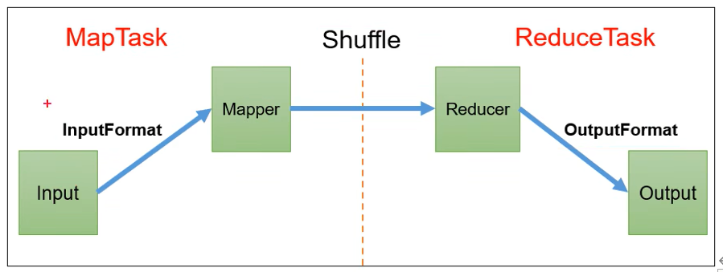

MapReduce 的工作流程框架如上图所示，要处理的数据首先经过 InputFormat 进行切片处理，然后将每个切片交给 Mapper 进行处理，Mapper 处理结束后经过 Shuffle 后再交给 Recuder，最后经过 OutFormat 输出。更加具体的流程图如下：


1. 首先需要输入文件
2. 客户端对输入数据进行逻辑切片
3. 将切片信息，程序的 jar 文件，Job 的配置文件放置到缓冲文件夹，提交任务
4. 开启 MapTask，MapTask **拉取**数据
5. 通过 InputFormat 对数据进行物理切片，形成 K,V 调用 Mapper 的 map 方法
6. 自定义的 map 方法执行对数据进行处理，然后通过 `Context.Write(K,V)` 方法写出数据
7. 写出的数据将被放到缓环形缓冲区
8. 当环形缓冲区被占用 80% 时将对数据进行分区，并通过**快速排序**对分区内的数据按照 key 的索引进行排序
9. 对排序完的数据进行溢写操作，将文件保存到磁盘
10. 在一次任务执行过程中可能产生多个溢写文件，在所有 Mapper 执行结束后将对所有分区的各个溢写文件进行**归并排序**
11. 在归并结束后，**可以**提前机型合并操作，来提高传输效率，也可以不进行


12. 启动 MapTask 任务，并告知 ReduceTask 处理数据的范围
13. ReduceTask 将数据从各个 MapTask 服务器**下载**（ReduceTask 主动）到本地，默认会先放在内存，达到一定阈值会溢写到磁盘，并进行归并排序处理
14. 每次读入一组数据，交给 Reduce 程序进行处理
15. 还**可以**对组内的数据进行排序处理
16. Reducer 将数据处理结束后通过 OutPutFormat 将文件保存到目标位置

#### 输入数据处理

在 WordCount 的示例中，对于文本文件的切分默认使用 TextInputFormat 对文本进行切分，然后对每行调用 Mapper 的 map 方法来进行处理。除 TextInputFormat 之外，还有 CombineInputFormat、SequenceInputFormat、KeyValueInputFormat 等，也可以自定义 InputFormat。

##### 并行度决定机制

在 Hadoop 中的任何文件会被分块进行存储，每个块被成为一个 block。在进行数据处理时还将进行切片处理，每个切片将被一个 MapperTask 运行，并且切片过程与分块没有关系，也就是说即使分块大小为 128Mb，在切片时也可以按照 100Mb 进行切片，但是**默认**切片大小等于分块大小。

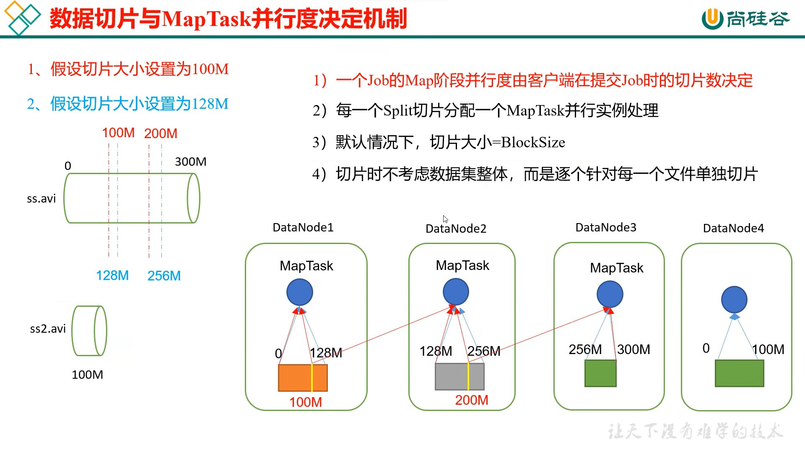

上图中的两种情况对比，假设分块大小为 128Mb。如果切片大小为 100Mb 那么对于第一块文件剩下的 28Mb 文件将和第二块的 78Mb 文件进行拼接形成以切片，以此类推，这样会造成有大量的数据在服务器之间进行移动（因为不同的块被存放在了不同的服务器上），会浪费资源。如果按照分块大小进行切片，将会避免该问题的发生，更加高效。

##### FileInputFormat


##### CombineTextInputFormat


在一般的 TextInputFormat 中，每个文件是单独进行切片处理的，也就是说如果切片大小为 128Mb，即使你的有 100 个文件的总和不够 128Mb 也会切为 100 片，这样就会启动 100 个 Mapper 任务，每一个占用 1core 1G 的资源，就会造成严重的资源浪费。

CombineTextInputFormat 在进行切分时，会先对文件进行单独切片，然后对每个片进行合并操作，这样就是减少 Mapper 数量，提升效率。

##### 任务提交过程

具体的代码执行过程可以通过 debug 进行查看，通过在 driver 类中的 `job.waitForCompletion`  处添加断点来进行 debug。以下是提交任务的流程：

> 1. 首先通过自定义的 Driver 类来进行配置所有的任务信息，然后通过 job.waitForCompletion(true) 来提交任务
>
>    > 1. 首先 job 类将检查任务的状态信息是否符为 DEFINE，如果是则进执行任务的提交
>    >
>    >    > 1. 在提交过程中，首先将保证任务的状态是 DEFINE
>    >    >
>    >    > 2. 通过 setUseNewAPI 来设置 API 的兼容。
>    >    >
>    >    > 3. 获取连接。在获取连接中，会根据任务的配置信息类决定在那里运行，通过设置 LocalClientProtocolProvider 或 YarnClientProtocolProvider 来设置任务在那里执行
>    >    >
>    >    > 4. 创建 JobSubmitter 对象并提交任务
>    >    >
>    >    >    > 1. 第一部将检查用户设置的路径是否正确（输入输出路径是否存在）
>    >    >    > 2. 获取用户的配置，生成 JobID 和工作的缓存目录
>    >    >    > 3. 对输入数据进行切片，并将需要的切片信息（这里知识逻辑切片，并没有真正切片，真正切片的是 InputFormat）放在缓存目录中，通过 writeConf 方法将配置写出到 job.xml 中
>    >    >    > 4. 最后提交任务，提交任务后缓存目录将被删除
>    >    >
>    >    > 5. 将任务的状态设置为 RUNNING
>    >
>    > 2. 开始监控任务状态，等待结束后返回返回结果状态
>
> 2. 显示任务是否执行成功

#### Shuffle

Shuffle 是一个比较复杂的过程，在这个阶段，可以对 Mapper 的输出结果进行排序，压缩，分区等操作，然后将处理后的数据交给 Reduce 处理。流程如下：


##### Partitioner

我们知道在 Map 阶段一个任务将被拆分，由多个 MapTask 进行执行，在 Redcue 阶段，也会有多个任务同时进行，每一个分区将会对应一个 RedcueTask。ReduceTask 的数量会受到 Partitioner 数量的影响。具体源码如下：

```java
// 如果设置的分区数大于 1 会执行自定义的 Partitioner，如果没有自定义会使用默认的 HashPartitioner
if (partitions > 1) {
    partitioner = (org.apache.hadoop.mapreduce.Partitioner<K,V>)
        ReflectionUtils.newInstance(jobContext.getPartitionerClass(), job);
} else {
    
    // 如果设置 ReduceTask 的任务数量为 0，将没有 Shuffle、Reucde 阶段，直接输出 Map 阶段的结果
    // 如果设置的 ReduceTask 任务数大于 1 但是小于分区数，会出现 IO 异常
    
    // 如果设置的 partitioners 为 1，将不使用自定义的 Partitioner，直接生成一个分区
    partitioner = new org.apache.hadoop.mapreduce.Partitioner<K,V>() {
        @Override
        public int getPartition(K key, V value, int numPartitions) {
            return partitions - 1;
        }
    };
    
    //如果 ReducerTask 任务数量大于分区数，将会产生空文件
}
```

**注意**：自定义的 Partitioner 编号必须从 0 开始，并且要**连续**，不能跳号。

##### 排序

MapTask 阶段

> 1. 它会将处理的结果暂时放到环形缓冲区中，当环形缓冲区使⽤率达到⼀定阈值后，再对缓冲区中的数据进行⼀次快速排序，并将这些有序数据溢写到磁盘上。
> 2. 溢写完毕后，它会对磁盘上所有文件进行归并排序。

ReduceTask 阶段

当所有数据拷贝完毕后，ReduceTask 统一对内存和磁盘上的所有数据进行⼀次归并排序。

> 1. 部分排序：MapReduce 根据输⼊记录的键对数据集排序。保证输出的每个⽂件内部有序。
> 2. 全局排序：最终输出结果只有⼀个⽂件，且⽂件内部有序。实现⽅式是只设置一个 ReduceTask。但该⽅法在处理⼤型⽂件时效率极低，因为一台机器处理所有⽂件，完全丧失了 MapReduce 所提供的并⾏架构。
> 3. 辅助排序：(GroupingComparator 分组)在 Reduce 端对 key 进⾏分组。应⽤于：在接收的 key 为 bean 对象时，想让⼀个或⼏个字段相同(全部字段⽐较不相同)的 key 进⼊到同⼀个 reduce ⽅法时，可以采⽤分组排序。
> 4. 二次排序：在⾃定义排序过程中，如果 compareTo 中的判断条件为两个即为二次排序。

##### 案例

1. 对 FlowBean 的程序输出按照总流量进行倒序排序

   > 直接实现时不能实现的，可以将 FlowBean 的输出作为本案例的输入，然后将 FlowBean 类作为 key，实现 WritableComparable，然后进行排序就可以了。

2. 在倒叙排序的基础上进行按照手机号分区

   > 在案例 1 的基础上进行自定义 Partitioner 就可以了。

这两个案例比较简单，就不演示了。

##### Combiner

由上边的 Shuffle 的流程图所示，Combiner 是一个可选的过程，并不是必须的组件。设置 Combiner 可以将 Mapper 的输出结果进行预聚合，从而降低在服务器之间传输的成本。Combiner 本质与 Reducer 一样，只不过是执行在 Map 阶段，所以自定义的 Combiner 同样是继承 Reducer 类，然后通过 `job.setCombinerClass()` 来设置，通常直接设置成自定义的 Reducer 类就可以。这里同样是不

#### 输出数据处理

OutputFormat 负责将计算产生的结果进行输出，输出的目标不一定是文件，也可能是 MySQL、HBase 等其他介质。用户y也可以通过自定义 OutPutFormat 组件来实现自己的功能，系统默认使用 FileOutputFormat。

##### 示例

给出如下的网址文件，将带有 atguigu 的网址放到单独的文件中。

```
http://www.atguigu.com
http://www.google.com
http://www.baidu.com
http://www.atguigu.com
```

Mapper 和 Reducer 这里就不过多展示了，下面是自定义的 LogFileOutputFormat 和 LogRecordWrite

```java

// 其实这个类只是一个壳，并没有真正的写出数据，而是通过这个类获取一个 RecordWriter 类来真正的进行输出
// 为啥要这样设计呢？
public class LogFileOutputFormat extends FileOutputFormat<Text, NullWritable> {
    @Override
    public RecordWriter<Text, NullWritable> getRecordWriter(TaskAttemptContext job) throws IOException, InterruptedException {
        return new LogRecordWrite(job);
    }
}
```

```java
// 这是真正向外输出数据的类，泛型是输入数据的类型
public class LogRecordWrite extends RecordWriter<Text, NullWritable> {
    private final FSDataOutputStream atguiguOut;
    private final FSDataOutputStream otherOut;

    // 一个构造器，传过来的是 context，里面包含了任务信息
    public LogRecordWrite(TaskAttemptContext context) {
        try {

            // 通过 context 的配置信息创建一个 FS 的对象，用来输出数据，这里不能用 java.io 包下的，因为生产环境会存放在 Hadoop 集群上
            FileSystem fileSystem = FileSystem.get(context.getConfiguration());

            // 创建连个流
            this.atguiguOut = fileSystem.create(new Path("/home/zh/hadoop/output/002/atguigu"));
            this.otherOut = fileSystem.create(new Path("/home/zh/hadoop/output/002/other"));
        } catch (IOException e) {
            throw new RuntimeException(e);
        }
    }

    @Override
    public void write(Text key, NullWritable value) {
        String log = key.toString();
        try {
            if (log.contains("atguigu")) {
                this.atguiguOut.writeBytes(log + "\n");
            } else {
                this.otherOut.writeBytes(log + "\n");
            }
        } catch (IOException e) {
            throw new RuntimeException(e);
        }

    }

    @Override
    public void close(TaskAttemptContext context) {
        IOUtils.closeStream(this.atguiguOut);
        IOUtils.closeStream(this.otherOut);
    }
}
```

#### MapTask 工作机制

##### 简述

MapReduce  程序主要分为连个阶段：MapTask 和 RecudeTask。MapTask 阶段主要讲输入文件进行切片处理并计算，并通过 Shuflle 机制对数据进行排序，为 ReduceTask 做准备。

在 Hadoop 中，主要是由 MapTask 类进行实现的，主要包含了 Read、Map、Collect、溢写、Merge 五个阶段，最后 Merge 阶段产生的输出文件将被 ReduceTask 拉取。


##### MapTask 工作流程

> 1. 初始化输入文件
>
>    > 1. 读入输入文件，对文件进行物理切分
>
> 2. 执行 Mapper
>
>    > 1. 初始化 Mapper 对象
>    >
>    > 1. 循环对每一组 KV 调用自定义 Mapper 的 map 方法
>    >
>    > 2. 按照业务逻辑对数据进行处理
>    >
>    > 3. 通过 context 对象将处理的数据进行写出
>    >
>    >    > 1. 检查写出的 KV 类型和预设的类型是否相符，检查分区编号是否正常，如果不符合将抛出异常
>    >    > 2. 对 KV 进行序列化，并将 index、partition、keystar、valstart 放入环形缓冲区的 Meta 区域；将 Key、Value、unused 放入环形缓冲区的 Records 区域
>
> 3. 关闭输入资源
>
> 4. 关闭 mapperContext
>
>    > 1. 对环形缓冲区的数据进行排序溢写
>    >
>    >    > 1. 创建临时工作空间并创建输入流
>    >    > 2. 对缓冲区内的数据进行快速排序
>    >    > 3. 循环每一个分区，将数据溢写到文件
>    >
>    > 2. 对分区进行归并排序

#### ReduceTask 工作机制

##### 简介

ReduceTask 在 MapTask 之后，主要分为三个阶段：Copy、Sort、Reduce。在 MapTask 阶段的分区数量将决定 ReduceTask 的并行度，也可以没有 ReduceTask 阶段，直接将 MapTask 阶段的结果输出。


##### ReduceTask 工作流程

> 1. 添加 copy、sort、reduce 三个阶段到 progress，每完成一个阶段就会进行标记
>
> 2. 设置新 API 的兼容，初始化 ReduceTask 对象
>
>    > 1. 获取 OutputFormat 实例，默认是 TextOutputFormat
>
> 3. 创建 shuffleConsumerPlugin 对象，并进行初始化操作
>
>    > 1. 初始化参数，创建 ShuffleSchedulerImpl 对象
>    >
>    >    > 1. 获取所有的 MapTask 数量来方便抓取
>    >
>    > 2. 创建 MergeManager 对象
>    >
>    >    > 1. 分别创建 MemoryMerger 和 DiskMerger 来归并内存和磁盘上的数据
>
> 4. 执行 shuffleConsumerPlugin 的 run 方法
>
>    > 1. 在其中将进行数据的抓取和排序的工作
>
> 5. 执行自定的 Reducer
>
>    > 1. 初始化 Reducer 对象
>    > 2. 对数据的没有给 key 调用 Reducer 的逻辑
>    > 3. 将数据进行输出
>
> 6. 运行结束

#### Join 计算

##### 什么是 Join

在数据库查询过程中，有时需要用到 join 语句来对不同的表进行连接，来实现数据的展示。在大数据处理过程往往也需要进行同样的操作，比如下面的例子：

现在有两个文件，分别存放了订单数据和商品名称数据，现在将要将订单和商品名称进行关联。

```
# order 数据，分别是 订单编号、商品编号、数量
1000001	01	1
1000002	01	3
1000003	02	2
1000004	01	3

# pid 数据，分别是 商品编号、商品名称
01	小米
02	华为

# 预输出结果
1000004 小米    3
1000002 小米    3
1000001 小米    1
1000003 华为    2
```

##### 解决思路

在 MapperTask 执行原理中可以看到，在执行 Mapper 之前会先对 Mapper 对象进行初始化操作，这个时候，我们可以通过 context 对象来得知数据是从那个文件传输过来的，通过观察上边的数据，我们可以将商品编号列作为 Mapper 输出的 Key，并将其他数据封装成一个类（不管是那个文件的数据，都塞在同一个对象里），然后传递给 Reducer 进行处理。在 Reducer 中再将名称赋值给所有的对象。

##### 代码示例

```java
public class TableBean implements Writable {

    private String order;
    private String pid;
    private int amount;
    private String name;
    private String flag;

   	// getter and setter

    @Override
    public void write(DataOutput out) throws IOException {
        out.writeUTF(this.order);
        out.writeUTF(this.pid);
        out.writeInt(this.amount);
        out.writeUTF(this.name);
        out.writeUTF(this.flag);
    }

    @Override
    public void readFields(DataInput in) throws IOException {
        this.order = in.readUTF();
        this.pid = in.readUTF();
        this.amount = in.readInt();
        this.name = in.readUTF();
        this.flag = in.readUTF();
    }

    @Override
    public String toString() {
        return this.order + "\t" + this.name + "\t" + this.amount;
    }
}

```

```java
public class JoinMapper extends Mapper<LongWritable, Text, Text, TableBean> {

    private String flag;
    private final Text outKey = new Text();
    private final TableBean outValue = new TableBean();

    @Override
    public void setup(Context context) {
        FileSplit fileSplit = (FileSplit) context.getInputSplit();
        this.flag = fileSplit.getPath().getName();
    }

    @Override
    public void map(LongWritable key, Text value, Mapper<LongWritable, Text, Text, TableBean>.Context context) throws IOException, InterruptedException {
        String[] split = value.toString().split("\t");
        this.outValue.setFlag(this.flag);

        // 不管是那个表的数据都塞在 TableBean
        if (this.flag.contains("order")) {
            this.outValue.setOrder(split[0]);
            this.outValue.setPid(split[1]);
            this.outValue.setAmount(Integer.parseInt(split[2]));
            this.outValue.setName(""); // 由于要进行输出，所以不能有 null，所以要赋空值
        } else {
            this.outValue.setOrder("");
            this.outValue.setPid(split[0]);
            this.outValue.setAmount(0);
            this.outValue.setName(split[1]);
        }
        this.outKey.set(this.outValue.getPid());
        context.write(this.outKey, this.outValue);
    }
}

```

```java
public class JoinReducer extends Reducer<Text, TableBean, TableBean, NullWritable> {
    @Override
    public void reduce(Text key, Iterable<TableBean> values, Reducer<Text, TableBean, TableBean, NullWritable>.Context context) throws IOException, InterruptedException {
        TableBean nameBean = new TableBean();
        List<TableBean> beans = new LinkedList<>();

        // 遍历所有的对象，将标记了名称的对象找出来
        for (TableBean value : values) {
            if (value.getFlag().contains("order")) {
                TableBean bean = new TableBean();
                try {
                    BeanUtils.copyProperties(bean, value); // 这里要对象复制，并不能直接添加 value 对象，因为每次返回的 value 对象相同，只是状态不同
                    beans.add(bean);
                } catch (IllegalAccessException | InvocationTargetException e) {
                    throw new RuntimeException(e);
                }
            } else {
                try {
                    BeanUtils.copyProperties(nameBean, value);
                } catch (IllegalAccessException | InvocationTargetException e) {
                    throw new RuntimeException(e);
                }
            }
        }

        // 循环输出每一个对象
        for (TableBean bean : beans) {
            bean.setName(nameBean.getName()); //  记得设置名称
            context.write(bean, NullWritable.get());
        }
    }
}
```

##### MapJoin

在刚刚的实例中，存在一个比较明显的问题，就是如果 order 表的一个 pid 条数过多将会发生数据倾斜。像这种一个大表和一个小表的情况下，可以将小表进行缓存，然后在处理大表的时候将 pid 进行 join 操作。

```java
public class MapJoinMapper extends Mapper<LongWritable, Text, Text, NullWritable> {

    private final Map<String, String> map = new HashMap<>();
    private final Text outKey = new Text();
    
    @Override
    protected void setup(Mapper<LongWritable, Text, Text, NullWritable>.Context context) throws IOException {
        
        // 在 setup 中对缓存文件进行处理，添加 Map 中方便使用
        URI[] cacheFiles = context.getCacheFiles();
        FileSystem fileSystem = FileSystem.get(context.getConfiguration());
        FSDataInputStream fsDataInputStream = fileSystem.open(new Path(cacheFiles[0]));
        BufferedReader bufferedReader = new BufferedReader(new InputStreamReader(fsDataInputStream, StandardCharsets.UTF_8));

        String line;
        while (StringUtils.isNotEmpty(line = bufferedReader.readLine())) {
            String[] split = line.split("\t");
            this.map.put(split[0], split[1]);
        }
    }

    @Override
    protected void map(LongWritable key, Text value, Mapper<LongWritable, Text, Text, NullWritable>.Context context) throws IOException, InterruptedException {
        String[] split = value.toString().split("\t");
        
        // 通过刚刚的缓存对文件进行 join 操作
        this.outKey.set(split[0] + "\t" + this.map.get(split[1]) + "\t" + split[2]);
        context.write(this.outKey, NullWritable.get());
    }
}
```

```java
public class MapJoinDriver {
    public static void main(String[] args) throws IOException, InterruptedException, ClassNotFoundException, URISyntaxException {
        Job job = Job.getInstance(new Configuration());
        job.setJarByClass(MapJoinDriver.class);

        job.setMapOutputKeyClass(Text.class);
        job.setMapOutputValueClass(NullWritable.class);
        job.setMapperClass(MapJoinMapper.class);

        FileInputFormat.setInputPaths(job, new Path("/home/zh/hadoop/input/004/input"));
        FileOutputFormat.setOutputPath(job, new Path("/home/zh/hadoop/output/004"));

        // 设置需要缓存的文件
        job.addCacheFile(new URI("file:///home/zh/hadoop/input/004/catch/pid"));

        // 这个比较简单，不进行 Reduce 操作
        job.setNumReduceTasks(0);
        
        boolean res = job.waitForCompletion(true);
        System.out.println(res ? "success" : "fail");
        System.exit(res ? 0 : 1);
    }
}
```

#### ETL 清洗

##### 什么是 ETL 清洗

这个其实很简单，就是在 Mapper 中对数据进行过滤。将需要的数据通过 context 进行 write，不需要的数据不进行 write 操作就好了。

##### 常用正则表达式

这种东西百度一搜一大把，我就就不进行整理了，[这里](https://www.rongcloud.cn/blog/?p=5818)给出个搜索结果，感觉还挺全的。

### Hadoop 压缩

#### 有哪些压缩算法

| 压缩格式 | 是否自带 |  算法   |  扩展名  | 是否可切片 |      启用后是否需要修改程序      |
| :------: | :------: | :-----: | :------: | :--------: | :------------------------------: |
| DEFAULT  |    是    | DEFAULT | .default |     否     |    和文本处理一样，不需要处理    |
|   Gzip   |    是    | DEFAULT |   .gz    |     否     |    和文本处理一样，不需要处理    |
|  bzip2   |    是    |  bzip2  |   .bz2   |     是     |    和文本处理一样，不需要处理    |
|   LZO    |    否    |   LZO   |   .lzo   |     是     | 需要建立所以，还需要指定输入格式 |
|  Snappy  |    是    | Snappy  | .snappy  |     否     |    和文本处理一样，不需要处理    |

#### 压缩性能比较

| 压缩算法 | 原始文件大小 | 压缩文件大小 | 压缩速度 | 解压速度 |
| :------: | :----------: | :----------: | :------: | :------: |
|   gzip   |    8.3GB     |    1.8GB     | 17.5MB/s |  58MB/s  |
|  bzip2   |    8.3GB     |    1.1GB     | 2.4MB/s  | 9.5MB/s  |
|   LZO    |    8.3GB     |    2.9GB     | 49.3MB/s | 74.6MB/s |

#### 生产换环境怎么用


#### 配置方式

某些压缩算法需要本地连接库，在使用算法之前可以通过 `hadoop ckecknative` 命令查看支持哪些压缩方式

```shell
# hadoop ckecknative
Native library checking:
hadoop:  true /home/zh/bin/hadoop-3.1.3/lib/native/libhadoop.so.1.0.0
zlib:    true /lib64/libz.so.1
zstd  :  true /usr/lib64/libzstd.so.1
snappy:  true /usr/lib64/libsnappy.so.1
lz4:     true revision:10301
bzip2:   true /usr/lib64/libbz2.so.1
openssl: false Cannot load libcrypto.so (libcrypto.so: 无法打开共享对象文件: 没有那个文件或目录)!
ISA-L:   false libhadoop was built without ISA-L support
```

**注意**：snappy 需要 linux 环境和 hadoop3.x 的支持

|                             参数                             |                   默认值                    |     阶段     |                      建议                      |
| :----------------------------------------------------------: | :-----------------------------------------: | :----------: | :--------------------------------------------: |
|            io.compression.codecx（core-site.xml）            |                     无                      |     压缩     | Hadoop 使用文件扩展名判断是否支持某种编解码器  |
|      mapreduce.map.output. compress（mapred-site.xml）       |                    false                    | mapper 输出  |           这个参数设置 true 启用压缩           |
|   mapreduce.map.output. compress.codec（mapred-site.xml）    | org.apache.hadoop. io.compress.DefaultCodec |  mapper输出  | 企业使用 LZO 或 Snappy编解码器在次阶段压缩数据 |
| mapreduce.output. fileoutputformat.compress（mapred-site.xml） |                    false                    | reducer 输出 |           这个参数设为 true 启用压缩           |
| mapreduce.output. fileoutputformat.compress（mapred-site.xml） | org.apache.hadoop.io. compress.DefaultCodec | reudcer 输出 |   使用标准工具或者编解码器，如 gzip 和 bzip2   |

在代码中启用非常的简单，只需要在驱动类中添加如下配置即可：

```java
// 设置 map 阶段的压缩
configuration.setBoolean("mapreduce.map.output.compress", true);
configuration.setClass("mapreduce.map.output.compress.codec", BZip2Codec.class, CompressionCodec.class);

// 设置 reduce 阶段的压缩
FileOutputFormat.setCompressOutput(job, true);
FileOutputFormat.setOutputCompressorClass(job, BZip2Codec.class);
```

## YARN

### 理论

Yarn 是一个资源调度平台，负责为运算程序提供服务器运算资源，相当于一个分布式的操作系统平台，而 MapReduce 等运算程序则相当于操作系统之上的应用程序。

#### Yarn 基础架构


#### Yarn 的工作机制


工作流程如下：

1.  

#### Mapreduce/HDFS/Yarn

#### 调度器和调度算法

目前，Hadoop 作业调度器主要由三种：FIFO、容量（Capacity Scheduler）调度器和公平（Fair Scheduler）调度器。Apache Hadoop3.1.3 默认的资源调度器是 Capacity Scheduler。

CDH 框架默认调度器是 Fair Scheduler。

具体配置详见：`yarn-defalut.xml` 文件

```xml
<property>
	<description> </description>
    <name>yarn.resourcemanager.scheduler.class</name
        <value>org.apach.hadoop.server.resourcemanager.scheduler.capacity.CapacityScheduler</value>
</property>
```

##### FIFO

FIFO 调度器（First In First Out）：单队列，根据提交作业的先后顺序，先来先服务。一般情况下不是使用该调度器。


 

##### 容量调度器

是由雅虎开发的。


##### 公平调度器

 由 FaceBook 开发。 


 


#### Yarn 在生产环境下需要配置的参数

#### 命令行操作 Yarn

### 怎么玩

#### 生产环境下怎么配置

#### 容量调度器在生产环境怎么配置

#### 公平调度器的配置

#### Yarn tool 接口

