# 😄 Hadoop

### Hadoop概念

#### Hadoop是什么


#### Hadoopå‘展å²


.png>)

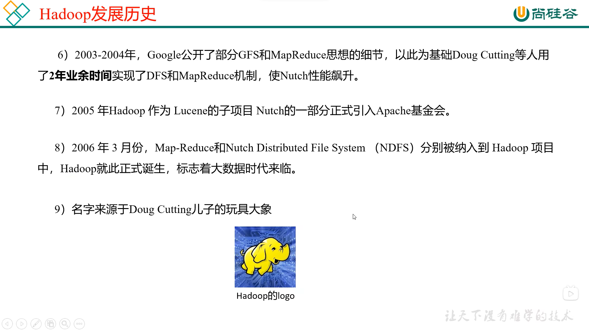


#### Hadoop的三大å‘行版


#### Hadoop的优势


#### Hadoop的组æˆï¼ˆé¢è¯•é‡ç‚¹ï¼‰

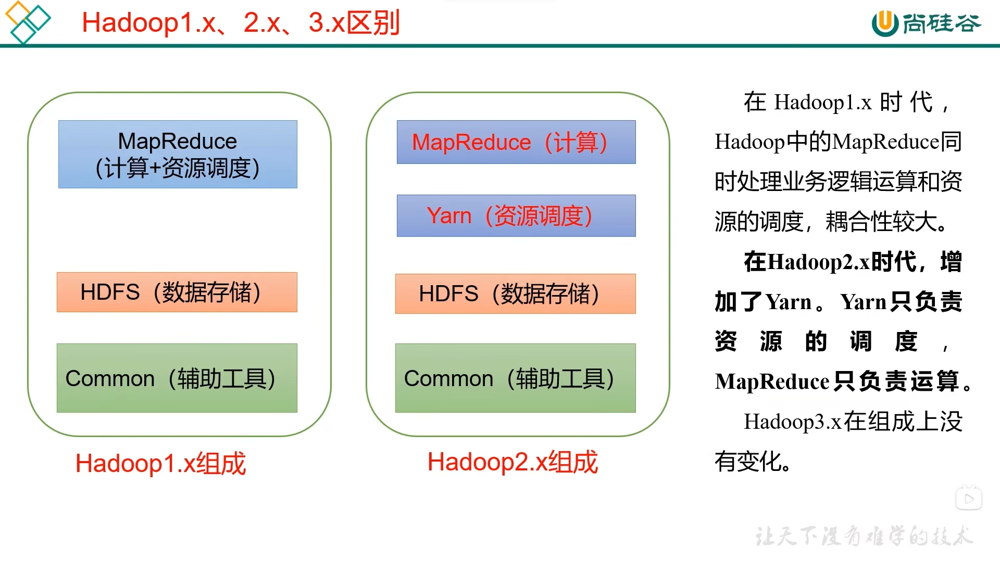

**HDFS概述**

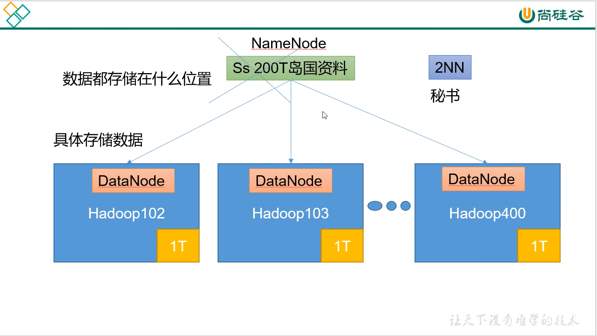


**YARN资æºè°ƒåº¦**


一个container需è¦1-8G内存，至少1个CPU。


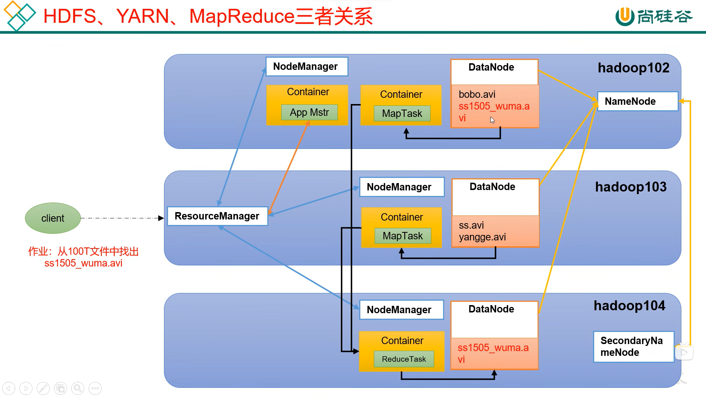

#### 大数æ®æŠ€æœ¯ç”Ÿæ€ä½“ç³»

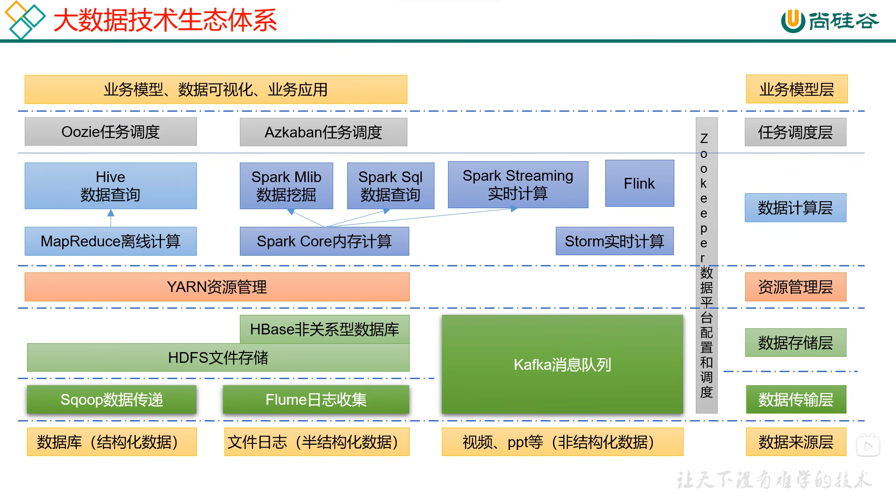

#### æ¨è系统案例

### ç¯å¢ƒæ­å»º

#### 模æ¿è™šæ‹Ÿæœºå‡†å¤‡

安装一个虚拟机，我是在 PVE 中安装的 openSUSE 虚拟机。

é…ç½®

* CPU:：2
* 内存：4G
* ç£ç›˜ï¼š64G

内存和ç£ç›˜ä¸è¦å¤ªå°ï¼Œå› ä¸ºæ¯ä¸€ä¸ª yarn ä»»åŠ¡é»˜è®¤éœ€è¦ 1G 的内存，大一点方便使用。

创建一个普通用户，ä¸å»ºè®®ä½¿ç”¨ root 用户对 Hadoop 集群进行æ“作，所以安装ç¯å¢ƒå°±ä½¿ç”¨é root 用户，é¿å…出ç°æƒé™é—®é¢˜ã€‚

**安装JDKã€Hadoop**

安装 JDK-11 å’Œ Hadoop-3.1.3，并é…ç½®ç¯å¢ƒå˜é‡ã€‚

```shell
> cat /etc/profile.d/my_env.sh 
export JAVA_HOME=/home/zh/bin/jdk-11
export Hadoop_HOME=/home/zh/bin/Hadoop-3.1.3
export PATH=$PATH:$JAVA_HOME/bin:$Hadoop_HOME/bin:$Hadoop_HOME/sbin
```

Hadoop 也è¦é…置对应的 home 目录，并且，建议åŒæ—¶é…ç½® sbin 目录，方便使用。

ç¯å¢ƒå˜é‡çš„é…置并ä¸æ˜¯ç›´æ¥åœ¨ `/etc/profile` 文件，SUSE 对 `/etc/profile` 的声æ˜å¦‚下：

```shell
# PLEASE DO NOT CHANGE /etc/profile. There are chances that your changes
# will be lost during system upgrades. Instead use /etc/profile.local for
# your local settings, favourite global aliases, VISUAL and EDITOR
# variables, etc ...
```

æ„æ€å°±æ˜¯è¯´å¦‚æœç³»ç»Ÿå‡çº§å°†ä¼šé‡æ–°é…置该文件，会导致自定义é…置失效，该文件会自动添加 `/etc/profile.d` 下的文件，所以应该在 `/etc/profile.d` 下创建新的文件æ¥è‡ªå®šä¹‰ç¯å¢ƒå˜é‡ã€‚

**其他é…ç½®**

网络 ip 地å€ä¸ºï¼š192.168.1.102，hostname 为：Hadoop102，**并关闭防ç«å¢™**。

é…ç½® hosts 文件：

| hostname |   Hadoop102   |   Hadoop103   |   Hadoop104   |
| :------: | :-----------: | :-----------: | :-----------: |
|    ip    | 192.168.1.102 | 192.168.1.103 | 192.168.1.104 |

é…ç½® ssh çš„å…密登陆，首先生æˆå¯†é’¥å’Œå…¬é’¥ã€‚

```shell
> ssh-keygen
Generating public/private rsa key pair.
Enter file in which to save the key (/home/zh/.ssh/id_rsa): 
Enter passphrase (empty for no passphrase): 
Enter same passphrase again: 
Your identification has been saved in /home/zh/.ssh/id_rsa
Your public key has been saved in /home/zh/.ssh/id_rsa.pub
The key fingerprint is:
SHA256:zfwWw2j9jOv10NlzFDrcsD5ezDKeFT4LBjPFdnYvfxA zh@Hadoop102
The key's randomart image is:
+---[RSA 3072]----+
|                 |
|            .    |
|             =E+.|
|         + ++ B.+|
|        S *+==ooo|
|         . .=*=*+|
|            +B=X*|
|           .+oOo*|
|           .o+ ..|
+----[SHA256]-----+
```

生æˆå¯†é’¥å’Œå…¬é’¥ä¹‹å将公钥上传到需è¦å…密登陆的æœåŠ¡å™¨ä¸Šï¼Œå› ä¸ºè¿™æ˜¯æ¨¡æ¿è™šæ‹Ÿæœºï¼Œæ‰€ä»¥ä¸Šä¼ ç»™è‡ªå·±å°±å¯ä»¥ï¼Œå…‹éš†åå°±å¯ä»¥ä½¿ç”¨äº†ã€‚

```shell
> ssh-copy-id 192.168.1.102
/usr/bin/ssh-copy-id: INFO: Source of key(s) to be installed: "/home/zh/.ssh/id_rsa.pub"
The authenticity of host '192.168.1.102 (192.168.1.102)' can't be established.
ECDSA key fingerprint is SHA256:rfMm+vaeZgiQUFcODiLhKgO3Gs31sZHyordqn8+n6e0.
Are you sure you want to continue connecting (yes/no/[fingerprint])? yes
/usr/bin/ssh-copy-id: INFO: attempting to log in with the new key(s), to filter out any that are already installed
/usr/bin/ssh-copy-id: INFO: 1 key(s) remain to be installed -- if you are prompted now it is to install the new keys
Password: 

Number of key(s) added: 1

Now try logging into the machine, with:   "ssh '192.168.1.102'"
and check to make sure that only the key(s) you wanted were added.
```

通过上述的命令会自动将刚刚生æˆçš„公钥拷è´åˆ°ç›®æ ‡æœåŠ¡å™¨çš„åŒç”¨æˆ·åçš„ .ssh 文件夹下，这样以åå°±å¯ä»¥é€šè¿‡ **ssh hostname** çš„æ–¹å¼ç™»é™†ç›®æ ‡æœåŠ¡å™¨çš„åŒç”¨æˆ·å账户了。

在集群中进行文件的传输有è¿ä¸ªå¸¸ç”¨çš„命令，分别是 scp å’Œ rsync，用法如下：

```shell
# 文件拷è´å‘½ä»¤ï¼Œä»æœ¬åœ°åˆ°è¿œç¨‹æœåŠ¡å™¨ï¼Œå¯ä»¥å°†è¿ä¸ªéƒ¨åˆ†è°ƒè¿‡æ¥ï¼Œä»è¿œç¨‹åˆ°æœ¬åœ°
scp æºåœ°å€ 用户å@hostname:目标地å€

# 文件åŒæ­¥å·¥å…·ï¼Œå¯ä»¥åªå¤åˆ¶æœ€æ–°æ›´æ”¹çš„文件，åŒæ ·å¯ä»¥è°ƒæ¢ä¸¤ä¸ªåœ°å€
rsync æºåœ°å€ 用户å@hostname:目标地å€
```

因为集群需è¦ç»å¸¸è¿›è¡Œé…置的分å‘，并ä¸éœ€è¦å¯¹æ‰€æœ‰æ–‡ä»¶è¿›è¡Œå…¨éƒ¨å¤åˆ¶ï¼Œåªè¦æ›´æ–°å˜åŒ–的文件就å¯ä»¥ï¼Œå¯ä»¥ç”¨ä»¥ä¸‹çš„脚本方便使用。

```shell
#!/bin/bash
if [ $# -lt 1 ];then
        echo "args errors!"
        exit
fi

for Hadoop in Hadoop102 Hadoop103 Hadoop104;do
        for f in $@;do
                if [ -d $f ];then
                        ssh $Hadoop mkdir -p $(pwd)/$f
                        rsync -av $f $Hadoop:$(pwd)/$f
                else
                        echo $f not exists
                fi
        done
done
```

感觉上边的脚本并ä¸å®Œç¾ï¼Œä½†æ˜¯æˆ‘也ä¸ä¼šæ”¹ ^ \_ ^ 。

**测试**

首先检查 java å’Œ Hadoop ç¯å¢ƒå˜é‡æ˜¯å¦æœ‰æ•ˆï¼Œç„¶å检查网络é…置并测试网络是å¦è¿åŒã€‚

最å通过以下演示执行 Hadoop çš„ workdCount 程åºæ£€æŸ¥ Hadoop 是å¦èƒ½å¤Ÿå·¥ä½œã€‚首先创建一个文件夹用æ¥å­˜æ”¾è¾“入的文件，并且在其中新建一个文本文件输入些å•è¯ï¼Œä½¿ç”¨ç©ºæ ¼åˆ†å¼€ã€‚

```shell
> mkdir wcinput
> vim wcinput/word.txt
zh dahai
cls zh
zh ada
dahai zh ada cls
```

执行 Hadoop çš„ wordcount 程åºæµ‹è¯• Hadoop 是å¦èƒ½å¤Ÿæ­£å¸¸å·¥ä½œã€‚

```shell
> Hadoop jar bin/Hadoop-3.1.3/share/Hadoop/mapreduce/Hadoop-mapreduce-examples-3.1.3.jar wordcount wcinput wcoutput
2023-01-04 20:53:36,863 INFO impl.MetricsConfig: loaded properties from Hadoop-metrics2.properties
2023-01-04 20:53:36,918 INFO impl.MetricsSystemImpl: Scheduled Metric snapshot period at 10 second(s).
2023-01-04 20:53:36,918 INFO impl.MetricsSystemImpl: JobTracker metrics system started
2023-01-04 20:53:36,997 INFO input.FileInputFormat: Total input files to process : 1
......
2023-01-04 20:53:38,205 INFO mapreduce.Job:  map 100% reduce 100%
2023-01-04 20:53:38,206 INFO mapreduce.Job: Job job_local689621915_0001 completed successfully
2023-01-04 20:53:38,213 INFO mapreduce.Job: Counters: 30
......
```

如æœä¸Šè¿°æ‰§è¡Œæ²¡æœ‰æŠ¥é”™ï¼Œè¯´æ˜ç¨‹åºæ‰§è¡ŒæˆåŠŸï¼Œè¾“出路径下生æˆçš„ \_SUCCESS 没有任何内容，表示程åºæˆåŠŸï¼Œpart-r-00000 文件用æ¥å­˜æ”¾è¾“出结æœã€‚

```shell
> ls
bin  wcinput  wcoutput

> cd wcoutput
part-r-00000  _SUCCESS

> cat part-r-00000 
ada     2
cls     2
dahai   2
zh      4
```

如æœä¸Šè¿°æµ‹è¯•å…¨éƒ¨é€šè¿‡åˆ™è¯´æ˜ç›®å‰é…置没有问题，å¯ä»¥è¿›è¡Œä¸‹ä¸€æ­¥æ“作。如æœé‡æ–°æ‰§è¡Œ wordcount 程åºè¯·åˆ é™¤è¾“出目录，如æœä¸åˆ é™¤ç¬¬äºŒæ¬¡æ‰§è¡Œå°†ä¼šæŠ¥è¾“出路径已存在的错误。

#### 集群é…ç½®

**克隆虚拟机**

将上边é…置好的模æ¿è™šæ‹Ÿæœºå…‹éš†ä¸¤ä»½ï¼Œæœ€å一共得到三个虚拟机，分别修改 hostname å’Œ ip 地å€ã€‚

修改完æˆä¹‹å测试是å¦å¯ä»¥ç›¸äº’å…密登陆，是å¦å¯ä»¥è¿›è¡Œé…置的分å‘。

**Hadoop è¿è¡Œæ¨¡å¼**

**本地模å¼**

æ•°æ®å­˜å‚¨åœ¨Linux本地。åªæ˜¯åœ¨æµ‹è¯•æ—¶**å¶å°”**用一下。

**伪分布å¼**

虽然åªæœ‰ä¸€ä¸ªèŠ‚点，但是数æ®æ˜¯å­˜å‚¨åœ¨HDFS的。没钱或者数æ®é‡ä¸å¤§çš„å…¬å¸ã€‚

**完全分布å¼é›†ç¾¤ï¼ˆå¼€å‘é‡ç‚¹ï¼‰**

有多å°æœåŠ¡å™¨åŒæ—¶è¿›è¡ŒæœåŠ¡ã€‚在ä¼ä¸šä¸­å¤§é‡ä½¿ç”¨ã€‚

**节点é…ç½®**

**Hadoop 常è§å‘½ä»¤**

Hadoop 的常用命令存在两个文件夹下，常è§çš„命令åŠè¯´æ˜å¦‚下:

* Hadoop：用äºç®¡ç†HDFS文件系统的命令，包括创建目录ã€ä¸Šä¼ ã€ä¸‹è½½ã€åˆ é™¤ç­‰ã€‚
* hdfs：用äºç®¡ç†HDFSæœåŠ¡çš„命令，包括å¯åŠ¨ã€åœæ­¢ã€æŸ¥çœ‹çŠ¶æ€ç­‰ã€‚
* yarn：用äºç®¡ç†YARN资æºè°ƒåº¦çš„命令，包括æ交ã€æŸ¥çœ‹ä½œä¸šçŠ¶æ€ç­‰ã€‚
* mapred：用äºç®¡ç†MapReduce作业的命令，包括æ交ã€æŸ¥çœ‹ä½œä¸šçŠ¶æ€ç­‰ã€‚
* start/stop-dfs/yarn：用æ¥å¯åŠ¨/åœæ­¢ dfs/yarn 集群。
* start/stop-dfs/yarn-demons：用æ¥å•èŠ‚点å¯åŠ¨/åœæ­¢ dfs/yarn。
* mr-jobhistory-daemon：用æ¥å¯åŠ¨å†å²ä»»åŠ¡æœåŠ¡å™¨ã€‚

**集群规划**

Hadoop 是集群è¿è¡Œçš„系统，并且分为许多部分，通过é…置使得ä¸åŒçš„节点è¿è¡Œä¸åŒçš„æœåŠ¡ï¼Œä½†æ˜¯è®¾è®¡é›†ç¾¤æ—¶æœ€å¥½éµä»ä»¥ä¸‹çš„规范：

* NameNodeã€ResourceManager å’Œ SecondNameNode ä¸è¦å†åŒä¸€å°æœåŠ¡å™¨ï¼Œå› ä¸ºè¿™äº›ç®¡ç†æœåŠ¡éƒ½éœ€è¦å ç”¨èµ„æºï¼Œæ‰€ä»¥å°½é‡ä¸è¦åœ¨åŒä¸€å°æœåŠ¡å™¨åŒæ—¶éƒ¨ç½²ï¼Œé˜²æ­¢å•å°å‹åŠ›è¿‡å¤§ã€‚
* NameNode å’Œ SecondNameNode ä¸è¦å†åŒä¸€å°æœåŠ¡å™¨ï¼Œé¦–先是因为这两个æœåŠ¡éƒ½å ç”¨èµ„æºï¼Œå¹¶ä¸” SecondNameNode 是辅助 NameNode 的，如æœè£…æ€åŒä¸€å°æœåŠ¡å™¨ï¼Œä¸¤ä¸ªä¼šåŒæ—¶å®•æœºã€‚

综åˆä¸Šè¿°è§„范，最终的å„节点æœåŠ¡å¦‚下：

|      |       Hadoop102       |             Hadoop103            |          Hadoop104          |
| :--: | :-------------------: | :------------------------------: | :-------------------------: |
| HDFS | **NameNode**ï¼›DataNode |             DataNode             | **SecondNameNode**ï¼›DataNode |
| YARN |      NodeManager      | **ResourcesManager**ï¼›NodeManager |         NodeManager         |

**Hadoop é…置文件**

Hadoop çš„é…置方å¼æœ‰å››ç§ï¼šé»˜è®¤é…ç½®ã€æ‰‹åŠ¨é…ç½®ã€ç¨‹åºé…置文件ã€ç¨‹åºä¸­é…置，优先级ä¾æ¬¡é€’å¢ï¼Œåœ¨è¿™é‡Œå…ˆä»‹ç»å‰ä¸¤ç§é…置方å¼ã€‚

Hadoop çš„å„个组件如æœæ²¡æœ‰è¿›è¡Œæ‰‹åŠ¨é…置的å±æ€§å°†è¿›è¡Œé»˜è®¤é…置，如æœæƒ³è¦æŸ¥çœ‹é»˜è®¤é…ç½®å¯ä»¥åœ¨ `$Hadoop_HOME/share/Hadoop` 下找到 commonã€hdfsã€yarn 三个文件夹，里边有对应的 jar 文件，解å‹å³å¯çœ‹åˆ°é»˜è®¤çš„é…置文件。

手动的é…置文件在 `$Hadoop_HOME/etc/Hadoop` 下，常用的有四个é…置文件：

* core-site.xml：包å«Hadoop核心组件（如HDFSå’ŒYARN）的公共é…置信æ¯ã€‚
* hdfs-site.xml：包å«HDFS组件的特定é…置信æ¯ã€‚
* yarn-site.xml：包å«YARN组件的特定é…置信æ¯ã€‚
* mapred-site.xml：包å«MapReduce组件的特定é…置信æ¯ã€‚

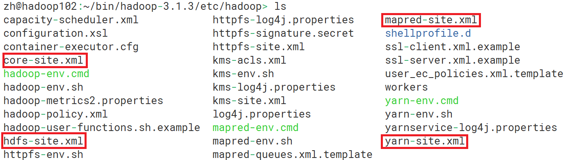

**core-site.xml**

```xml
<configuration>
	<!--é…ç½® NameNode 地å€-->
	<property>
		<name>fs.defaultFS</name>
		<value>hdfs://Hadoop102:8020</value>
	</property>
	<!--é…ç½® data 的存储路径-->
	<property>
		<name>Hadoop.tmp.dir</name>
		<value>/home/zh/Hadoop_data</value>
	</property>
</configuration>
```

**hdfs-site.xml**

```xml
<configuration>
	<property>
		<!--é…ç½® NameNode 对管ç†å‘˜è®¿é—®çš„ web 地å€å’Œç«¯å£å·-->
		<name>dfs.namemode.http-address</name>
		<value>Hadoop102:9870</value>
	</property>
	<property>
		<!--é…ç½® SecondNameNode 对管ç†å‘˜è®¿é—®çš„ web 地å€å’Œç«¯å£å·-->
		<name>dfs.namenode.secondary.http-address</name>
		<value>Hadoop104:9868</value>
	</property>
</configuration>
```

**yarn-site.xml**

```xml
<configuration>
	<property>
		<!--指定 mapreduce 走 shuffle-->
		<name>yarn.nodemanager.aux-services</name>
		<value>mapreduce_shuffle</value>
	</property>
	<property>
		<!--指定 resourcemanager æœåŠ¡å™¨-->
		<name>yarn.resourcemanager.hostname</name>
		<value>Hadoop103</value>
	</property>
	<property>
		<!--ç¯å¢ƒå˜é‡çš„继承-->
		<!--å¬è¯´è¿™ä¸ªæ˜¯ä¸€ä¸ª 3.1.3 çš„ bug，å续版本ä¸éœ€è¦åœ¨é…置这个-->
		<name>yarn.nodemanager.env-whitelist</name>
		<value>JAVA_HOME,Hadoop_COMMON_HOME,Hadoop_HDFS_HOME,Hadoop_CONF_DIR,CLASSPATH_PREPEND_DISTCACHE,Hadoop_YARN_HOME,Hadoop_MAPRED_HOME</value>
	</property>
</configuration>
```

**mapperd\_site.xml**

```xml
<configuration>
	<!--指定 mapperreduce 程åºè¿è¡Œåœ¨ YARN 上-->
	<property>
		<name>mapreduce.framework.name</name>
		<value>yarn</value>
	</property>
</configuration>
```

**works**

é…置集群æœåŠ¡å™¨çš„ hostname。\*\*注æ„：\*\*这里ä¸èƒ½æœ‰ç©ºæ ¼å’Œç©ºè¡Œ

```shell
Hadoop102
Hadoop103
Hadoop104
```

#### å¯åŠ¨é›†ç¾¤

**åˆå§‹åŒ– NameNode 储存空间**

在 NameNode 第一次使用之å‰éœ€è¦å¯¹å‚¨å­˜ç©ºé—´ï¼ˆé…置的文件夹）进行åˆå§‹åŒ–æ“作，相当äºæ–°ç¡¬ç›˜ä½¿ç”¨ä¹‹å‰éœ€è¦è¿›è¡Œæ ¼å¼åŒ–分区一样。如æœæ²¡æœ‰æŠ¥é”™è¡¨ç¤ºåˆå§‹åŒ–æˆåŠŸã€‚åªéœ€è¦å¯¹ NameNode æœåŠ¡å™¨è¿›è¡Œåˆå§‹åŒ–æ“作。

```shell
> hdfs namenode -fromat
/************************************************************
STARTUP_MSG: Starting NameNode
STARTUP_MSG:   host = Hadoop102/192.168.1.102
STARTUP_MSG:   args = [-format]
STARTUP_MSG:   version = 3.1.3
......
/************************************************************
SHUTDOWN_MSG: Shutting down NameNode at Hadoop102/192.168.1.102
************************************************************/
```

åˆå§‹åŒ–完æˆä¹‹å将你é…置的 hdfs 的存储目录下生æˆä¸€äº›æ–‡ä»¶ï¼Œä¼šåœ¨ `dfs/name/current` æ–‡ä»¶å¤¹ä¸‹ç”Ÿæˆ fsimage å’Œ editor 文件，用æ¥ä¿å­˜ä¸Šä¼ çš„文件的信æ¯ï¼Œå…·ä½“的功能将在å续讲解。

除了用æ¥å­˜æ”¾æ–‡ä»¶ä¿¡æ¯çš„ç›®å½•ä¹‹å¤–ï¼Œè¿˜ä¼šå† `dfs/data/current/VERSION` 中生æˆæ–‡ä»¶æœ¬æ¬¡åˆå§‹åŒ–的文件系统的 ID（datanodeUuid），åªæœ‰æ–‡ä»¶ç³»ç»Ÿ ID 相åŒçš„ namenode å’Œ datanode 节点æ‰èƒ½å…±åŒå·¥ä½œç»„æˆé›†ç¾¤ï¼Œå¦‚æœ ID ä¸ä¸€æ ·å°†ä¸èƒ½ç»„æˆé›†ç¾¤ï¼Œè¿™æ ·è®¾è®¡å¯ä»¥é˜²æ­¢æ–‡ç”±äºæ–‡ä»¶ç³»ç»Ÿçš„内容ä¸åŒ¹é…（比如一å°æœåŠ¡å™¨é‡æ–°åˆå§‹åŒ–了工作空间，但是其他æœåŠ¡å™¨è¿˜æœ‰å†å²æ•°æ®ï¼‰é€ æˆæ–‡ä»¶æŸå。

```shell
> cat VERSION 
#Sun Jan 08 17:35:17 CST 2023
datanodeUuid=b5867d24-c7d5-4e54-abfb-44c8fa230f55
storageType=DATA_NODE
cTime=0
clusterID=CID-ce27dce7-0766-4fec-b536-b0965cf23a2d
layoutVersion=-57
storageID=DS-156883f6-ce5b-44de-99f0-f7f26fbe6561
```

**å¯åŠ¨**

```shell
> start-dfs.sh 
Starting namenodes on [Hadoop102]
Starting datanodes
Hadoop104: WARNING: /home/zh/bin/Hadoop-3.1.3/logs does not exist. Creating.
Hadoop103: WARNING: /home/zh/bin/Hadoop-3.1.3/logs does not exist. Creating.
Starting secondary namenodes [Hadoop104]

> jps
30344 DataNode
30666 Jps
30173 NameNode
```

集群å¯åŠ¨æˆåŠŸä¹‹å分别在ä¸åŒçš„æœåŠ¡å™¨æ‰§è¡Œ jps 命令，并äºé›†ç¾¤çš„规划åšå¯¹æ¯”，看是å¦å¯åŠ¨æˆåŠŸã€‚

在æµè§ˆå™¨è¾“å…¥ http://192.168.1.102:9870/ å¯ä»¥çœ‹åˆ°åˆšåˆšé…置的管ç†å‘˜ web 页é¢ã€‚


å¦å¤– YARN 也æ供一个 web 访问页é¢ï¼ˆhttp://192.168.1.103:8088/cluster），å¯ä»¥çœ‹åˆ°æ­£åœ¨è¿è¡Œçš„任务的详细信æ¯ã€‚

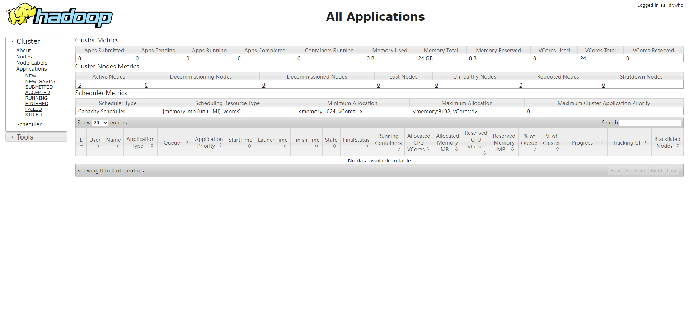

#### 简å•æµ‹è¯•

**创建文件夹**

å¯¹äº Hadoop 的文件系统，我们å¯ä»¥é€šè¿‡å‘½ä»¤è¡Œçš„æ–¹å¼è¿›è¡Œåˆ›å»ºï¼Œåˆ é™¤ï¼Œç§»åŠ¨ç­‰å¸¸è§çš„文件æ“作。我们å¯ä»¥é€šè¿‡ä¸‹è¾¹çš„命令在 Hadoop 中创建一个文件夹：

```shell
> Hadoop fs -mkdir /wcinput
```

执行完毕之å，我们å¯ä»¥åœ¨ Hadoop web 管ç†é¡µé¢çš„ `Utilities>Browse the file ssystem` 中看到刚刚创建的文件夹。

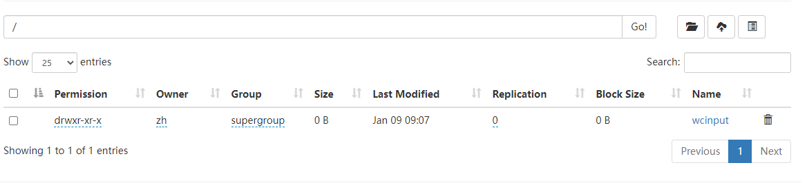

**文件上传**

创建完文件夹之å，我们å¯ä»¥é€šè¿‡å‘½ä»¤è¡Œçš„æ–¹å¼å°†æœ¬åœ°çš„文件上传到改文件夹中。

```shell
> Hadoop fs -put wcinput/word.txt /wcinput
```

上传完æˆå，打开 HDFS çš„ web 页é¢ï¼Œæˆ‘们进入 /wcinput 文件夹å¯ä»¥çœ‹åˆ°åˆšåˆšçš„文件夹，å¯ä»¥ç‚¹å‡»çœ‹åˆ°æ–‡ä»¶çš„详情，å¯ä»¥é¢„览和下载。如æœç‚¹å‡»å®Œä¸‹è½½æ示页é¢æ‰“ä¸å¼€ï¼Œè¯·é…置主机的 host 文件，设置å„个æœåŠ¡å™¨ hostname 对应的 ip 地å€ã€‚

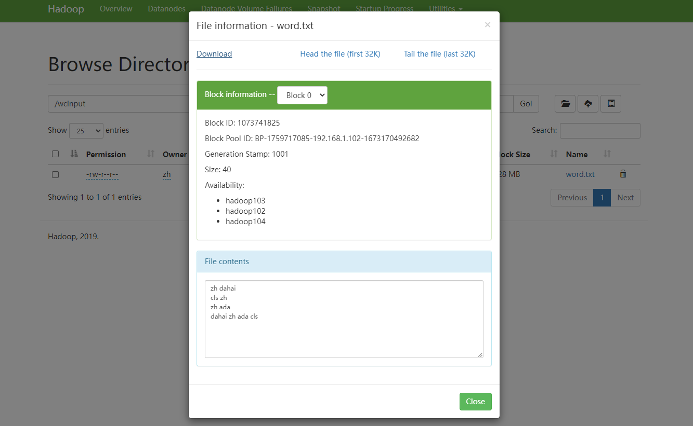

上传到集群的文件将会ä¿å­˜åˆ°é…置的目录的 data 文件夹下，并且文件会被分å—，å°æ–‡ä»¶å¯èƒ½åªå ç”¨ä¸€ä¸ªæ–‡ä»¶å¿«ï¼Œå¤§çš„文件会被切割æˆå¤šä¸ªæ–‡ä»¶å¿«è¿›è¡Œå­˜å‚¨ã€‚除此之外，åŒä¸€ä¸ªæ–‡ä»¶è¿˜ä¼šè¢«å­˜å‚¨åœ¨å¤šä¸ªæœåŠ¡å™¨ä¸Šï¼Œä»¥ä¿è¯æ–‡ä»¶çš„å¯é æ€§ã€‚

**集群版 wordcount**

上边执行的 wordcount 程åºæ˜¯åœ¨æœ¬åœ°æ¨¡å¼ä¸‹è¿è¡Œçš„，并没有使用集群，åªæ˜¯ç”¨æ¥è¿›è¡Œç®€å•çš„测试。wordcount 程åºåŒæ ·èƒ½å¤Ÿè¿è¡Œåœ¨é›†ç¾¤ä¸Šç”± yarn 调度。å¯ä»¥æ‰§è¡ŒåŒæ ·çš„命令æ¥æ‰§è¡Œï¼Œä½†æ˜¯è¦å°†è¾“入输出目录æ¢æˆé›†ç¾¤çš„目录，具体命令如下：

```shell
> Hadoop jar bin/Hadoop-3.1.3/share/Hadoop/mapreduce/Hadoop-mapreduce-examples-3.1.3.jar wordcount /wcinput /wcoutput
2023-01-09 09:47:02,420 INFO client.RMProxy: Connecting to ResourceManager at Hadoop103/192.168.1.103:8032
2023-01-09 09:47:02,597 INFO mapreduce.JobResourceUploader: Disabling Erasure Coding for path: /tmp/Hadoop-yarn/staging/zh/.staging/job_1673225993091_0001
2023-01-09 09:47:02,656 INFO sasl.SaslDataTransferClient: SASL encryption trust check: localHostTrusted = false, remoteHostTrusted = false
2023-01-09 09:47:02,745 INFO input.FileInputFormat: Total input files to process : 1
2023-01-09 09:47:02,762 INFO sasl.SaslDataTransferClient: SASL encryption trust check: localHostTrusted = false, remoteHostTrusted = false
2023-01-09 09:47:02,797 INFO sasl.SaslDataTransferClient: SASL encryption trust check: localHostTrusted = false, remoteHostTrusted = false
2023-01-09 09:47:02,818 INFO mapreduce.JobSubmitter: number of splits:1
2023-01-09 09:47:02,958 INFO sasl.SaslDataTransferClient: SASL encryption trust check: localHostTrusted = false, remoteHostTrusted = false
2023-01-09 09:47:02,990 INFO mapreduce.JobSubmitter: Submitting tokens for job: job_1673225993091_0001
2023-01-09 09:47:02,991 INFO mapreduce.JobSubmitter: Executing with tokens: []
2023-01-09 09:47:03,097 INFO conf.Configuration: resource-types.xml not found
2023-01-09 09:47:03,097 INFO resource.ResourceUtils: Unable to find 'resource-types.xml'.
2023-01-09 09:47:03,191 INFO impl.YarnClientImpl: Submitted application application_1673225993091_0001
2023-01-09 09:47:03,210 INFO mapreduce.Job: The url to track the job: http://Hadoop103:8088/proxy/application_1673225993091_0001/
2023-01-09 09:47:03,210 INFO mapreduce.Job: Running job: job_1673225993091_0001
2023-01-09 09:47:08,269 INFO mapreduce.Job: Job job_1673225993091_0001 running in uber mode : false
2023-01-09 09:47:08,270 INFO mapreduce.Job:  map 0% reduce 0%
2023-01-09 09:47:11,295 INFO mapreduce.Job:  map 100% reduce 0%
2023-01-09 09:47:15,310 INFO mapreduce.Job:  map 100% reduce 100%
2023-01-09 09:47:16,319 INFO mapreduce.Job: Job job_1673225993091_0001 completed successfully
2023-01-09 09:47:16,377 INFO mapreduce.Job: Counters: 53
......
```

程åºçš„部分输出如上，在任务è¿è¡Œçš„时候，å¯ä»¥é€šè¿‡ yarn çš„ web 页é¢æŸ¥çœ‹æ­£åœ¨è¿è¡Œçš„任务的详情，如下入所示：

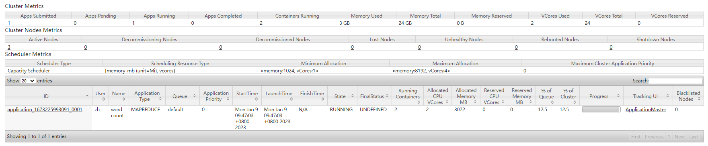

è¿è¡Œç»“æŸå，将在 HDFS 系统中产生目标文件夹æ¥å­˜æ”¾æ‰§è¡Œç»“æœï¼Œå†…容ä¸æœ¬åœ°è¿è¡Œçš„结æœç›¸åŒã€‚

#### é…ç½®å†å²æœåŠ¡å™¨

**什么是å†å²æœåŠ¡å™¨**

在刚刚 wordcount 的测试中，yarn çš„ web 页é¢å¹¶ä¸èƒ½æ˜¾ç¤ºå†å²ä»»åŠ¡ï¼Œè¿™æ˜¯å› ä¸º yarn åªæ˜¯å¤æ‚而调度，并ä¸ä¼šè®°å½•å†å²ä»»åŠ¡ã€‚如æœæƒ³è¦èƒ½å¤Ÿä¿å­˜å†å²ä»»åŠ¡ï¼Œå¯ä»¥é…ç½®å†å²ä»»åŠ¡æœåŠ¡å™¨ï¼Œå®ƒå¯ä»¥åœ¨ yarn è¿è¡Œæ—¶å°†ä»»åŠ¡çš„详情记录下æ¥ï¼Œä½†æ˜¯å¹¶ä¼šä¸è®°å½•ä»»åŠ¡çš„è¿è¡Œæ—¥å¿—。

**é…ç½®**

å¯ä»¥é…ç½® yarn æ¥å¼€å¯å†å²ä»»åŠ¡æœåŠ¡å™¨ï¼Œåœ¨ `$Hadoop_HOME/etc/Hadoop/mapred-site.xml` 中添加如下é…置：

```xml
<property>
	<!--é…ç½®å†å²æœåŠ¡å™¨ç«¯çš„地å€-->
	<name>mapreduce.jobhistory.address</name>
	<value>Hadoop102:10020</value>
</property>
<property>
	<!--é…ç½®å†å²æœåŠ¡å™¨çš„ web 地å€-->
	<name>mapreduce.jobhistory.webapp.address</name>
	<value>Hadoop102:19888</value>
</property>
```

é…置完æˆä¹‹å将新的é…置信æ¯è¿›è¡Œåˆ†å‘。最åé‡å¯ yarn 并通过如下命令æ¥å¯åŠ¨å†å²æœåŠ¡å™¨ï¼š

```shell
> mapred --daemon start historyserver

> jps
13584 NameNode
13761 DataNode
26708 NodeManager
27657 JobHistoryServer
27722 Jps
```

é‡æ–°æ‰§è¡Œåˆšåˆšçš„ wordcount 程åºï¼Œå¯ä»¥åœ¨ yarn 的页é¢çœ‹åˆ°æœ€æ–°çš„任务，就算刷新页é¢ä¹Ÿèƒ½å¤ŸæŸ¥çœ‹ä»»åŠ¡çš„详情。

#### é…置日志èšé›†åŠŸèƒ½

**什么是日志èšé›†**

刚刚é…置完æˆäº†å†å²ä»»åŠ¡æœåŠ¡å™¨ï¼Œä½†æ˜¯ä»ç„¶ä¸èƒ½ä¿ç•™ä»»åŠ¡è¿è¡Œçš„详细日志，并且整个集群在è¿è¡Œçš„过程中也会产生å„ç§å„样的日志存储在自己的æœåŠ¡å™¨ä¸Šï¼Œæ—¥å¿—èšé›†åŠŸèƒ½å°±æ˜¯å°†æ‰€æœ‰æœåŠ¡å™¨çš„日志èšé›†åœ¨ä¸€èµ·ï¼Œé€šè¿‡ web å‘管ç†äººå‘˜å±•ç¤ºã€‚

**é…ç½®**

在 `$Hadoop_HOME/etc/Hadoop/yarn-site.xml` 中添加如下é…ç½®æ¥å¼€å¯æ—¥å¿—èšé›†åŠŸèƒ½ï¼š

```xml
<property>
    <!--å¼€å¯æ—¥å¿—èšé›†åŠŸèƒ½-->
    <name>yarn.log-aggregation-enable</name>
    <value>true</value>
</property>
<property>
    <!--设置å†å²æœåŠ¡å™¨çš„地å€-->
    <name>yarn.log.server.url</name>
    <value>http://Hadoop102:19888/jobhistory/logs</value>
</property>
<property>
    <!--设置日志ä¿ç•™ 7 天-->
    <name>yarn.log.aggregation.retain-seconds</name>
    <value>604800</value>
</property>
```

然åè¦é‡å¯ yarn å’Œ jobhistory æœåŠ¡å™¨ã€‚

```shell
> mapred --deamon stop jobhistory
> stop-yarn.sh

> mapred --deamon start jobhistory
> start-yarn.sh
```

é‡å¯å®Œæˆä¹‹å在è¿è¡Œæ–°çš„任务将会收集日志，å¯ä»¥é€šè¿‡å†å²ä»»åŠ¡æœåŠ¡å™¨çš„ logs 按钮进行查看。

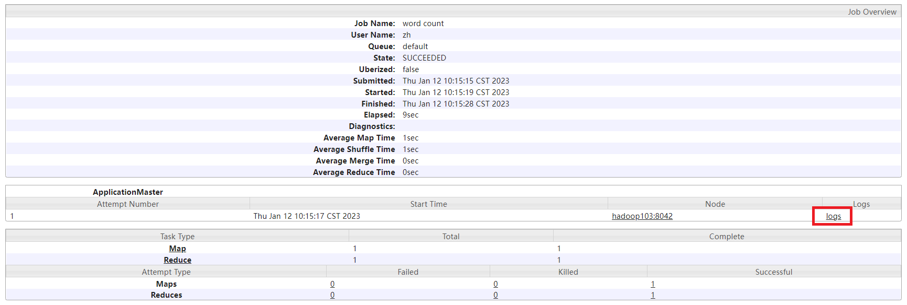

#### å„ç§å¯åŠ¨åœæ­¢æ–¹å¼æ€»ç»“

**集群**

å¯åŠ¨/åœæ­¢ hdfs/yarn：

```shell
> start/stop-dfs/yarn.sh
```

**å•èŠ‚点**

```shell
> hdfs --daemon start/stop namenode/datanode/secondnamenode
```

**脚本**

如æœæœåŠ¡å™¨å¾ˆå¤šï¼Œæ‰‹åŠ¨é‡å¯åŠ¨å•èŠ‚点很麻烦，å¯ä»¥é€šè¿‡ä¸‹è¾¹çš„脚本，将一æ¡å‘½ä»¤åˆ†å‘给所有æœåŠ¡å™¨æ‰§è¡Œ

```shell
#!/bin/bash

for Hadoop in Hadoop102 Hadoop103 Hadoop104;do
        echo "=======================" $Hadoop "======================="
        ssh $Hadoop $@
done
```

#### 常è§ç«¯å£å·

|        端å£å·       | Hadoop2.x |     Hadoop3.x     |
| :--------------: | :-------: | :---------------: |
|   NameNode内部通信   |  8020/900 | **8020**/900/9820 |
| NameNode HTTP UI |   50070   |        9870       |
| MapReduce 查看执行任务 |    8088   |        8088       |
|     å†å²ä»»åŠ¡æœåŠ¡å™¨é€šä¿¡    |   19888   |       19888       |

#### 时间åŒæ­¥

在集群内部需è¦è¿›è¡Œæ—¶é—´åŒæ­¥ï¼Œå¦‚æœé›†ç¾¤èƒ½å¤Ÿè¿æ¥å¤–网会自动进行时间åŒæ­¥ï¼Œå¦‚æœä¸èƒ½è¿æ¥å¤–网，需è¦ä»¥ä¸€å°æœåŠ¡å™¨ä¸ºå‡†ï¼Œå¯¹å…¶ä»–æœåŠ¡å™¨è¿›è¡ŒåŒæ­¥ã€‚具体的é…置过程部分就ä¸å†™äº†ã€‚

#### 常è§é”™è¯¯çš„解决方案

**DFS web页é¢æŠ¥é”™ã€‚**

**报错信æ¯**

> Failed to retrieve data from /webhdfs/v1/?op=LISTSTATUS: Server Error

查看 logs 下的 NameNode 日志文件，报错信æ¯å¦‚下：

> 2023-01-07 21:28:38,045 WARN org.eclipse.jetty.servlet.ServletHandler: Error for /webhdfs/v1/ java.lang.NoClassDefFoundError: javax/activation/DataSource at com.sun.xml.bind.v2.model.impl.RuntimeBuiltinLeafInfoImpl.(RuntimeBuiltinLeafInfoImpl.java:457) at com.sun.xml.bind.v2.model.impl.RuntimeTypeInfoSetImpl.(RuntimeTypeInfoSetImpl.java:65) at com.sun.xml.bind.v2.model.impl.RuntimeModelBuilder.createTypeInfoSet(RuntimeModelBuilder.java:133) at com.sun.xml.bind.v2.model.impl.RuntimeModelBuilder.createTypeInfoSet(RuntimeModelBuilder.java:85) at com.sun.xml.bind.v2.model.impl.ModelBuilder.(ModelBuilder.java:156) at com.sun.xml.bind.v2.model.impl.RuntimeModelBuilder.(RuntimeModelBuilder.java:93) at com.sun.xml.bind.v2.runtime.JAXBContextImpl.getTypeInfoSet(JAXBContextImpl.java:473) at com.sun.xml.bind.v2.runtime.JAXBContextImpl.(JAXBContextImpl.java:319) at com.sun.xml.bind.v2.runtime.JAXBContextImpl$JAXBContextBuilder.build(JAXBContextImpl.java:1170) at com.sun.xml.bind.v2.ContextFactory.createContext(ContextFactory.java:145) at com.sun.xml.bind.v2.ContextFactory.createContext(ContextFactory.java:236)

**åŸå› **

jdk-9 开始弃用了 [`java.activation`](http://openjdk.java.net/jeps/261#EE-modules) 模å—，到 jdk-11 å®Œå…¨è¢«åˆ é™¤äº†ï¼Œå¦‚æœ Hadoop 版本比较ä½å¹¶ä¸” jdk 版本高就会找ä¸åˆ°ä¾èµ–而报错。

**ä¿®å¤**

最简å•çš„åŠæ³•æ˜¯é™çº§ jdk 使用，如æœæ˜¯ä½¿ç”¨ jdk-9 或者 jdk-10 å¯ä»¥åœ¨ `$Hadoop_HOME/etc/Hadoop/Hadoop-env.sh` 文件中添加如下é…ç½®æ¥å¯ç”¨ `java.activation` 模å—。

```shell
export Hadoop_OPTS="${Hadoop_OPTS} --add-modules java.activation "
```

如æœä½¿ç”¨ jdk-11 åŠä»¥ä¸Šçš„版本，å¯ä»¥æ‰‹åŠ¨ä¸‹è½½ java.activation 模å—çš„ [jar](https://jcenter.bintray.com/javax/activation/javax.activation-api/1.2.0/javax.activation-api-1.2.0.jar) 包，然å存放在åˆé€‚çš„ä½ç½®ï¼Œæˆ‘是在 $Hadoop\_HOME/lib 下新建了一个 dfs 的文件夹，表示这是 dfs çš„ä¾èµ–。然å在 $Hadoop\_HOME/etc/Hadoop/Hadoop-env.sh 中将新的文件ä¾èµ–路径添加进å»ï¼Œæœ€åé‡å¯é›†ç¾¤å³å¯è§£å†³é—®é¢˜ã€‚

```shell
export Hadoop_CLASSPATH+="$Hadoop_HOME/lib/dfs/*.jar"
```

**部分 DataNode ä¸å¯åŠ¨**

**报错信æ¯**

ä¸ä¼šæŠ¥ä»»ä½•å¼‚常，我在日志也没有找到报错信æ¯ï¼Œä½†æ˜¯å…·ä½“的表ç°å°±æ˜¯æ€»æ˜¯æœ‰ä¸€éƒ¨åˆ† DataNode 节点ä¸å¯åŠ¨ï¼Œåœ¨é›†ç¾¤ä¿¡æ¯ä¸­ä¹Ÿçœ‹ä¸åˆ°å¯¹åº”的节点，也没有任何异常。

**åŸå› **

因为 NameNode 会æ¯æ¬¡åˆå§‹åŒ–ç³»ç»Ÿä¼šç”Ÿæˆ ID，如æœé‡å¤æ‰§è¡Œè¿‡åˆå§‹åŒ–或者在多个æœåŠ¡å™¨ä¸Šè¿›è¡Œåˆå§‹åŒ–ï¼Œå°†ä¼šé€ æˆ ID ä¸åŒ¹é…，节点ä¸å¯åŠ¨ã€‚

**ä¿®å¤**

关闭集群，清空所有节点上用æ¥ä¿å­˜æ•°æ®çš„文件夹和 logs 文件夹，然åé‡æ–°åˆå§‹åŒ–空间，最åå¯åŠ¨é›†ç¾¤å³å¯ã€‚

### HDFS

#### HDFS 简介

**优缺点**


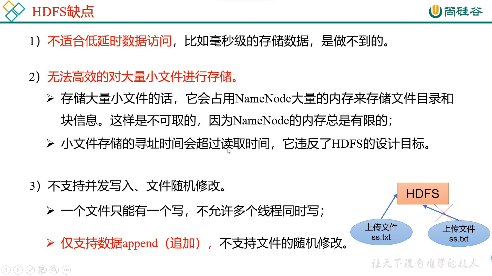

**HDFS 组æˆ**


**文件å—大å°**

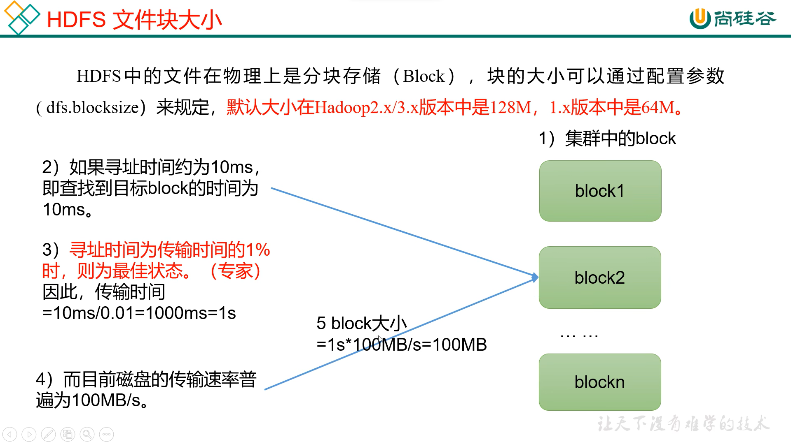

#### 命令行æ“作

```shell
> Hadoop fs
Usage: Hadoop fs [generic options]
......
The general command line syntax is:
command [genericOptions] [commandOptions]
```

```shell
> hdfs fs
Usage: Hadoop fs [generic options]
......
The general command line syntax is:
command [genericOptions] [commandOptions]
```

这两个命令是一样的，会使用一个就å¯ä»¥ã€‚我比较喜欢 `Hadoop fs` 。一些常用的å‚数如下，对äºè¿™äº›å‚æ•°è¦ç†Ÿè®°ï¼Œè¿™äº›å‘½ä»¤æ¯”较简å•ï¼Œä¸ linux 命令比较æ¥è¿‘，就ä¸è¿›è¡Œä¸€ä¸€æ¼”示了。

```shell
[-appendToFile <localsrc> ... <dst>]
[-cat [-ignoreCrc] <src> ...]
[-chgrp [-R] GROUP PATH...]
[-chmod [-R] <MODE[,MODE]... | OCTALMODE> PATH...]
[-chown [-R] [OWNER][:[GROUP]] PATH...]
[-copyFromLocal [-f] [-p] [-l] [-d] [-t <thread count>] <localsrc> ... <dst>]
[-copyToLocal [-f] [-p] [-ignoreCrc] [-crc] <src> ... <localdst>]
[-count [-q] [-h] [-v] [-t [<storage type>]] [-u] [-x] [-e] <path> ...]
[-cp [-f] [-p | -p[topax]] [-d] <src> ... <dst>]
[-find <path> ... <expression> ...]
[-get [-f] [-p] [-ignoreCrc] [-crc] <src> ... <localdst>]
[-head <file>]
[-help [cmd ...]]
[-ls [-C] [-d] [-h] [-q] [-R] [-t] [-S] [-r] [-u] [-e] [<path> ...]]
[-mkdir [-p] <path> ...]
[-moveFromLocal <localsrc> ... <dst>]
[-moveToLocal <src> <localdst>]
[-mv <src> ... <dst>]
[-put [-f] [-p] [-l] [-d] <localsrc> ... <dst>]
[-rm [-f] [-r|-R] [-skipTrash] [-safely] <src> ...]
[-rmdir [--ignore-fail-on-non-empty] <dir> ...]
[-tail [-f] [-s <sleep interval>] <file>]
```

#### API æ“作

**安装**

如æœä½¿ç”¨ window 进行 Hadoop çš„å¼€å‘工作，需è¦å®‰è£…特殊的补ä¸æ‰èƒ½ä½¿ç”¨ï¼Œå…·ä½“的安装过程我就ä¸æ¼”示了，大概的æµç¨‹å°±æ˜¯é¦–先下载 Hadoop çš„ windows 版，然åé…ç½®ç¯å¢ƒå˜é‡ï¼Œæœ€å使用 winUtils 进行打补ä¸ï¼ŒwinUtils è¡¥ä¸çš„版本需è¦ä¸ Hadoop 的版本相匹é…æ‰å¯ä»¥ã€‚

**创建工程**

正常创建一个 maven 工程，然å添加ä¾èµ–å’Œ log4j çš„é…置文件。

maven ä¾èµ–如下：

```xml
<dependencies>
    <!-- https://mvnrepository.com/artifact/org.apache.Hadoop/Hadoop-client -->
    <dependency>
        <groupId>org.apache.Hadoop</groupId>
        <artifactId>Hadoop-client</artifactId>
        <version>3.3.4</version>
    </dependency>
    <!-- https://mvnrepository.com/artifact/org.apache.Hadoop/Hadoop-common -->
    <dependency>
        <groupId>org.apache.Hadoop</groupId>
        <artifactId>Hadoop-common</artifactId>
        <version>3.3.4</version>
    </dependency>
    <!-- https://mvnrepository.com/artifact/org.apache.logging.log4j/log4j-core -->
    <dependency>
        <groupId>org.slf4j</groupId>
        <artifactId>slf4j-log4j12</artifactId>
        <version>1.7.30</version>
    </dependency>
    <dependency>
        <groupId>junit</groupId>
        <artifactId>junit</artifactId>
        <version>4.13.2</version>
        <scope>compile</scope>
    </dependency>
</dependencies>
```

log4j çš„é…置文件如下：

```properties
log4j.rootLogger=INFO, stdout
log4j.appender.stdout=org.apache.log4j.ConsoleAppender
log4j.appender.stdout.layout=org.apache.log4j.PatternLayout
log4j.appender.stdout.layout.ConversionPattern=%d %p[%c] - %m%n
log4j.appender.logfile=org.apache.log4j.FileAppender
log4j.appender.logfile.File=target/spring.log
log4j.appender.logfile.layout=org.apache.log4j.PatternLayout
log4j.appender.logfile.layout.ConversionPattern=%d %p [%c] - %m%n
```

**代ç ç¤ºä¾‹**

通用套路：åƒè¿™ç§éœ€è¦å¯¹è¿œç¨‹æœåŠ¡å™¨è¿›è¡Œæ“作的，一般的æ“作æµç¨‹å°±æ˜¯å…ˆè·å–è¿æ¥ï¼Œç„¶å进行正常的æ“作，最å关闭è¿æ¥å³å¯ã€‚在执行代ç ä¹‹å‰ä¸€å®šè¦ä¿è¯ä½ çš„集群是在正常è¿è¡Œçš„。

**导包**

在进行 api æ“作时，由一些é‡å¤çš„ç±»å，对äºæ–°æ‰‹ç»Ÿä¸€æ错，本节代ç ä½¿ç”¨çš„包信æ¯å¦‚下：

```java
import org.apache.Hadoop.conf.Configuration;
import org.apache.Hadoop.fs.FileSystem;
import org.apache.Hadoop.fs.Path;

import java.net.URI;
```

**è¿æ¥çš„è·å–ä¸å…³é—­**

```java
public void before() throws Exception {
    URI uri = new URI("hdfs://Hadoop102:8020");
    Configuration configuration = new Configuration();
    fs = FileSystem.get(uri, configuration, "zh");
}
public void after() throws Exception {
    fs.close();
}
```

**常è§æ“作**

```java
public void mkdir() throws Exception {
    fs.mkdirs(new Path("/api_test"));
}

public void delete() throws Exception {
    fs.delete(new Path("/output"), true);
}

public void upload() throws Exception {
    fs.moveFromLocalFile(new Path("D:\\atar.gz"), new Path("/api_test"));
}

public void download() throws Exception {
    fs.copyToLocalFile(new Path("/api_test/a.tar.gz"), new Path("D:\\a.tar.gz"));
}

public void rename() throws Exception{
    fs.rename(new Path("/api_test/Hadoop-3.3.4.tar.gz"), new Path("/api_test/a.tar.gz"));
}

public void fileDetail() throws IOException {
    RemoteIterator<LocatedFileStatus> statusIterator
        = fs.listFiles(new Path("/api_test"), false);
    while (statusIterator.hasNext()) {
        LocatedFileStatus next = statusIterator.next();
        System.out.println(
            next.getPath() +
            "\t" + next.isDirectory() +
            "\t" + next.getPermission() +
            "\t" + next.getOwner() +
            "\t" + next.getGroup() +
            "\t" + next.getLen() +
            "\t" + next.getModificationTime() +
            "\t" + next.getReplication() +
            "\t" + next.getBlockSize() +
            "\t" + Arrays.toString(next.getBlockLocations())
        );
    }
}

public void isDir() throws IOException {
    FileStatus[] fileStatuses = fs.listStatus(new Path("/api_test"));
    for (FileStatus fileStatus : fileStatuses) {
        System.out.println((fileStatus.isDirectory() ? "" : "ä¸") + "是目录");
    }
}
```

上边的åªæ˜¯äº›ç®€å•çš„测试，至äºåŒå的其他方法和具体的å‚数说æ˜å¯ä»¥çœ‹ä¸€çœ‹ API，感觉这些东西都ä¸æ˜¯å¾ˆéš¾ï¼Œä¸»è¦å°±æ˜¯ä¼šç”¨è¿™äº› API å°±å¯ä»¥ã€‚

**é…置优先级**

在ç¯å¢ƒæ­å»ºçš„过程中，我们已ç»çŸ¥é“了 Hadoop 的两ç§é…置文件：默认é…置和自定义é…置。其中默认é…置在对应的 jar 包中，自定义é…置文件在 `$Hadoop_HOME/etc/Hadoop/` 下。

在开å‘过程中，å¯ä»¥åœ¨ resource 文件夹下建立相åŒçš„é…置文件å进行é…置。还å¯ä»¥é€šè¿‡ä¸Šè¿°ç¤ºä¾‹ä»£ç çš„ Configuration 对象æ¥è¿›è¡Œé…置。这四ç§é…置方å¼çš„优先级为：

```
默认é…ç½® < æœä¹‰å™¨ä¸Šçš„é…ç½® < ç¨‹åº resources 下的é…ç½® < 代ç ä¸­é€šè¿‡ Configuration 对象的é…ç½®
```

#### HDFS 读写æµç¨‹

**写æµç¨‹**

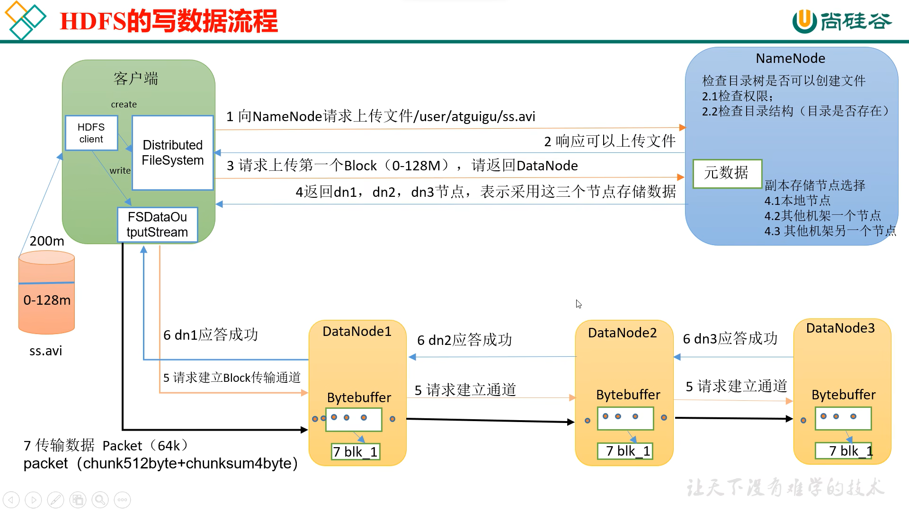

> 1. é¦–å…ˆå®¢æˆ·ç«¯å‘ NameNode 请求上传文件，NameNode 进行æƒé™ç­‰ä¸€ç³»åˆ—验è¯ä¹‹å相应是å¦å¯ä»¥ä¸Šä¼ ã€‚
> 2.  如æœå¯ä»¥ä¸Šä¼ ï¼Œå®¢æˆ·ç«¯å°†å‘ NameNode 请求上传第一å—æ•°æ®ï¼ŒNameNode 将选择适当的æœåŠ¡å™¨èŠ‚点返å›ï¼Œå…·ä½“çš„åŸåˆ™æ–¹å¼å¦‚下：
>
>     > 1. 本地存储优先
>     > 2. 机æ¶æ„ŸçŸ¥ï¼Œæ¥åŸåˆ™æœåŠ¡å™¨ï¼Œå…·ä½“过程下边详细介ç»
>     > 3. æ ¹æ®èŠ‚点的负载å‡è¡¡æ¥åŠ¨æ€è°ƒèŠ‚
> 3.  客户端将和å„个æœåŠ¡å™¨èŠ‚点进行应答，如æœåº”ç­”æˆåŠŸå°†å»ºç«‹é€šé“（应答和通é“都是一æ¡é¾™ï¼Œå¦‚上图）
>
>     > 1. é¦–å…ˆå°†æ–‡ä»¶æ‰“åŒ…æˆ 512byte çš„ chunk，并附加 4byte 的校验信æ¯
>     > 2. å°† chunk 放在缓冲区，缓冲区满 64k å将进行å‘é€ï¼ŒæœåŠ¡å™¨æ”¶åˆ°æ•°æ®åŒ…å将进行应答
>     > 3. å‘出å»çš„ chunk å°†ä»å‘é€ç¼“冲区转移到应答缓冲区，åªæœ‰æ”¶åˆ°åº”答的包æ‰è¢«åˆ é™¤ï¼Œå¦‚æœåº”答失败将é‡æ–°å‘é€
> 4. 一个 block å‘é€å®Œæˆä¹‹åå°†å‘ NameNode 请求第二个 block çš„å‘é€ï¼Œé‡å¤æ­¥éª¤ 2 直至结æŸ

**机æ¶æ„ŸçŸ¥**

**官方介ç»**

对äºå‰¯æœ¬èŠ‚点的选择 Hadoop 通过机æ¶æ„ŸçŸ¥æ¥å®ç°ï¼Œå®˜æ–¹çš„介ç»é¡µé¢å¯ä»¥ç‚¹å‡»[这里](https://hadoop.apache.org/docs/r3.1.3/Hadoop-project-dist/Hadoop-hdfs/HdfsDesign.html#Data\_Replication)，官方介ç»å¦‚下：

> #### Replica Placement: The First Baby Steps
>
> The placement of replicas is critical to HDFS reliability and performance. Optimizing replica placement distinguishes HDFS from most other distributed file systems. This is a feature that needs lots of tuning and experience. The purpose of a rack-aware replica placement policy is to improve data reliability, availability, and network bandwidth utilization. The current implementation for the replica placement policy is a first effort in this direction. The short-term goals of implementing this policy are to validate it on production systems, learn more about its behavior, and build a foundation to test and research more sophisticated policies.
>
> Large HDFS instances run on a cluster of computers that commonly spread across many racks. Communication between two nodes in different racks has to go through switches. In most cases, network bandwidth between machines in the same rack is greater than network bandwidth between machines in different racks.
>
> The NameNode determines the rack id each DataNode belongs to via the process outlined in [Hadoop Rack Awareness](https://hadoop.apache.org/docs/r3.1.3/Hadoop-project-dist/Hadoop-common/RackAwareness.html). A simple but non-optimal policy is to place replicas on unique racks. This prevents losing data when an entire rack fails and allows use of bandwidth from multiple racks when reading data. This policy evenly distributes replicas in the cluster which makes it easy to balance load on component failure. However, this policy increases the cost of writes because a write needs to transfer blocks to multiple racks.
>
> For the common case, when the replication factor is three, `HDFS’s placement policy is to put one replica on the local machine if the writer is on a datanode`, otherwise on a random datanode, `another replica on a node in a different (remote) rack`, and the `last on a different node in the same remote rack`. This policy cuts the inter-rack write traffic which generally improves write performance. The chance of rack failure is far less than that of node failure; this policy does not impact data reliability and availability guarantees. However, it does reduce the aggregate network bandwidth used when reading data since a block is placed in only two unique racks rather than three. With this policy, the replicas of a file do not evenly distribute across the racks. One third of replicas are on one node, two thirds of replicas are on one rack, and the other third are evenly distributed across the remaining racks. This policy improves write performance without compromising data reliability or read performance.
>
> If the replication factor is greater than 3, the placement of the 4th and following replicas are determined randomly while keeping the number of replicas per rack below the upper limit (which is basically `(replicas - 1) / racks + 2`).
>
> Because the NameNode does not allow DataNodes to have multiple replicas of the same block, maximum number of replicas created is the total number of DataNodes at that time.
>
> After the support for [Storage Types and Storage Policies](https://hadoop.apache.org/docs/r3.1.3/Hadoop-project-dist/Hadoop-hdfs/ArchivalStorage.html) was added to HDFS, the NameNode takes the policy into account for replica placement in addition to the rack awareness described above. The NameNode chooses nodes based on rack awareness at first, then checks that the candidate node have storage required by the policy associated with the file. If the candidate node does not have the storage type, the NameNode looks for another node. If enough nodes to place replicas can not be found in the first path, the NameNode looks for nodes having fallback storage types in the second path.
>
> The current, default replica placement policy described here is a work in progress.
>
> ***
>
> #### Replica Selection
>
> To minimize global bandwidth consumption and read latency, HDFS tries to satisfy a read request from a replica that is closest to the reader. If there exists a replica on the same rack as the reader node, then that replica is preferred to satisfy the read request. If HDFS cluster spans multiple data centers, then a replica that is resident in the local data center is preferred over any remote replica.

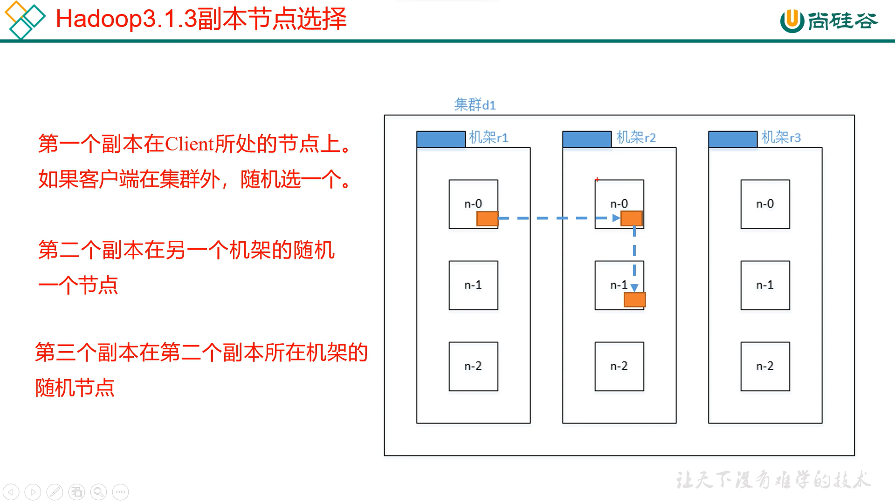

**æºç åˆ†æ**

æºä»£ç å¯ä»¥å» maven 仓库找 Hadoop-dfs çš„æºç åŒ…，然åå† `org.apache.Hadoop.hdfs.server.blockmanagement.BlockPlacementPolicyDefault` 这个类的 `chooseTargetInOrder` 方法

```java
protected Node chooseTargetInOrder(int numOfReplicas, 
                                   Node writer,
                                   final Set<Node> excludedNodes,
                                   final long blocksize,
                                   final int maxNodesPerRack,
                                   final List<DatanodeStorageInfo> results,
                                   final boolean avoidStaleNodes,
                                   final boolean newBlock,
                                   EnumMap<StorageType, Integer> storageTypes)
    throws NotEnoughReplicasException {
    final int numOfResults = results.size();
    if (numOfResults == 0) {
        // 第一个副本，选择本地节点
        DatanodeStorageInfo storageInfo = chooseLocalStorage(
            writer,
            excludedNodes, 
            blocksize, 
            maxNodesPerRack, 
            results, 
            avoidStaleNodes,
            storageTypes, 
            true
        );

        writer =
            (storageInfo != null) ? storageInfo.getDatanodeDescriptor() : null;
        if (--numOfReplicas == 0) {
            return writer;
        }
    }
    // dn0 就是刚刚选择的第一个节点
    final DatanodeDescriptor dn0 = results.get(0).getDatanodeDescriptor();
    if (numOfResults <= 1) {
        // 第二个副本，选择和 dn0 远程的节点
        chooseRemoteRack(
            1, 
            dn0, 
            excludedNodes, 
            blocksize, 
            maxNodesPerRack,
            results, 
            avoidStaleNodes, 
            storageTypes
        );
        if (--numOfReplicas == 0) {
            return writer;
        }
    }
    if (numOfResults <= 2) {
        // dn1 就是刚刚选择的第二个节点
        final DatanodeDescriptor dn1 = results.get(1).getDatanodeDescriptor();
        // 判断刚刚选择的è¿ä¸ªæ˜¯å¦æ˜¯åŒä¸€ä¸ªæœºæ¶
        if (clusterMap.isOnSameRack(dn0, dn1)) { // 如æœæ˜¯åŒä¸€ä¸ªï¼Œæœ€å一个将选择远程机æ¶
            chooseRemoteRack(
                1, 
                dn0, 
                excludedNodes, 
                blocksize, 
                maxNodesPerRack,
                results, 
                avoidStaleNodes, 
                storageTypes
            );
        } else if (newBlock){ // 如æœä¸åœ¨åŒäºä¸€ä¸ªï¼Œå¹¶ä¸”是新å—，那就选择和 dn1 相åŒçš„机æ¶
            chooseLocalRack(
                dn1, 
                excludedNodes, 
                blocksize, 
                maxNodesPerRack,
                results, 
                avoidStaleNodes, 
                storageTypes
            );
        } else {
            chooseLocalRack(
                writer, 
                excludedNodes, 
                blocksize, 
                maxNodesPerRack,
                results, 
                avoidStaleNodes, 
                storageTypes
            );
        }
        if (--numOfReplicas == 0) {
            return writer;
        }
    }
    chooseRandom(numOfReplicas, NodeBase.ROOT, excludedNodes, blocksize,
                 maxNodesPerRack, results, avoidStaleNodes, storageTypes);
    return writer;
}
```

**读æµç¨‹**

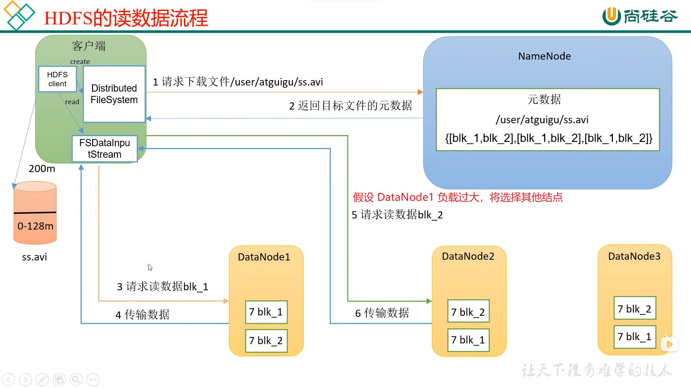

1. é¦–å…ˆå®¢æˆ·ç«¯å‘ NameNode 请求文件的下载
2. NameNode 将验è¯ä¸‹è½½çš„文件是å¦åˆæ³•ï¼Œæƒé™æ˜¯å¦æ­£å¸¸ç­‰ä¿¡æ¯ï¼Œå¦‚æœå¯ä»¥ä¸‹è½½å°†è¿”å›ç›®æ ‡æ–‡ä»¶çš„元数æ®
3. 客户端创建读数æ®æµï¼Œé€‰æ‹©æœ€è¿‘的节点（也会考虑负载å‡è¡¡ï¼‰è¿›è¡Œè¯»å–
4. 读å–完第一å—åå†è¯»é‡æ–°é€‰æ‹©èŠ‚点读å–下一å—，`这里是串行读并ä¸æ˜¯å¹¶è¡Œ`

#### NameNode 和 SecondNameNode

**NameNode 是如何存储数æ®çš„**

客户端上传的文件会分å—å存储在 DataNode 指定的文件夹中，这一点很容易ç†è§£ï¼Œé—®é¢˜çš„关键是这些文件的元数æ®æ˜¯å¦‚何进行存储的呢？

能够用æ¥è¿›è¡Œæ•°æ®å­˜å‚¨çš„åªæœ‰ä¸¤ç§æ–¹å¼ï¼šä¸€ç§æ˜¯å­˜æ”¾å†å†…存中，速度快但是ä¸å®‰å…¨ï¼›å¦ä¸€ç§æ˜¯å­˜æ”¾åœ¨ç£ç›˜ä¸­ï¼Œé€Ÿåº¦æ…¢ä½†æ˜¯å®‰å…¨ã€‚Hadoop è¿™ç§åœ¨çº¿çš„文件系统如何兼顾快速的安全呢？那就是通过ç£ç›˜é¡ºåºè¯»å†™é€Ÿåº¦æ¯”较快的特点，æ¯æ¬¡æ¥æ–°çš„文件时，åªå˜æ›´å†…存中的数æ®å¹¶ä¸”将文件的å˜æ›´è®°å½•åœ¨ editors 文件中，æœåŠ¡å™¨å…³æœºçš„时候å†è¿›è¡Œç»Ÿä¸€çš„åˆå¹¶ã€‚这样就å¯ä»¥å³å¿«åˆå®‰å…¨ã€‚

元数æ®ä¼šå‚¨å­˜åœ¨ NameNode 中，主è¦åˆ†ä¸ºä¸‰ä¸ªæ–‡ä»¶ fsimageã€editors å’Œ edits\_inprogress 中进行ä¿å­˜ï¼Œå…¶ä¸­ fsimage 是总的元数æ®ï¼Œeditors 是还没有æ¥å¾—åŠè¿›è¡Œåˆå¹¶çš„æ•°æ®ï¼Œedits\_inprogress 是当å‰æ­£åœ¨ä½¿ç”¨çš„记录文件。NameNode å’Œ SeconNameNode 的关系å¯ä»¥åšä¸€ä¸ªæ¯”喻：比如你上课å¬è®²éœ€è¦è®°ç¬”记，你有一个笔记本（fsimage）ã€ä¸€äº›æ¼”算纸（editors〠edits\_inprogress）和一个åŒæ¡Œï¼ˆSeconNameNode ），ç°åœ¨è€å¸ˆå°±æ˜¯å®¢æˆ·ç«¯ï¼Œä»–ä¸åœçš„å‘ä½ æ交知识，但是如æœä½ ä¸€ç›´ä¿®æ”¹ä½ ç¬”记本上的内容就会很慢，跟ä¸ä¸Šè€å¸ˆçš„节å¥ï¼Œè¿™ä¸ªæ—¶å€™ä½ å¯ä»¥å…ˆç†è§£çŸ¥è¯†æ”¾åœ¨è„‘å­é‡Œï¼ˆæ›´æ–°å†…存），åŒæ—¶å°†è€å¸ˆè®²çš„内容顺åºçš„记录在演算纸上（顺åºå†™å…¥åˆ° editors 中），然å等课下å†æ•´ç†åˆ°ç¬”记本上（æœåŠ¡å™¨å…³é—­æ—¶ååˆå¹¶ï¼‰ï¼Œä½†æ˜¯å¦‚æœä¸Šè¯¾è®²çš„内容很多你就è¦æ•´ç†å¾ˆé•¿æ—¶é—´ï¼Œè¿™ä¸ªæ—¶å€™ä½ çš„好åŒæ¡Œå°±ä¸Šåœºäº†ï¼Œä»–会æ¯éš”一段时间就将你的笔记本和演算纸拿走帮你整ç†å¥½å†é€å›æ¥ï¼ˆå°† fsimge å’Œ editors å–走进行åˆå¹¶ï¼Œè¿™ä¸ªæ—¶å€™ä½ çš„演算纸是 edits\_inprogress ），这样你就å¯ä»¥å¾ˆè½»æ¾äº†ã€‚具体的æµç¨‹å¦‚下：


**查看 fsimageã€editors**

fsimgeã€editors 通过正常的手段是打ä¸å¼€çš„，å¯ä»¥é€šè¿‡ oivã€oev 命令æ¥è½¬æˆ XML æ ¼å¼è¿›è¡ŒæŸ¥çœ‹ï¼Œå…·ä½“的命令如下：

```shell
# oiv/oev -p æ–‡ä»¶ç±»å‹ -i fsimage/editors文件å -o 输出路径
```

**检查点设置**

2NN 会æ¯éš”一段时间就询问 NN 是å¦éœ€è¦è¿›è¡Œåˆå¹¶ï¼Œè¯¢é—®çš„间隔时间和åˆå¹¶çš„åˆå¹¶çš„文件数é‡å¯ä»¥é€šè¿‡ `hdfs-site.xml` 进行é…置，具体的é…置代ç å¦‚下：

```xml
<property>
    <!--åªæœ‰å½“文件 editors 中的文件到达指定数é‡æ—¶æ‰è¿›è¡Œåˆå¹¶ï¼Œé»˜è®¤é»˜è®¤ 1000000-->
	<name>dfs.namenode.checkpoint.period</name>
    <value>1000000</value>
</property>
<property>
    <!--默认 2NN ä¸€åˆ†é’Ÿå‘ NN 询问一次-->
	<name>dfs.namenode.checkpoint.check.period</name>
    <value>60s</value>
</property>
```

2NN è¿™ç§æ–¹å¼åŸºæœ¬ä¸ç”¨ï¼Œä¸€èˆ¬éƒ½æ˜¯é…ç½® NN 的高å¯ç”¨ã€‚

#### DataNode 工作机制


上述的时间å¯ä»¥é€šè¿‡é…置文件进行é…置，这里就ä¸æ¼”示了。在 dataNode 内部会使用 crc32 算法对文件进行校验，æ¥ä¿è¯æ•°æ®çš„准确性。

### MapReduce

#### MapReduce 概述

**定义**

MapReduce 是 Google æ出的一个软件æ¶æ„，用äºå¤§è§„模数æ®é›†çš„并行è¿ç®—。概念 Map å’Œ Reduce ，åŠä»–们的主è¦æ€æƒ³ï¼Œéƒ½æ˜¯ä»å‡½æ•°å¼ç¼–程语言借鉴的，还有ä»çŸ¢é‡ç¼–程语言借æ¥çš„特性。

当å‰çš„软件å®ç°æ˜¯æŒ‡å®šä¸€ä¸ª Map 函数，用æ¥æŠŠä¸€ç»„键值对映射æˆä¸€ç»„新的键值对，指定并å‘çš„ Reduce 函数，用æ¥ä¿è¯æ‰€æœ‰æ˜ å°„的键值对中的æ¯ä¸€ä¸ªå…±äº«ç›¸åŒçš„键组。

**优势ã€åŠ£åŠ¿**

优点

> * 易äºç¼–程，用户åªå…³å¿ƒä¸šåŠ¡é€»è¾‘，å®ç°æ¡†æ¶æ¥å£
> * 良好的扩展性：å¯ä»¥åŠ¨æ€å¢åŠ æœåŠ¡å™¨ï¼Œè§£å†³è®¡ç®—资æºä¸å¤Ÿçš„问题
> * 高容错性：任何一å°æŒ‚æ‰å¯ä»¥å°†ä»»åŠ¡è½¬ç§»åˆ°å…¶ä»–节点
> * 适åˆæµ·é‡æ•°æ®è®¡ç®—（TB/PB），几åƒå°æœåŠ¡å™¨å…±åŒè®¡ç®—

缺点

> * ä¸æ“…长试试计算，ä¸èƒ½è¾¾åˆ°æ¯«ç§’级别
> * ä¸æ“…é•¿æµå¼è®¡ç®— ，Sparkstreamingã€Flink
> * ä¸æ“…é•¿DAG有å‘æ— å…³ç¯å›¾è®¡ç®—（并éä¸è¡Œï¼‰ã€‚Spark æ“…é•¿

#### WordCount 案例

**MapReduce 编程规范**

一般的 MapReduce 程åºç”± Mapper，Reducer，Driver 组æˆï¼Œä½†æ˜¯æœ‰çš„程åºä¹Ÿå¯èƒ½æ²¡æœ‰ Reducer。对äºä¸€ä¸ªä»»åŠ¡é¦–先会分é…给多个æœåŠ¡å™¨ï¼ˆå°çš„è¯ä¹Ÿå¯èƒ½æ˜¯ä¸€ä¸ªï¼‰ï¼Œæ¯ä¸ªæœåŠ¡å™¨æ¥æ‰§è¡Œ Mapper 程åºï¼Œç„¶å将执行å的结æœäº¤ç»™ Reducer 程åºæ¥è¿›è¡Œæ±‡æ€»ã€‚


WordCount 的大致æµç¨‹å¦‚下：


**Mapper**

通过继承 `org.apache.Hadoop.mapreduce.Mapper` æ¥å®ç°è‡ªå·±çš„程åºï¼ˆåœ¨ç¼–写代ç æ—¶ï¼Œä¸€å®šè¦`注æ„导包`），首先看一下 Mapper 类的å„个方法åŠå®˜æ–¹çš„说æ˜ï¼š

```java
public class Mapper<KEYIN, VALUEIN, KEYOUT, VALUEOUT> {

    /**
   * The <code>Context</code> passed on to the {@link Mapper} implementations.
   */
    public abstract class Context
        implements MapContext<KEYIN,VALUEIN,KEYOUT,VALUEOUT> {
    }

    /**
   * Called once at the beginning of the task.
   */
    protected void setup(Context context
                        ) throws IOException, InterruptedException {
        // NOTHING
    }

    /**
   * Called once for each key/value pair in the input split. Most applications
   * should override this, but the default is the identity function.
   */
    protected void map(KEYIN key, VALUEIN value, 
                       Context context) throws IOException, InterruptedException {
        context.write((KEYOUT) key, (VALUEOUT) value);
    }

    /**
   * Called once at the end of the task.
   */
    protected void cleanup(Context context
                          ) throws IOException, InterruptedException {
        // NOTHING
    }

    /**
   * Expert users can override this method for more complete control over the
   * execution of the Mapper.
   * @param context
   * @throws IOException
   */
    public void run(Context context) throws IOException, InterruptedException {
        setup(context);
        try {
            while (context.nextKeyValue()) {
                map(context.getCurrentKey(), context.getCurrentValue(), context);
            }
        } finally {
            cleanup(context);
        }
    }
}
```

`org.apache.Hadoop.mapreduce.Mapper` 声æ˜äº†ä¸€ä¸ª Mapper å¯èƒ½ç”¨åˆ°çš„几个方法，值得注æ„的是 `map` 方法，他会对æ¯ä¸€ä¸ª **Key/Value** 都执行一次。在我们的示例中，会将æ¯ä¸€è¡Œçš„文本都执行一次 map 方法。WordCount 程åºçš„ Mapper 类如下：

```java
package top.cafebabe202.study.Hadoop.mapreduce;

import org.apache.Hadoop.io.IntWritable;
import org.apache.Hadoop.io.LongWritable;
import org.apache.Hadoop.io.Text;
import org.apache.Hadoop.mapreduce.Mapper;

import java.io.IOException;

// 继承 Mapper ç±»å‹ã€‚四个泛å‹ï¼Œæ˜¯è¾“入输出的 KV ç±»å‹
public class WordCountMapper extends Mapper<LongWritable, Text, Text, IntWritable> {

    // 创建两个å˜é‡ï¼Œç”¨äºå°†æœ¬ map çš„ä¿¡æ¯è¾“出，写æˆå…¬å…±å˜é‡å¯ä»¥å‡å°‘对象的创建，æ高性能
    // 因为æ¯æ¬¡å†™å‡ºçš„时候都是将对象进行åºåˆ—化，写出之å并ä¸ä¼šä¾èµ–åŸå¯¹è±¡ï¼Œæ‰€ä»¥å¯ä»¥ä½¿ç”¨åŒä¸€ä¸ªå¯¹è±¡
    private final Text outK = new Text();
    private final IntWritable outV = new IntWritable(1);

    /**
     * @param key     在数æ®å—中的字节å移é‡
     * @param value   该 Map 的输入值，我觉得应该也å¯ä»¥æ˜¯äºŒè¿›åˆ¶æµå§ï¼Œä¸èƒ½åªèƒ½å¤„ç†æ–‡æœ¬æ•°æ®å§ï¼Œæˆ‘觉得这个 value æ¯æ¬¡çš„值应该按照类å‹è¿›è¡Œåˆ†å‰²å§ï¼ŒText ç±»å‹æ˜¯æŒ‰ç…§è¡Œåˆ’分的，ä¸çŸ¥é“二进制数æ®åˆ†æ€ä¹ˆåˆ’分
     * @param context 上下文对象，用äºå‘ reduce 传输数æ®ï¼Œä¹ŸåŒ…å«è¯¥ä»»åŠ¡ç›¸å…³çš„é…置信æ¯
     */
    @Override
    protected void map(LongWritable key, Text value, Context context) throws IOException, InterruptedException {

        // 这里æ¯æ¬¡éƒ½æ˜¯ä¼ é€’过æ¥ä¸€è¡Œæ–‡æœ¬ä¿¡æ¯ï¼Œæ‰€ä»¥è¦å°†ä¸€è¡Œæ–‡æœ¬æ‹†åˆ†æˆå¤šä¸ªå•è¯
        String[] words = value.toString().split(" ");
        for (String word : words) {
            this.outK.set(word);

            // æ¯ä¸€ä¸ªå•è¯éƒ½æ˜¯ç¬¬ä¸€æ¬¡å‡ºç°ï¼Œæ‰€ä»¥æ¯ä¸ªå•è¯æ¬¡æ•°éƒ½æ˜¯ 1，相åŒçš„å•è¯ä¼šæœ‰å¤šä¸ª key/value 对
            context.write(outK, outV);
        }
    }
}
```

**Reducer**

首先还是先看一下官方的 `org.apache.Hadoop.mapreduce.Reducer` 类：

```java
package org.apache.Hadoop.mapreduce;

public class Reducer<KEYIN,VALUEIN,KEYOUT,VALUEOUT> {

  /**
   * The <code>Context</code> passed on to the {@link Reducer} implementations.
   */
  public abstract class Context 
    implements ReduceContext<KEYIN,VALUEIN,KEYOUT,VALUEOUT> {
  }

  /**
   * Called once at the start of the task.
   */
  protected void setup(Context context
                       ) throws IOException, InterruptedException {
    // NOTHING
  }

  /**
   * This method is called once for each key. Most applications will define
   * their reduce class by overriding this method. The default implementation
   * is an identity function.
   */
  protected void reduce(KEYIN key, Iterable<VALUEIN> values, Context context
                        ) throws IOException, InterruptedException {
    for(VALUEIN value: values) {
      context.write((KEYOUT) key, (VALUEOUT) value);
    }
  }

  /**
   * Called once at the end of the task.
   */
  protected void cleanup(Context context
                         ) throws IOException, InterruptedException {
    // NOTHING
  }

  /**
   * Advanced application writers can use the 
   * {@link #run(org.apache.Hadoop.mapreduce.Reducer.Context)} method to
   * control how the reduce task works.
   */
  public void run(Context context) throws IOException, InterruptedException {
    setup(context);
    try {
      while (context.nextKey()) {
        reduce(context.getCurrentKey(), context.getValues(), context);
        // If a back up store is used, reset it
        Iterator<VALUEIN> iter = context.getValues().iterator();
        if(iter instanceof ReduceContext.ValueIterator) {
          ((ReduceContext.ValueIterator<VALUEIN>)iter).resetBackupStore();        
        }
      }
    } finally {
      cleanup(context);
    }
  }
}
```

åŒæ ·å€¼å¾—注æ„的是 `reduce` 方法，他会对æ¯ä¸€ä¸ª **Key** 执行一次该方法，在我们的示例当中，Mapper 方法的输出类å‹æ˜¯ Text/IntWriteable，其中 Key 为å•è¯ï¼Œåœ¨MapperRecuer 执行过程中会将所以的 Key 进行åˆå¹¶ä½œä¸º Reducer 的输入 Key，将他们的 Value 组æˆä¸€ä¸ªé›†åˆä½œä¸º Reducer 的输入 Value。WordCount çš„ Reducer 类如下：

```java
// 四个å‚数，分别是输入输出的 KV ç±»å‹ï¼Œåº”该和 Mapper 的输出 KV ç±»å‹ä¸€æ ·ã€‚
public class WordCountReducer extends Reducer<Text, IntWritable, Text, IntWritable> {
    private final IntWritable outV = new IntWritable();

    /**
     * @param text    Mapper 输出的 Key，æ¯ä¸ª Key åªä¼ å…¥ä¸€æ¬¡
     * @param values  Mapper 输出中æ¯ä¸ª Key 的所有 value 值的集åˆ
     * @param context 上下文对象，用äºå‘ reduce 传输数æ®ï¼Œä¹ŸåŒ…å«è¯¥ä»»åŠ¡ç›¸å…³çš„é…置信æ¯
     */
    @Override
    public void reduce(Text text, Iterable<IntWritable> values, Context context) throws IOException, InterruptedException {
        int sum = 0;
        for (IntWritable value : values) {
            sum += value.get();
        }
        this.outV.set(sum);
        context.write(text, outV);
    }
}
```

**Driver**

```java
// 任务的总æµç¨‹ï¼Œéƒ½å·®ä¸å¤šå§ï¼Œå…«è‚¡
public class WorkCountDriver {
    public static void main(String[] args) throws IOException, InterruptedException, ClassNotFoundException {
        
        // 创建 job 对象
        Configuration configuration = new Configuration();
        Job job = Job.getInstance(configuration);

        // 设置å¯åŠ¨ç±»
        job.setJarByClass(WorkCountDriver.class);

        // 设置 map 和 reduce 类
        job.setMapperClass(WordCountMapper.class);
        job.setReducerClass(WordCountReducer.class);

        // 设置 map 和最终的 K,V 输出类å‹
        job.setMapOutputKeyClass(Text.class);
        job.setMapOutputValueClass(IntWritable.class);
        job.setOutputKeyClass(Text.class);
        job.setOutputValueClass(IntWritable.class);

        // 设置输出输出路径
        FileInputFormat.setInputPaths(job, new Path("D:\\wordcount"));
        FileOutputFormat.setOutputPath(job, new Path("D:\\wordcountres"));

        //æ交任务
        boolean b = job.waitForCompletion(true);
        System.out.println(b ?"Successful":"fail");
        System.exit(b ? 0 : 1);
    }
}
```

**执行**

首先创建一个输入目录，然å设置输出目录（和执行官方 WordCount 程åºä¸€æ ·ï¼‰ï¼Œç„¶å点击è¿è¡ŒæŒ‰é’®ã€‚è¿è¡Œç»“æœå’Œæ‰§è¡Œå®˜æ–¹ç»“æœä¸€æ ·ï¼Œè¿™é‡Œä¸è¿‡å¤šè¿›è¡Œè®²è§£ã€‚

#### åºåˆ—化

**为什么ä¸ç”¨ Java åºåˆ—化**

如æœæƒ³è¦ä¼ è¾“或存储 Java 对象，å¯ä»¥é€šè¿‡å®ç° Java çš„ Serializable æ¥å£æ¥å®ç°åºåˆ—化，既然 Java 本身就å¯ä»¥å®ç°åºåˆ—化，那么为什么 Hadoop 还è¦å®ç°è‡ªå·±çš„åºåˆ—化方法呢？

Java 在åºåˆ—化对象时除了对象的数æ®ä¿¡æ¯æ—¶è¿˜ä¼šæ·»åŠ è®¸å¤šé¢å¤–çš„ä¿¡æ¯ï¼Œä¾‹å¦‚：校验ç ã€å¤´ä¿¡æ¯ã€ç±»çš„继承关系等一些列内容，这些信æ¯è€ƒè™‘了众多因素。但是 Hadoop çš„åºåˆ—化åªæ˜¯ç”¨æ¥åœ¨ç³»ç»Ÿå†…部进行传输，ç¯å¢ƒç›¸å¯¹å®‰å…¨ï¼Œå¹¶ä¸éœ€è¦è¿‡å¤šçš„ä¿¡æ¯æ¥ä¿éšœå®‰å…¨ï¼Œæ‰€ä»¥å¯¹äº Hadoop æ¥è¯´ Java 自带的åºåˆ—化框æ¶è¿‡é‡äº†ï¼Œéœ€è¦è‡ªå·±åˆ›å»ºä¸€ä¸ªè½»é‡åŒ–çš„åºåˆ—化体系。

**如何å®ç°åºåˆ—化**

想è¦åœ¨ Hadoop 中å®ç°åºåˆ—化，åªéœ€è¦å®ç° `org.apache.hadoop.io.Writable` æ¥å£å³å¯ï¼Œå…·ä½“çš„è¦æ±‚请看å边的代ç ä¸­çš„注释。

**示例**

下边是手机用户的上网信æ¯ï¼ˆéšä¾¿å†™çš„），æ¯ä¸€åˆ—çš„å«ä¹‰å·²ç»ç»™å®šï¼Œä½¿ç”¨  进行分割，网å€åˆ—å¯èƒ½ä¼šç¼ºä¹éƒ¨åˆ†ä¿¡æ¯ï¼Œç°åœ¨è¦æ±‚按照手机å·è¿›è¡Œæ±‡æ€»ï¼Œè¾“å‡ºæ–‡ä»¶ä¸­å°†åŒ…å« 4 列，分别是：手机å·ã€ä¸Šè¡Œæµé‡æ€»å’Œã€ä¸‹è¡Œæµé‡æ€»å’Œã€æµé‡æ€»å’Œã€‚

```
åºå·	手机å·		IP			网å€				上行æµé‡	下行æµé‡	状æ€ç 
1	15123772126	192.168.1.1	www.baidu.com	191			1230		200
1	15123772122	192.168.1.2					191			1230		200
1	15123772126	192.168.1.1	www.baidu.com	191			1230		200
1	15123772122	192.168.1.2	www.google.com	191			1230		200
1	15123772126	192.168.1.1					191			1230		200
1	15123772126	192.168.1.1	www.baidu.com	191			1230		200
1	15123772126	192.168.1.1	www.baidu.com	191			1230		200
1	15123772122	192.168.1.2	www.baidu.com	191			1230		200
1	15123772126	192.168.1.1	www.baidu.com	191			1230		200
1	15123772126	192.168.1.1	www.baidu.com	191			1230		200
1	15123772126	192.168.1.1					191			1230		200
1	15123772122	192.168.1.2	www.baidu.com	191			1230		200
1	15123772126	192.168.1.1	www.baidu.com	191			1230		200
1	15123772126	192.168.1.1	www.baidu.com	191			1230		200
1	15123772126	192.168.1.1					191			1230		200
1	15123772126	192.168.1.1	www.baidu.com	191			1230		200
```

æ€è·¯ï¼šå…¶å®å¾ˆç®€å•ï¼Œå³å°† wordCount çš„ value ç±»å‹æ¢æˆè‡ªå®šä¹‰çš„ FlowBean ç±»å‹å³å¯ã€‚以下是代ç ç¤ºä¾‹ã€‚

自定义的 FlowBean：

```java
/**
 * 创建一个 FlowBean 类，用æ¥å­˜å‚¨æ¯ä¸ªæ‰‹æœºå·çš„ä¿¡æ¯ã€‚
 */
public class FlowBean implements Writable {

    // 定义相关的å±æ€§ï¼Œåˆ†åˆ«ç”¨æ¥å­˜å‚¨ä¸Šè¡Œæ€»å’Œã€ä¸‹è¡Œæ€»å’Œ
    private int upSum;
    private int downSum;

    // å¿…é¡»è¦æœ‰ä¸€ä¸ªç©ºå‚æ„造器
    public FlowBean() {
    }
    
    // 这里çœç•¥äº† Geter and Setter

    @Override
    public void write(DataOutput out) throws IOException {

        // 写出å„个需è¦è¿›è¡Œåºåˆ—化的å±æ€§ï¼Œè¿™é‡Œçš„顺åºå¯ä»¥éšæ„；写出 int ç±»å‹ä½¿ç”¨ writeInt 方法
        out.writeInt(this.upSum);
        out.writeInt(this.downSum);
    }

    @Override
    public void readFields(DataInput in) throws IOException {

        // 读å–一个整形；注æ„这里的顺åºï¼Œè¦å’Œä¸Šè¾¹å†™å‡ºçš„顺åºç›¸åŒï¼Œå…ˆå†™å…ˆè¯»
        this.upSum = in.readInt();
        this.downSum = in.readInt();
    }

    @Override
    public String toString() {

        // 在输出到文件的时候将调用 toString 方法，总和是在这里进行计算的
        return this.upSum + "\t" + this.downSum + "\t" + (this.upSum + this.downSum);
    }
}
```

Mapper 类：

```java

public class MyMapper extends Mapper<LongWritable, Text, Text, FlowBean> {

    // ä¾æ—§æ˜¯å®šä¹‰å˜é‡ï¼Œç”¨æ¥å†™å‡ºæ•°æ®
    private final FlowBean bean;
    private final Text key;

    public MyMapper() {
        this.bean = new FlowBean();
        this.key = new Text();
    }

    // 这里和 wordCount å分相似，就是将 value çš„ IntWrite ç±»å‹æ¢æˆäº†è‡ªå·±ç¼–写的 FlowBean
    @Override
    protected void map(LongWritable key, Text value, Mapper<LongWritable, Text, Text, FlowBean>.Context context) throws IOException, InterruptedException {
        String[] strs = value.toString().split("\t");
        this.key.set(strs[1]);
        this.bean.setUpSum(Integer.parseInt(strs[strs.length - 3]));
        this.bean.setDownSum(Integer.parseInt(strs[strs.length - 2]));
        context.write(this.key, this.bean);
    }
}
```

Reducer 类：

```java
public class MyReducer extends Reducer<Text, FlowBean, Text, FlowBean> {
    private final FlowBean bean;

    public MyReducer() {
        this.bean = new FlowBean();
    }

    // 这里的 key value å’Œ wordCount å分相似
    @Override
    protected void reduce(Text key, Iterable<FlowBean> values, Reducer<Text, FlowBean, Text, FlowBean>.Context context) throws IOException, InterruptedException {
        int downSum = 0, upSum = 0;

        // 将所有的上下行æµé‡éƒ½åŠ åœ¨ä¸€èµ·
        for (FlowBean value : values) {
            upSum += value.getUpSum();
            downSum += value.getDownSum();
        }
        this.bean.setUpSum(upSum);
        this.bean.setDownSum(downSum);
        context.write(key, this.bean);
    }
}
```

上边是主è¦ä»£ç ï¼Œçœç•¥äº†åŒ…ä¿¡æ¯å’Œ Driver 代ç ï¼ˆå› ä¸ºå‡ ä¹ä¸€æ ·ï¼‰ã€‚执行结æœå¦‚下：

```
15123772122	764		4920	5684
15123772126	2292	14760	17052
```

#### MapReduce 核心框æ¶åŸç†

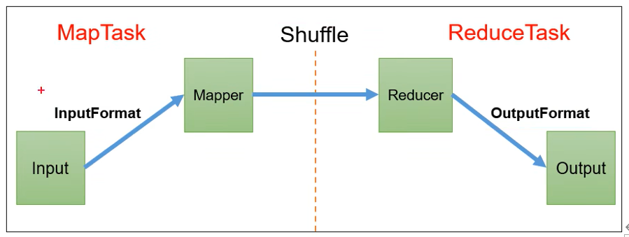

MapReduce 的工作æµç¨‹æ¡†æ¶å¦‚上图所示，è¦å¤„ç†çš„æ•°æ®é¦–å…ˆç»è¿‡ InputFormat 进行切片处ç†ï¼Œç„¶åå°†æ¯ä¸ªåˆ‡ç‰‡äº¤ç»™ Mapper 进行处ç†ï¼ŒMapper 处ç†ç»“æŸåç»è¿‡ Shuffle åå†äº¤ç»™ Recuder，最åç»è¿‡ OutFormat 输出。更加具体的æµç¨‹å›¾å¦‚下：

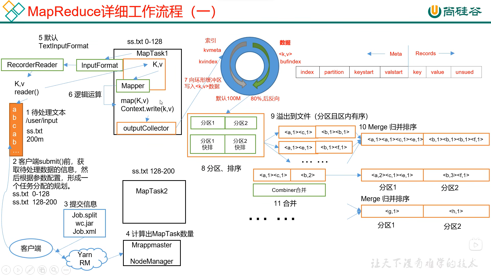

1. 首先需è¦è¾“入文件
2. 客户端对输入数æ®è¿›è¡Œé€»è¾‘切片
3. 将切片信æ¯ï¼Œç¨‹åºçš„ jar 文件，Job çš„é…置文件放置到缓冲文件夹，æ交任务
4. å¼€å¯ MapTask，MapTask **拉å–**æ•°æ®
5. 通过 InputFormat 对数æ®è¿›è¡Œç‰©ç†åˆ‡ç‰‡ï¼Œå½¢æˆ K,V 调用 Mapper çš„ map 方法
6. 自定义的 map 方法执行对数æ®è¿›è¡Œå¤„ç†ï¼Œç„¶å通过 `Context.Write(K,V)` 方法写出数æ®
7. 写出的数æ®å°†è¢«æ”¾åˆ°ç¼“ç¯å½¢ç¼“冲区
8. 当ç¯å½¢ç¼“冲区被å ç”¨ 80% 时将对数æ®è¿›è¡Œåˆ†åŒºï¼Œå¹¶é€šè¿‡**快速æ’åº**对分区内的数æ®æŒ‰ç…§ key 的索引进行æ’åº
9. 对æ’åºå®Œçš„æ•°æ®è¿›è¡Œæº¢å†™æ“作，将文件ä¿å­˜åˆ°ç£ç›˜
10. 在一次任务执行过程中å¯èƒ½äº§ç”Ÿå¤šä¸ªæº¢å†™æ–‡ä»¶ï¼Œåœ¨æ‰€æœ‰ Mapper 执行结æŸå将对所有分区的å„个溢写文件进行**归并æ’åº**
11. 在归并结æŸå，**å¯ä»¥**æå‰æœºå‹åˆå¹¶æ“作，æ¥æ高传输效ç‡ï¼Œä¹Ÿå¯ä»¥ä¸è¿›è¡Œ

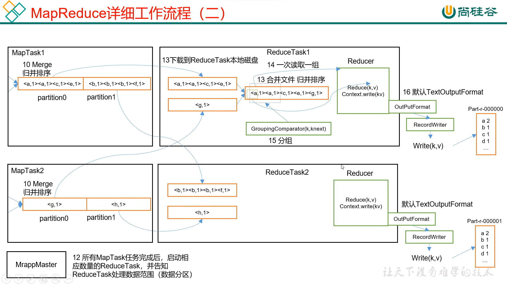

12. å¯åŠ¨ MapTask 任务，并告知 ReduceTask 处ç†æ•°æ®çš„范围
13. ReduceTask 将数æ®ä»å„个 MapTask æœåŠ¡å™¨**下载**（ReduceTask 主动）到本地，默认会先放在内存，达到一定阈值会溢写到ç£ç›˜ï¼Œå¹¶è¿›è¡Œå½’并æ’åºå¤„ç†
14. æ¯æ¬¡è¯»å…¥ä¸€ç»„æ•°æ®ï¼Œäº¤ç»™ Reduce 程åºè¿›è¡Œå¤„ç†
15. 还**å¯ä»¥**对组内的数æ®è¿›è¡Œæ’åºå¤„ç†
16. Reducer 将数æ®å¤„ç†ç»“æŸå通过 OutPutFormat 将文件ä¿å­˜åˆ°ç›®æ ‡ä½ç½®

**输入数æ®å¤„ç†**

在 WordCount 的示例中，对äºæ–‡æœ¬æ–‡ä»¶çš„切分默认使用 TextInputFormat 对文本进行切分，然å对æ¯è¡Œè°ƒç”¨ Mapper çš„ map 方法æ¥è¿›è¡Œå¤„ç†ã€‚除 TextInputFormat 之外，还有 CombineInputFormatã€SequenceInputFormatã€KeyValueInputFormat 等，也å¯ä»¥è‡ªå®šä¹‰ InputFormat。

**并行度决定机制**

在 Hadoop 中的任何文件会被分å—进行存储，æ¯ä¸ªå—被æˆä¸ºä¸€ä¸ª block。在进行数æ®å¤„ç†æ—¶è¿˜å°†è¿›è¡Œåˆ‡ç‰‡å¤„ç†ï¼Œæ¯ä¸ªåˆ‡ç‰‡å°†è¢«ä¸€ä¸ª MapperTask è¿è¡Œï¼Œå¹¶ä¸”切片过程ä¸åˆ†å—没有关系，也就是说å³ä½¿åˆ†å—大å°ä¸º 128Mb，在切片时也å¯ä»¥æŒ‰ç…§ 100Mb 进行切片，但是**默认**切片大å°ç­‰äºåˆ†å—大å°ã€‚


上图中的两ç§æƒ…况对比，å‡è®¾åˆ†å—大å°ä¸º 128Mb。如æœåˆ‡ç‰‡å¤§å°ä¸º 100Mb 那么对äºç¬¬ä¸€å—文件剩下的 28Mb 文件将和第二å—çš„ 78Mb 文件进行拼æ¥å½¢æˆä»¥åˆ‡ç‰‡ï¼Œä»¥æ­¤ç±»æ¨ï¼Œè¿™æ ·ä¼šé€ æˆæœ‰å¤§é‡çš„æ•°æ®åœ¨æœåŠ¡å™¨ä¹‹é—´è¿›è¡Œç§»åŠ¨ï¼ˆå› ä¸ºä¸åŒçš„å—被存放在了ä¸åŒçš„æœåŠ¡å™¨ä¸Šï¼‰ï¼Œä¼šæµªè´¹èµ„æºã€‚如æœæŒ‰ç…§åˆ†å—大å°è¿›è¡Œåˆ‡ç‰‡ï¼Œå°†ä¼šé¿å…该问题的å‘生，更加高效。

**FileInputFormat**

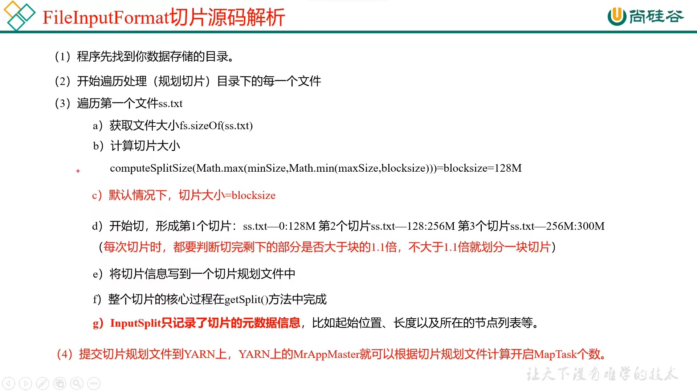

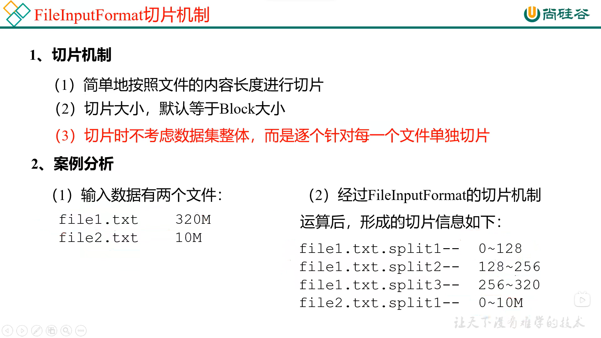

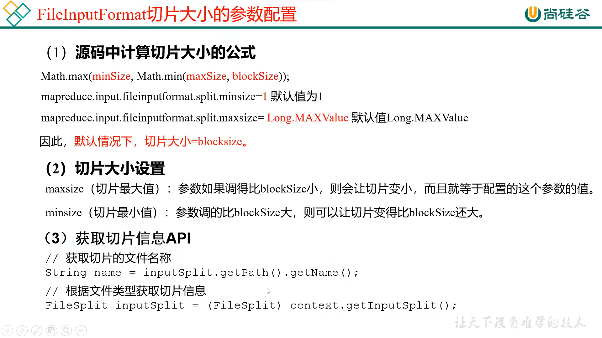

**CombineTextInputFormat**

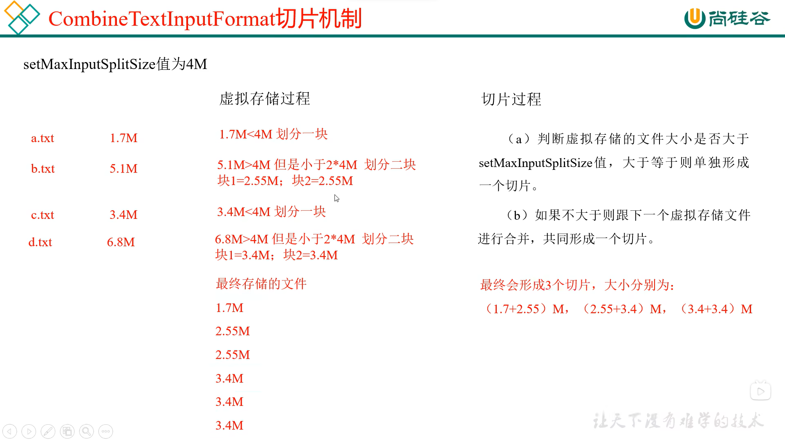

在一般的 TextInputFormat 中，æ¯ä¸ªæ–‡ä»¶æ˜¯å•ç‹¬è¿›è¡Œåˆ‡ç‰‡å¤„ç†çš„，也就是说如æœåˆ‡ç‰‡å¤§å°ä¸º 128Mb，å³ä½¿ä½ çš„有 100 个文件的总和ä¸å¤Ÿ 128Mb 也会切为 100 片，这样就会å¯åŠ¨ 100 个 Mapper 任务，æ¯ä¸€ä¸ªå ç”¨ 1core 1G 的资æºï¼Œå°±ä¼šé€ æˆä¸¥é‡çš„资æºæµªè´¹ã€‚

CombineTextInputFormat 在进行切分时，会先对文件进行å•ç‹¬åˆ‡ç‰‡ï¼Œç„¶å对æ¯ä¸ªç‰‡è¿›è¡Œåˆå¹¶æ“作，这样就是å‡å°‘ Mapper æ•°é‡ï¼Œæå‡æ•ˆç‡ã€‚

**任务æ交过程**

具体的代ç æ‰§è¡Œè¿‡ç¨‹å¯ä»¥é€šè¿‡ debug 进行查看，通过在 driver 类中的 `job.waitForCompletion` 处添加断点æ¥è¿›è¡Œ debug。以下是æ交任务的æµç¨‹ï¼š

> 1.  首先通过自定义的 Driver ç±»æ¥è¿›è¡Œé…置所有的任务信æ¯ï¼Œç„¶å通过 job.waitForCompletion(true) æ¥æ交任务
>
>     > 1.  首先 job 类将检查任务的状æ€ä¿¡æ¯æ˜¯å¦ç¬¦ä¸º DEFINE，如æœæ˜¯åˆ™è¿›æ‰§è¡Œä»»åŠ¡çš„æ交
>     >
>     >     > 1. 在æ交过程中，首先将ä¿è¯ä»»åŠ¡çš„状æ€æ˜¯ DEFINE
>     >     > 2. 通过 setUseNewAPI æ¥è®¾ç½® API 的兼容。
>     >     > 3. è·å–è¿æ¥ã€‚在è·å–è¿æ¥ä¸­ï¼Œä¼šæ ¹æ®ä»»åŠ¡çš„é…置信æ¯ç±»å†³å®šåœ¨é‚£é‡Œè¿è¡Œï¼Œé€šè¿‡è®¾ç½® LocalClientProtocolProvider 或 YarnClientProtocolProvider æ¥è®¾ç½®ä»»åŠ¡åœ¨é‚£é‡Œæ‰§è¡Œ
>     >     > 4.  创建 JobSubmitter 对象并æ交任务
>     >     >
>     >     >     > 1. 第一部将检查用户设置的路径是å¦æ­£ç¡®ï¼ˆè¾“入输出路径是å¦å­˜åœ¨ï¼‰
>     >     >     > 2. è·å–用户的é…ç½®ï¼Œç”Ÿæˆ JobID 和工作的缓存目录
>     >     >     > 3. 对输入数æ®è¿›è¡Œåˆ‡ç‰‡ï¼Œå¹¶å°†éœ€è¦çš„切片信æ¯ï¼ˆè¿™é‡ŒçŸ¥è¯†é€»è¾‘切片，并没有真正切片，真正切片的是 InputFormat）放在缓存目录中，通过 writeConf 方法将é…置写出到 job.xml 中
>     >     >     > 4. 最åæ交任务，æ交任务å缓存目录将被删除
>     >     > 5. 将任务的状æ€è®¾ç½®ä¸º RUNNING
>     > 2. 开始监æ§ä»»åŠ¡çŠ¶æ€ï¼Œç­‰å¾…结æŸåè¿”å›è¿”å›ç»“æœçŠ¶æ€
> 2. 显示任务是å¦æ‰§è¡ŒæˆåŠŸ

**Shuffle**

Shuffle 是一个比较å¤æ‚的过程，在这个阶段，å¯ä»¥å¯¹ Mapper 的输出结æœè¿›è¡Œæ’åºï¼Œå‹ç¼©ï¼Œåˆ†åŒºç­‰æ“作，然å将处ç†åçš„æ•°æ®äº¤ç»™ Reduce 处ç†ã€‚æµç¨‹å¦‚下：

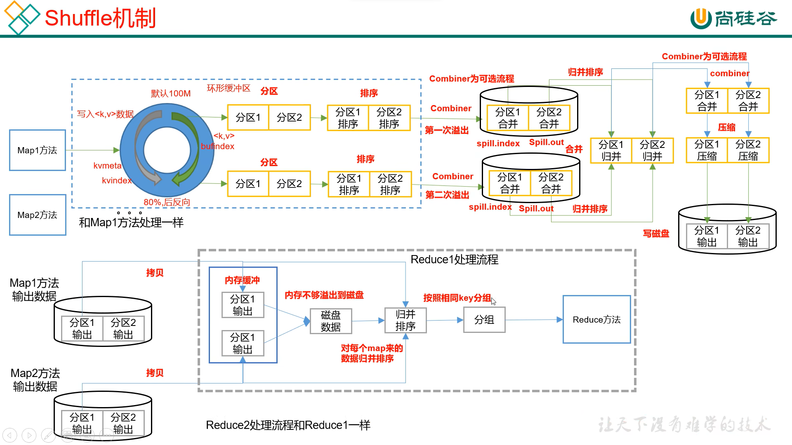

**Partitioner**

我们知é“在 Map 阶段一个任务将被拆分，由多个 MapTask 进行执行，在 Redcue 阶段，也会有多个任务åŒæ—¶è¿›è¡Œï¼Œæ¯ä¸€ä¸ªåˆ†åŒºå°†ä¼šå¯¹åº”一个 RedcueTask。ReduceTask çš„æ•°é‡ä¼šå—到 Partitioner æ•°é‡çš„å½±å“。具体æºç å¦‚下：

```java
// 如æœè®¾ç½®çš„åˆ†åŒºæ•°å¤§äº 1 会执行自定义的 Partitioner，如æœæ²¡æœ‰è‡ªå®šä¹‰ä¼šä½¿ç”¨é»˜è®¤çš„ HashPartitioner
if (partitions > 1) {
    partitioner = (org.apache.hadoop.mapreduce.Partitioner<K,V>)
        ReflectionUtils.newInstance(jobContext.getPartitionerClass(), job);
} else {
    
    // 如æœè®¾ç½® ReduceTask 的任务数é‡ä¸º 0，将没有 Shuffleã€Reucde 阶段，直æ¥è¾“出 Map 阶段的结æœ
    // 如æœè®¾ç½®çš„ ReduceTask ä»»åŠ¡æ•°å¤§äº 1 但是å°äºåˆ†åŒºæ•°ï¼Œä¼šå‡ºç° IO 异常
    
    // 如æœè®¾ç½®çš„ partitioners 为 1，将ä¸ä½¿ç”¨è‡ªå®šä¹‰çš„ Partitioner，直æ¥ç”Ÿæˆä¸€ä¸ªåˆ†åŒº
    partitioner = new org.apache.hadoop.mapreduce.Partitioner<K,V>() {
        @Override
        public int getPartition(K key, V value, int numPartitions) {
            return partitions - 1;
        }
    };
    
    //å¦‚æœ ReducerTask 任务数é‡å¤§äºåˆ†åŒºæ•°ï¼Œå°†ä¼šäº§ç”Ÿç©ºæ–‡ä»¶
}
```

**注æ„**：自定义的 Partitioner ç¼–å·å¿…é¡»ä» 0 开始，并且è¦**è¿ç»­**，ä¸èƒ½è·³å·ã€‚

**æ’åº**

MapTask 阶段

> 1. 它会将处ç†çš„结æœæš‚时放到ç¯å½¢ç¼“冲区中，当ç¯å½¢ç¼“冲区使⽤ç‡è¾¾åˆ°â¼€å®šé˜ˆå€¼å，å†å¯¹ç¼“冲区中的数æ®è¿›è¡Œâ¼€æ¬¡å¿«é€Ÿæ’åºï¼Œå¹¶å°†è¿™äº›æœ‰åºæ•°æ®æº¢å†™åˆ°ç£ç›˜ä¸Šã€‚
> 2. 溢写完毕å，它会对ç£ç›˜ä¸Šæ‰€æœ‰æ–‡ä»¶è¿›è¡Œå½’并æ’åºã€‚

ReduceTask 阶段

当所有数æ®æ‹·è´å®Œæ¯•å，ReduceTask 统一对内存和ç£ç›˜ä¸Šçš„所有数æ®è¿›è¡Œâ¼€æ¬¡å½’并æ’åºã€‚

> 1. 部分æ’åºï¼šMapReduce æ ¹æ®è¾“⼊记录的键对数æ®é›†æ’åºã€‚ä¿è¯è¾“出的æ¯ä¸ªâ½‚件内部有åºã€‚
> 2. 全局æ’åºï¼šæœ€ç»ˆè¾“出结æœåªæœ‰â¼€ä¸ªâ½‚件，且⽂件内部有åºã€‚å®ç°â½…å¼æ˜¯åªè®¾ç½®ä¸€ä¸ª ReduceTask。但该⽅法在处ç†â¼¤å‹â½‚件时效ç‡æä½ï¼Œå› ä¸ºä¸€å°æœºå™¨å¤„ç†æ‰€æœ‰â½‚件，完全丧失了 MapReduce 所æ供的并â¾æ¶æ„。
> 3. 辅助æ’åºï¼š(GroupingComparator 分组)在 Reduce 端对 key è¿›â¾åˆ†ç»„。应⽤äºï¼šåœ¨æ¥æ”¶çš„ key 为 bean 对象时，想让⼀个或â¼ä¸ªå­—段相åŒ(全部字段â½è¾ƒä¸ç›¸åŒ)çš„ key 进⼊到åŒâ¼€ä¸ª reduce ⽅法时，å¯ä»¥é‡‡â½¤åˆ†ç»„æ’åºã€‚
> 4. 二次æ’åºï¼šåœ¨â¾ƒå®šä¹‰æ’åºè¿‡ç¨‹ä¸­ï¼Œå¦‚æœ compareTo 中的判断æ¡ä»¶ä¸ºä¸¤ä¸ªå³ä¸ºäºŒæ¬¡æ’åºã€‚

**案例**

1.  对 FlowBean 的程åºè¾“出按照总æµé‡è¿›è¡Œå€’åºæ’åº

    > ç›´æ¥å®ç°æ—¶ä¸èƒ½å®ç°çš„，å¯ä»¥å°† FlowBean 的输出作为本案例的输入，然åå°† FlowBean 类作为 key，å®ç° WritableComparable，然å进行æ’åºå°±å¯ä»¥äº†ã€‚
2.  在倒å™æ’åºçš„基础上进行按照手机å·åˆ†åŒº

    > 在案例 1 的基础上进行自定义 Partitioner å°±å¯ä»¥äº†ã€‚

这两个案例比较简å•ï¼Œå°±ä¸æ¼”示了。

**Combiner**

由上边的 Shuffle çš„æµç¨‹å›¾æ‰€ç¤ºï¼ŒCombiner 是一个å¯é€‰çš„过程，并ä¸æ˜¯å¿…须的组件。设置 Combiner å¯ä»¥å°† Mapper 的输出结æœè¿›è¡Œé¢„èšåˆï¼Œä»è€Œé™ä½åœ¨æœåŠ¡å™¨ä¹‹é—´ä¼ è¾“çš„æˆæœ¬ã€‚Combiner æœ¬è´¨ä¸ Reducer 一样，åªä¸è¿‡æ˜¯æ‰§è¡Œåœ¨ Map 阶段，所以自定义的 Combiner åŒæ ·æ˜¯ç»§æ‰¿ Reducer 类，然å通过 `job.setCombinerClass()` æ¥è®¾ç½®ï¼Œé€šå¸¸ç›´æ¥è®¾ç½®æˆè‡ªå®šä¹‰çš„ Reducer 类就å¯ä»¥ã€‚这里åŒæ ·æ˜¯ä¸

**输出数æ®å¤„ç†**

OutputFormat 负责将计算产生的结æœè¿›è¡Œè¾“出，输出的目标ä¸ä¸€å®šæ˜¯æ–‡ä»¶ï¼Œä¹Ÿå¯èƒ½æ˜¯ MySQLã€HBase 等其他介质。用户y也å¯ä»¥é€šè¿‡è‡ªå®šä¹‰ OutPutFormat 组件æ¥å®ç°è‡ªå·±çš„功能，系统默认使用 FileOutputFormat。

**示例**

给出如下的网å€æ–‡ä»¶ï¼Œå°†å¸¦æœ‰ atguigu 的网å€æ”¾åˆ°å•ç‹¬çš„文件中。

```
http://www.atguigu.com
http://www.google.com
http://www.baidu.com
http://www.atguigu.com
```

Mapper å’Œ Reducer 这里就ä¸è¿‡å¤šå±•ç¤ºäº†ï¼Œä¸‹é¢æ˜¯è‡ªå®šä¹‰çš„ LogFileOutputFormat å’Œ LogRecordWrite

```java

// å…¶å®è¿™ä¸ªç±»åªæ˜¯ä¸€ä¸ªå£³ï¼Œå¹¶æ²¡æœ‰çœŸæ­£çš„写出数æ®ï¼Œè€Œæ˜¯é€šè¿‡è¿™ä¸ªç±»è·å–一个 RecordWriter ç±»æ¥çœŸæ­£çš„进行输出
// 为啥è¦è¿™æ ·è®¾è®¡å‘¢ï¼Ÿ
public class LogFileOutputFormat extends FileOutputFormat<Text, NullWritable> {
    @Override
    public RecordWriter<Text, NullWritable> getRecordWriter(TaskAttemptContext job) throws IOException, InterruptedException {
        return new LogRecordWrite(job);
    }
}
```

```java
// 这是真正å‘外输出数æ®çš„类，泛å‹æ˜¯è¾“入数æ®çš„ç±»å‹
public class LogRecordWrite extends RecordWriter<Text, NullWritable> {
    private final FSDataOutputStream atguiguOut;
    private final FSDataOutputStream otherOut;

    // 一个æ„造器，传过æ¥çš„是 context，里é¢åŒ…å«äº†ä»»åŠ¡ä¿¡æ¯
    public LogRecordWrite(TaskAttemptContext context) {
        try {

            // 通过 context çš„é…置信æ¯åˆ›å»ºä¸€ä¸ª FS 的对象，用æ¥è¾“出数æ®ï¼Œè¿™é‡Œä¸èƒ½ç”¨ java.io 包下的，因为生产ç¯å¢ƒä¼šå­˜æ”¾åœ¨ Hadoop 集群上
            FileSystem fileSystem = FileSystem.get(context.getConfiguration());

            // 创建è¿ä¸ªæµ
            this.atguiguOut = fileSystem.create(new Path("/home/zh/hadoop/output/002/atguigu"));
            this.otherOut = fileSystem.create(new Path("/home/zh/hadoop/output/002/other"));
        } catch (IOException e) {
            throw new RuntimeException(e);
        }
    }

    @Override
    public void write(Text key, NullWritable value) {
        String log = key.toString();
        try {
            if (log.contains("atguigu")) {
                this.atguiguOut.writeBytes(log + "\n");
            } else {
                this.otherOut.writeBytes(log + "\n");
            }
        } catch (IOException e) {
            throw new RuntimeException(e);
        }

    }

    @Override
    public void close(TaskAttemptContext context) {
        IOUtils.closeStream(this.atguiguOut);
        IOUtils.closeStream(this.otherOut);
    }
}
```

**MapTask 工作机制**

**简述**

MapReduce 程åºä¸»è¦åˆ†ä¸ºè¿ä¸ªé˜¶æ®µï¼šMapTask å’Œ RecudeTask。MapTask 阶段主è¦è®²è¾“入文件进行切片处ç†å¹¶è®¡ç®—，并通过 Shuflle 机制对数æ®è¿›è¡Œæ’åºï¼Œä¸º ReduceTask åšå‡†å¤‡ã€‚

在 Hadoop 中，主è¦æ˜¯ç”± MapTask 类进行å®ç°çš„，主è¦åŒ…å«äº† Readã€Mapã€Collectã€æº¢å†™ã€Merge 五个阶段，最å Merge 阶段产生的输出文件将被 ReduceTask 拉å–。

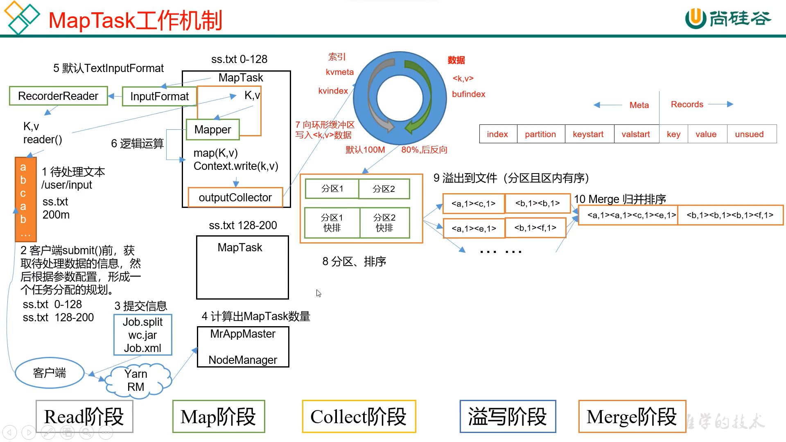

**MapTask 工作æµç¨‹**

> 1.  åˆå§‹åŒ–输入文件
>
>     > 1. 读入输入文件，对文件进行物ç†åˆ‡åˆ†
> 2.  执行 Mapper
>
>     > 1. åˆå§‹åŒ– Mapper 对象
>     > 2. 循ç¯å¯¹æ¯ä¸€ç»„ KV 调用自定义 Mapper çš„ map 方法
>     > 3. 按照业务逻辑对数æ®è¿›è¡Œå¤„ç†
>     > 4.  通过 context 对象将处ç†çš„æ•°æ®è¿›è¡Œå†™å‡º
>     >
>     >     > 1. 检查写出的 KV ç±»å‹å’Œé¢„设的类å‹æ˜¯å¦ç›¸ç¬¦ï¼Œæ£€æŸ¥åˆ†åŒºç¼–å·æ˜¯å¦æ­£å¸¸ï¼Œå¦‚æœä¸ç¬¦åˆå°†æŠ›å‡ºå¼‚常
>     >     > 2. 对 KV 进行åºåˆ—化，并将 indexã€partitionã€keystarã€valstart 放入ç¯å½¢ç¼“冲区的 Meta 区域；将 Keyã€Valueã€unused 放入ç¯å½¢ç¼“冲区的 Records 区域
> 3. 关闭输入资æº
> 4.  关闭 mapperContext
>
>     > 1.  对ç¯å½¢ç¼“冲区的数æ®è¿›è¡Œæ’åºæº¢å†™
>     >
>     >     > 1. 创建临时工作空间并创建输入æµ
>     >     > 2. 对缓冲区内的数æ®è¿›è¡Œå¿«é€Ÿæ’åº
>     >     > 3. 循ç¯æ¯ä¸€ä¸ªåˆ†åŒºï¼Œå°†æ•°æ®æº¢å†™åˆ°æ–‡ä»¶
>     > 2. 对分区进行归并æ’åº

**ReduceTask 工作机制**

**简介**

ReduceTask 在 MapTask 之å，主è¦åˆ†ä¸ºä¸‰ä¸ªé˜¶æ®µï¼šCopyã€Sortã€Reduce。在 MapTask 阶段的分区数é‡å°†å†³å®š ReduceTask 的并行度，也å¯ä»¥æ²¡æœ‰ ReduceTask 阶段，直æ¥å°† MapTask 阶段的结æœè¾“出。


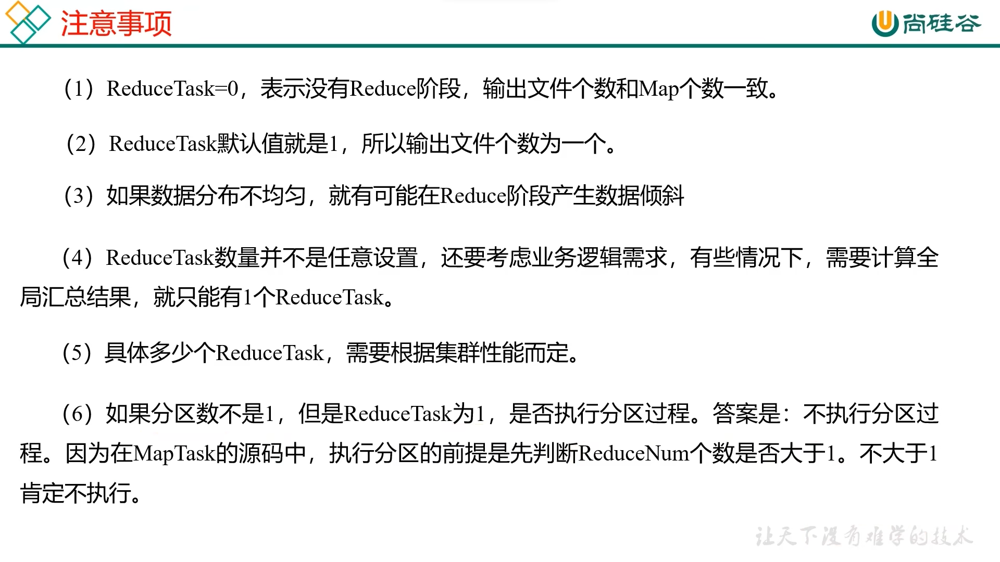

**ReduceTask 工作æµç¨‹**

> 1. 添加 copyã€sortã€reduce 三个阶段到 progress，æ¯å®Œæˆä¸€ä¸ªé˜¶æ®µå°±ä¼šè¿›è¡Œæ ‡è®°
> 2.  设置新 API 的兼容，åˆå§‹åŒ– ReduceTask 对象
>
>     > 1. è·å– OutputFormat å®ä¾‹ï¼Œé»˜è®¤æ˜¯ TextOutputFormat
> 3.  创建 shuffleConsumerPlugin 对象，并进行åˆå§‹åŒ–æ“作
>
>     > 1.  åˆå§‹åŒ–å‚数，创建 ShuffleSchedulerImpl 对象
>     >
>     >     > 1. è·å–所有的 MapTask æ•°é‡æ¥æ–¹ä¾¿æŠ“å–
>     > 2.  创建 MergeManager 对象
>     >
>     >     > 1. 分别创建 MemoryMerger å’Œ DiskMerger æ¥å½’并内存和ç£ç›˜ä¸Šçš„æ•°æ®
> 4.  执行 shuffleConsumerPlugin 的 run 方法
>
>     > 1. 在其中将进行数æ®çš„抓å–å’Œæ’åºçš„工作
> 5.  执行自定的 Reducer
>
>     > 1. åˆå§‹åŒ– Reducer 对象
>     > 2. 对数æ®çš„没有给 key 调用 Reducer 的逻辑
>     > 3. 将数æ®è¿›è¡Œè¾“出
> 6. è¿è¡Œç»“æŸ

**Join 计算**

**什么是 Join**

在数æ®åº“查询过程中，有时需è¦ç”¨åˆ° join 语å¥æ¥å¯¹ä¸åŒçš„表进行è¿æ¥ï¼Œæ¥å®ç°æ•°æ®çš„展示。在大数æ®å¤„ç†è¿‡ç¨‹å¾€å¾€ä¹Ÿéœ€è¦è¿›è¡ŒåŒæ ·çš„æ“作，比如下é¢çš„例å­ï¼š

ç°åœ¨æœ‰ä¸¤ä¸ªæ–‡ä»¶ï¼Œåˆ†åˆ«å­˜æ”¾äº†è®¢å•æ•°æ®å’Œå•†å“å称数æ®ï¼Œç°åœ¨å°†è¦å°†è®¢å•å’Œå•†å“å称进行关è”。

```
# order æ•°æ®ï¼Œåˆ†åˆ«æ˜¯ 订å•ç¼–å·ã€å•†å“ç¼–å·ã€æ•°é‡
1000001	01	1
1000002	01	3
1000003	02	2
1000004	01	3

# pid æ•°æ®ï¼Œåˆ†åˆ«æ˜¯ 商å“ç¼–å·ã€å•†å“å称
01	å°ç±³
02	å为

# 预输出结æœ
1000004 å°ç±³    3
1000002 å°ç±³    3
1000001 å°ç±³    1
1000003 å为    2
```

**解决æ€è·¯**

在 MapperTask 执行åŸç†ä¸­å¯ä»¥çœ‹åˆ°ï¼Œåœ¨æ‰§è¡Œ Mapper 之å‰ä¼šå…ˆå¯¹ Mapper 对象进行åˆå§‹åŒ–æ“作，这个时候，我们å¯ä»¥é€šè¿‡ context 对象æ¥å¾—知数æ®æ˜¯ä»é‚£ä¸ªæ–‡ä»¶ä¼ è¾“过æ¥çš„，通过观察上边的数æ®ï¼Œæˆ‘们å¯ä»¥å°†å•†å“ç¼–å·åˆ—作为 Mapper 输出的 Key，并将其他数æ®å°è£…æˆä¸€ä¸ªç±»ï¼ˆä¸ç®¡æ˜¯é‚£ä¸ªæ–‡ä»¶çš„æ•°æ®ï¼Œéƒ½å¡åœ¨åŒä¸€ä¸ªå¯¹è±¡é‡Œï¼‰ï¼Œç„¶å传递给 Reducer 进行处ç†ã€‚在 Reducer 中å†å°†å称赋值给所有的对象。

**代ç ç¤ºä¾‹**

```java
public class TableBean implements Writable {

    private String order;
    private String pid;
    private int amount;
    private String name;
    private String flag;

   	// getter and setter

    @Override
    public void write(DataOutput out) throws IOException {
        out.writeUTF(this.order);
        out.writeUTF(this.pid);
        out.writeInt(this.amount);
        out.writeUTF(this.name);
        out.writeUTF(this.flag);
    }

    @Override
    public void readFields(DataInput in) throws IOException {
        this.order = in.readUTF();
        this.pid = in.readUTF();
        this.amount = in.readInt();
        this.name = in.readUTF();
        this.flag = in.readUTF();
    }

    @Override
    public String toString() {
        return this.order + "\t" + this.name + "\t" + this.amount;
    }
}

```

```java
public class JoinMapper extends Mapper<LongWritable, Text, Text, TableBean> {

    private String flag;
    private final Text outKey = new Text();
    private final TableBean outValue = new TableBean();

    @Override
    public void setup(Context context) {
        FileSplit fileSplit = (FileSplit) context.getInputSplit();
        this.flag = fileSplit.getPath().getName();
    }

    @Override
    public void map(LongWritable key, Text value, Mapper<LongWritable, Text, Text, TableBean>.Context context) throws IOException, InterruptedException {
        String[] split = value.toString().split("\t");
        this.outValue.setFlag(this.flag);

        // ä¸ç®¡æ˜¯é‚£ä¸ªè¡¨çš„æ•°æ®éƒ½å¡åœ¨ TableBean
        if (this.flag.contains("order")) {
            this.outValue.setOrder(split[0]);
            this.outValue.setPid(split[1]);
            this.outValue.setAmount(Integer.parseInt(split[2]));
            this.outValue.setName(""); // ç”±äºè¦è¿›è¡Œè¾“出，所以ä¸èƒ½æœ‰ null，所以è¦èµ‹ç©ºå€¼
        } else {
            this.outValue.setOrder("");
            this.outValue.setPid(split[0]);
            this.outValue.setAmount(0);
            this.outValue.setName(split[1]);
        }
        this.outKey.set(this.outValue.getPid());
        context.write(this.outKey, this.outValue);
    }
}

```

```java
public class JoinReducer extends Reducer<Text, TableBean, TableBean, NullWritable> {
    @Override
    public void reduce(Text key, Iterable<TableBean> values, Reducer<Text, TableBean, TableBean, NullWritable>.Context context) throws IOException, InterruptedException {
        TableBean nameBean = new TableBean();
        List<TableBean> beans = new LinkedList<>();

        // éå†æ‰€æœ‰çš„对象，将标记了å称的对象找出æ¥
        for (TableBean value : values) {
            if (value.getFlag().contains("order")) {
                TableBean bean = new TableBean();
                try {
                    BeanUtils.copyProperties(bean, value); // 这里è¦å¯¹è±¡å¤åˆ¶ï¼Œå¹¶ä¸èƒ½ç›´æ¥æ·»åŠ  value 对象，因为æ¯æ¬¡è¿”å›çš„ value 对象相åŒï¼Œåªæ˜¯çŠ¶æ€ä¸åŒ
                    beans.add(bean);
                } catch (IllegalAccessException | InvocationTargetException e) {
                    throw new RuntimeException(e);
                }
            } else {
                try {
                    BeanUtils.copyProperties(nameBean, value);
                } catch (IllegalAccessException | InvocationTargetException e) {
                    throw new RuntimeException(e);
                }
            }
        }

        // 循ç¯è¾“出æ¯ä¸€ä¸ªå¯¹è±¡
        for (TableBean bean : beans) {
            bean.setName(nameBean.getName()); //  记得设置å称
            context.write(bean, NullWritable.get());
        }
    }
}
```

**MapJoin**

在刚刚的å®ä¾‹ä¸­ï¼Œå­˜åœ¨ä¸€ä¸ªæ¯”较æ˜æ˜¾çš„é—®é¢˜ï¼Œå°±æ˜¯å¦‚æœ order 表的一个 pid æ¡æ•°è¿‡å¤šå°†ä¼šå‘生数æ®å€¾æ–œã€‚åƒè¿™ç§ä¸€ä¸ªå¤§è¡¨å’Œä¸€ä¸ªå°è¡¨çš„情况下，å¯ä»¥å°†å°è¡¨è¿›è¡Œç¼“存，然å在处ç†å¤§è¡¨çš„时候将 pid 进行 join æ“作。

```java
public class MapJoinMapper extends Mapper<LongWritable, Text, Text, NullWritable> {

    private final Map<String, String> map = new HashMap<>();
    private final Text outKey = new Text();
    
    @Override
    protected void setup(Mapper<LongWritable, Text, Text, NullWritable>.Context context) throws IOException {
        
        // 在 setup 中对缓存文件进行处ç†ï¼Œæ·»åŠ  Map 中方便使用
        URI[] cacheFiles = context.getCacheFiles();
        FileSystem fileSystem = FileSystem.get(context.getConfiguration());
        FSDataInputStream fsDataInputStream = fileSystem.open(new Path(cacheFiles[0]));
        BufferedReader bufferedReader = new BufferedReader(new InputStreamReader(fsDataInputStream, StandardCharsets.UTF_8));

        String line;
        while (StringUtils.isNotEmpty(line = bufferedReader.readLine())) {
            String[] split = line.split("\t");
            this.map.put(split[0], split[1]);
        }
    }

    @Override
    protected void map(LongWritable key, Text value, Mapper<LongWritable, Text, Text, NullWritable>.Context context) throws IOException, InterruptedException {
        String[] split = value.toString().split("\t");
        
        // 通过刚刚的缓存对文件进行 join æ“作
        this.outKey.set(split[0] + "\t" + this.map.get(split[1]) + "\t" + split[2]);
        context.write(this.outKey, NullWritable.get());
    }
}
```

```java
public class MapJoinDriver {
    public static void main(String[] args) throws IOException, InterruptedException, ClassNotFoundException, URISyntaxException {
        Job job = Job.getInstance(new Configuration());
        job.setJarByClass(MapJoinDriver.class);

        job.setMapOutputKeyClass(Text.class);
        job.setMapOutputValueClass(NullWritable.class);
        job.setMapperClass(MapJoinMapper.class);

        FileInputFormat.setInputPaths(job, new Path("/home/zh/hadoop/input/004/input"));
        FileOutputFormat.setOutputPath(job, new Path("/home/zh/hadoop/output/004"));

        // 设置需è¦ç¼“存的文件
        job.addCacheFile(new URI("file:///home/zh/hadoop/input/004/catch/pid"));

        // 这个比较简å•ï¼Œä¸è¿›è¡Œ Reduce æ“作
        job.setNumReduceTasks(0);
        
        boolean res = job.waitForCompletion(true);
        System.out.println(res ? "success" : "fail");
        System.exit(res ? 0 : 1);
    }
}
```

**ETL 清洗**

**什么是 ETL 清洗**

这个其å®å¾ˆç®€å•ï¼Œå°±æ˜¯åœ¨ Mapper 中对数æ®è¿›è¡Œè¿‡æ»¤ã€‚将需è¦çš„æ•°æ®é€šè¿‡ context 进行 write，ä¸éœ€è¦çš„æ•°æ®ä¸è¿›è¡Œ write æ“作就好了。

**常用正则表达å¼**

è¿™ç§ä¸œè¥¿ç™¾åº¦ä¸€æœä¸€å¤§æŠŠï¼Œæˆ‘就就ä¸è¿›è¡Œæ•´ç†äº†ï¼Œ[这里](https://www.rongcloud.cn/blog/?p=5818)给出个æœç´¢ç»“æœï¼Œæ„Ÿè§‰è¿˜æŒºå…¨çš„。

#### Hadoop å‹ç¼©

**有哪些å‹ç¼©ç®—法**

|   å‹ç¼©æ ¼å¼  | 是å¦è‡ªå¸¦ |    算法   |    æ‰©å±•å   | 是å¦å¯åˆ‡ç‰‡ |    å¯ç”¨å是å¦éœ€è¦ä¿®æ”¹ç¨‹åº   |
| :-----: | :--: | :-----: | :------: | :---: | :--------------: |
| DEFAULT |   是  | DEFAULT | .default |   å¦   |   和文本处ç†ä¸€æ ·ï¼Œä¸éœ€è¦å¤„ç†  |
|   Gzip  |   是  | DEFAULT |    .gz   |   å¦   |   和文本处ç†ä¸€æ ·ï¼Œä¸éœ€è¦å¤„ç†  |
|  bzip2  |   是  |  bzip2  |   .bz2   |   是   |   和文本处ç†ä¸€æ ·ï¼Œä¸éœ€è¦å¤„ç†  |
|   LZO   |   å¦  |   LZO   |   .lzo   |   是   | 需è¦å»ºç«‹æ‰€ä»¥ï¼Œè¿˜éœ€è¦æŒ‡å®šè¾“å…¥æ ¼å¼ |
|  Snappy |   是  |  Snappy |  .snappy |   å¦   |   和文本处ç†ä¸€æ ·ï¼Œä¸éœ€è¦å¤„ç†  |

**å‹ç¼©æ€§èƒ½æ¯”较**

|  å‹ç¼©ç®—法 | åŸå§‹æ–‡ä»¶å¤§å° | å‹ç¼©æ–‡ä»¶å¤§å° |   å‹ç¼©é€Ÿåº¦   |   解å‹é€Ÿåº¦   |
| :---: | :----: | :----: | :------: | :------: |
|  gzip |  8.3GB |  1.8GB | 17.5MB/s |  58MB/s  |
| bzip2 |  8.3GB |  1.1GB |  2.4MB/s |  9.5MB/s |
|  LZO  |  8.3GB |  2.9GB | 49.3MB/s | 74.6MB/s |

**生产æ¢ç¯å¢ƒæ€ä¹ˆç”¨**

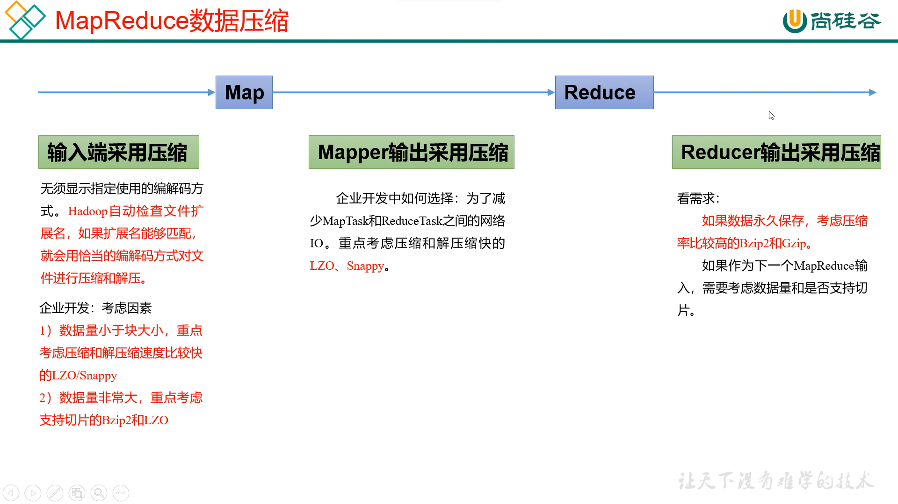

**é…置方å¼**

æŸäº›å‹ç¼©ç®—法需è¦æœ¬åœ°è¿æ¥åº“，在使用算法之å‰å¯ä»¥é€šè¿‡ `hadoop ckecknative` 命令查看支æŒå“ªäº›å‹ç¼©æ–¹å¼

```shell
# hadoop ckecknative
Native library checking:
hadoop:  true /home/zh/bin/hadoop-3.1.3/lib/native/libhadoop.so.1.0.0
zlib:    true /lib64/libz.so.1
zstd  :  true /usr/lib64/libzstd.so.1
snappy:  true /usr/lib64/libsnappy.so.1
lz4:     true revision:10301
bzip2:   true /usr/lib64/libbz2.so.1
openssl: false Cannot load libcrypto.so (libcrypto.so: 无法打开共享对象文件: 没有那个文件或目录)!
ISA-L:   false libhadoop was built without ISA-L support
```

**注æ„**：snappy éœ€è¦ linux ç¯å¢ƒå’Œ hadoop3.x 的支æŒ

|                              å‚æ•°                              |                     默认值                     |     阶段     |               建议              |
| :----------------------------------------------------------: | :-----------------------------------------: | :--------: | :---------------------------: |
|             io.compression.codecx（core-site.xml）             |                      æ—                       |     å‹ç¼©     |   Hadoop 使用文件扩展å判断是å¦æ”¯æŒæŸç§ç¼–解ç å™¨  |
|        mapreduce.map.output. compress（mapred-site.xml）       |                    false                    |  mapper 输出 |        这个å‚数设置 true å¯ç”¨å‹ç¼©       |
|     mapreduce.map.output. compress.codec（mapred-site.xml）    | org.apache.hadoop. io.compress.DefaultCodec |  mapper输出  | ä¼ä¸šä½¿ç”¨ LZO 或 Snappy编解ç å™¨åœ¨æ¬¡é˜¶æ®µå‹ç¼©æ•°æ® |
| mapreduce.output. fileoutputformat.compress（mapred-site.xml） |                    false                    | reducer 输出 |        这个å‚数设为 true å¯ç”¨å‹ç¼©       |
| mapreduce.output. fileoutputformat.compress（mapred-site.xml） | org.apache.hadoop.io. compress.DefaultCodec | reudcer 输出 |  使用标准工具或者编解ç å™¨ï¼Œå¦‚ gzip å’Œ bzip2  |

在代ç ä¸­å¯ç”¨é常的简å•ï¼Œåªéœ€è¦åœ¨é©±åŠ¨ç±»ä¸­æ·»åŠ å¦‚下é…ç½®å³å¯ï¼š

```java
// 设置 map 阶段的å‹ç¼©
configuration.setBoolean("mapreduce.map.output.compress", true);
configuration.setClass("mapreduce.map.output.compress.codec", BZip2Codec.class, CompressionCodec.class);

// 设置 reduce 阶段的å‹ç¼©
FileOutputFormat.setCompressOutput(job, true);
FileOutputFormat.setOutputCompressorClass(job, BZip2Codec.class);
```

### YARN

#### ç†è®º

Yarn 是一个资æºè°ƒåº¦å¹³å°ï¼Œè´Ÿè´£ä¸ºè¿ç®—程åºæä¾›æœåŠ¡å™¨è¿ç®—资æºï¼Œç›¸å½“äºä¸€ä¸ªåˆ†å¸ƒå¼çš„æ“作系统平å°ï¼Œè€Œ MapReduce ç­‰è¿ç®—程åºåˆ™ç›¸å½“äºæ“作系统之上的应用程åºã€‚

**Yarn 基础æ¶æ„**

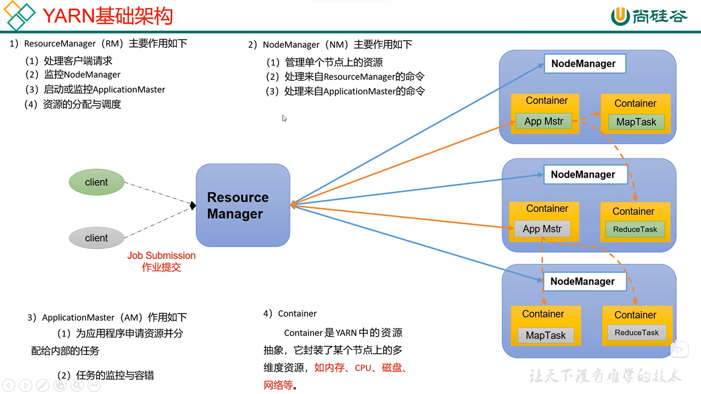

**Yarn 的工作机制**

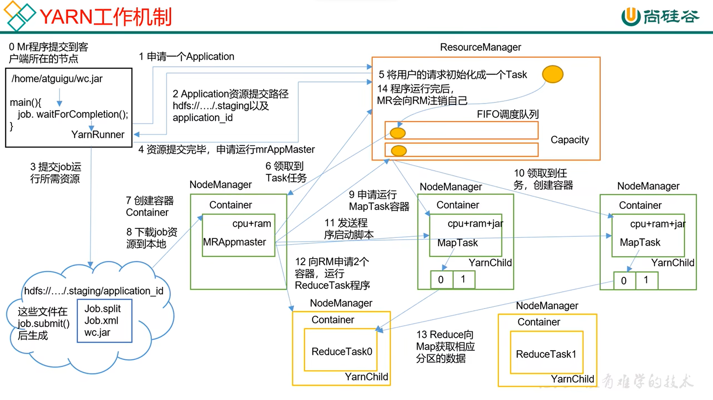

工作æµç¨‹å¦‚下：

1.  Mr 程åºå°†ä»»åŠ¡æ交到客户端所在的节点
2.  å®¢æˆ·ç«¯å°†å‘ ResourceManager 申请一个新的 Application
3.  ReourceManager è¿”å›èµ„æºæ交路径和 application_id
4.  客户端将任务所需è¦çš„资æºæ交到指定的目录
5.  å®¢æˆ·ç«¯å‘ ResourcesManaer 申请è¿è¡Œ mrAppMaster
6.  ResourceManager 将用户的请求åˆå§‹åŒ–为一个 Task，放入调度队列
7.  NodeManager 领å–到 Task
8.  NodeManager 创建用æ¥æ‰§è¡Œä»»åŠ¡çš„ Container（AppMaster 容器）
9.  将任务所需è¦çš„资æºä¸‹è½½åˆ°æœ¬åœ°
10.  å‘ ReousourceManager 申请è¿è¡Œ MapTask 任务的 Container
11.  ä¸åŒçš„ NodeManager 领å–到任务之å将创建è¿è¡Œ MapTask 任务的 Container
12.  AppMaster å‘ MapTask å‘é€å‘½ä»¤å¯åŠ¨çš„脚本
13.  等待 MapTask è¿è¡Œç»“æŸï¼ŒAppMaster å‘ ReousourceManager 申请 ReduceTask çš„ Container
14.  ReduceTask è¿è¡Œä»»åŠ¡ï¼Œç»“æŸåå‘ AppMaster 汇报
15.  AppMaster å‘ ReourceManager 注销自己

**Mapreduce/HDFS/Yarn**

**调度器和调度算法**

ç›®å‰ï¼ŒHadoop 作业调度器主è¦ç”±ä¸‰ç§ï¼šFIFOã€å®¹é‡ï¼ˆCapacity Scheduler）调度器和公平（Fair Scheduler）调度器。Apache Hadoop3.1.3 默认的资æºè°ƒåº¦å™¨æ˜¯ Capacity Scheduler。

CDH 框æ¶é»˜è®¤è°ƒåº¦å™¨æ˜¯ Fair Scheduler。

具体é…置详è§ï¼š`yarn-defalut.xml` 文件

```xml
<property>
	<description> </description>
    <name>yarn.resourcemanager.scheduler.class</name
        <value>org.apach.hadoop.server.resourcemanager.scheduler.capacity.CapacityScheduler</value>
</property>
```

**FIFO**

FIFO 调度器（First In First Out）：å•é˜Ÿåˆ—，根æ®æ交作业的先å顺åºï¼Œå…ˆæ¥å…ˆæœåŠ¡ã€‚一般情况下ä¸æ˜¯ä½¿ç”¨è¯¥è°ƒåº¦å™¨ã€‚

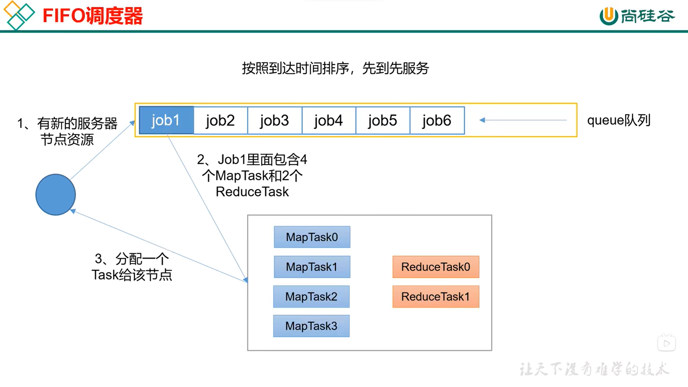

**容é‡è°ƒåº¦å™¨**

是由雅è™å¼€å‘的。

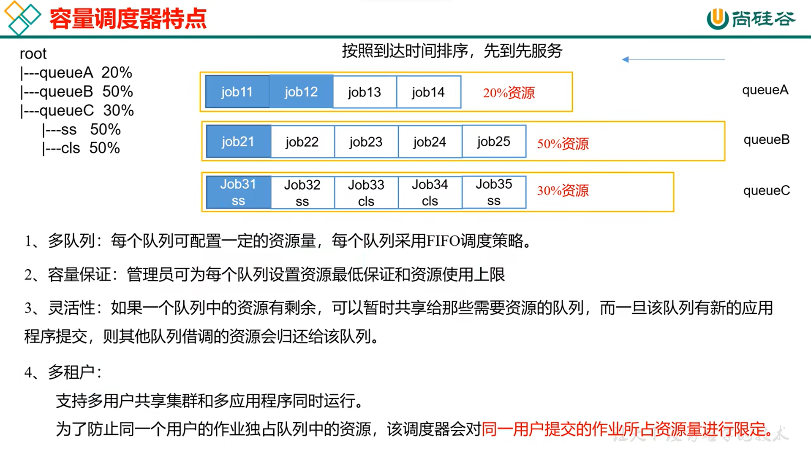

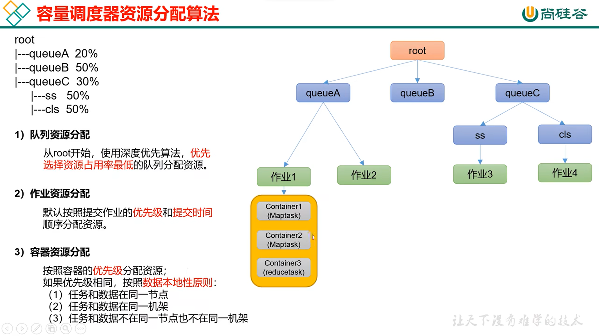

**公平调度器**

ç”± FaceBook å¼€å‘。

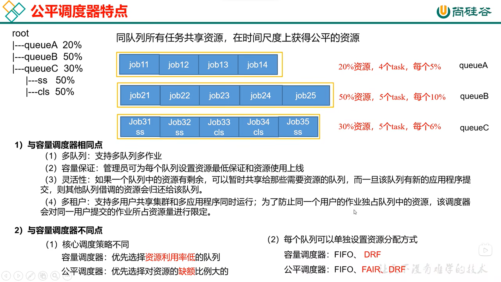

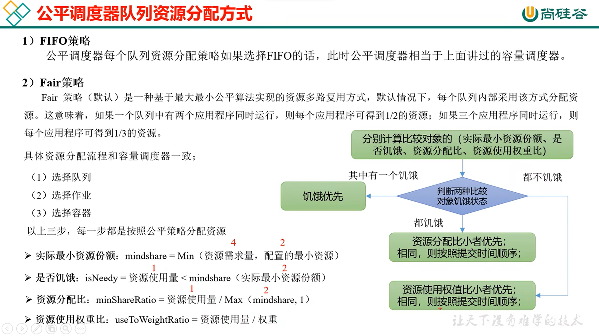

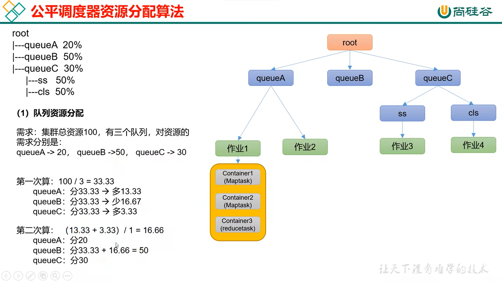

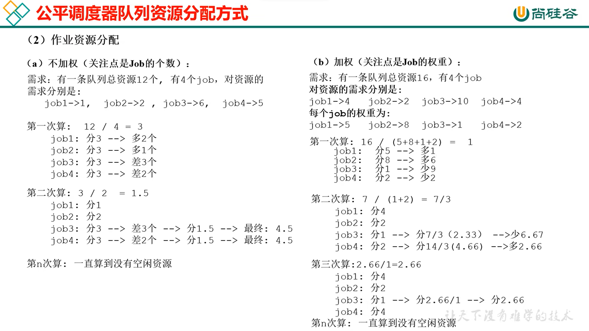

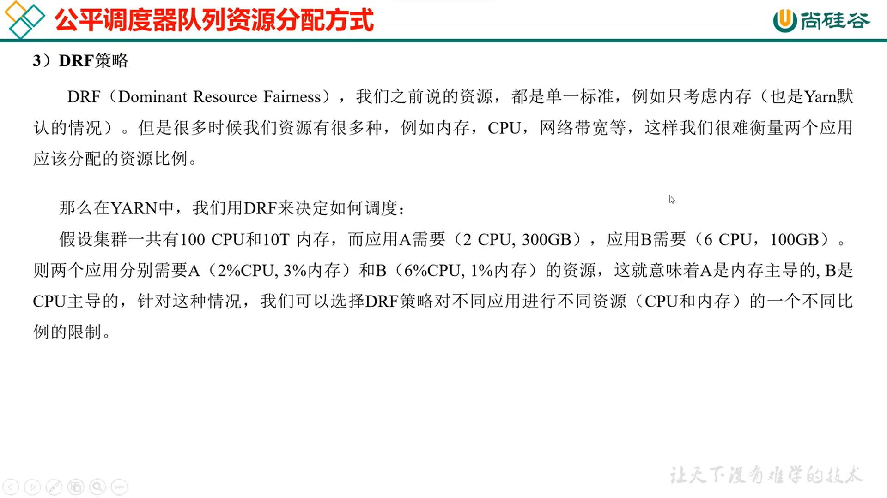

**Yarn 在生产ç¯å¢ƒä¸‹éœ€è¦é…置的å‚æ•°**

**命令行æ“作 Yarn**

#### æ€ä¹ˆç©

**生产ç¯å¢ƒä¸‹æ€ä¹ˆé…ç½®**

**容é‡è°ƒåº¦å™¨åœ¨ç”Ÿäº§ç¯å¢ƒæ€ä¹ˆé…ç½®**

**公平调度器的é…ç½®**

**Yarn tool æ¥å£**
