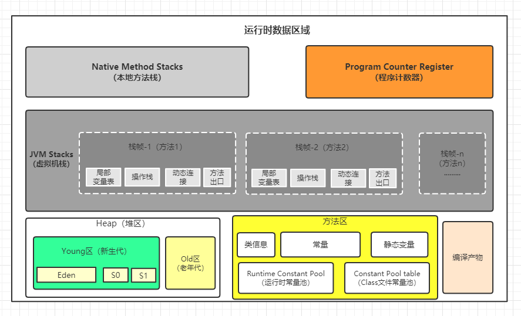
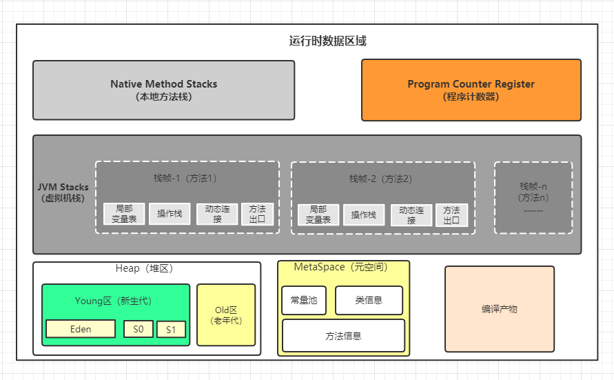
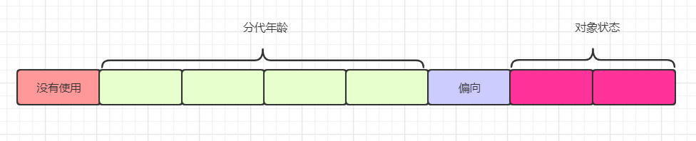

# JVM

## java内存区域与内存溢出异常

### 运行时数据区域

#### 程序计数器

程序计数器是一小块内存空间，他是程序控制流程的指示器，**分支、循环、跳转、异常处理、线程恢复等**基础功能都依赖这个计数器完成。每个线程都拥有自己的程序计数器，各个线程之间互不影响。程序计数器记录的是正在执行的虚拟机字节码指令的地址，如果正在执行的是本地方法，这个计数器值则应该为空。此内存区域是唯一一个在《java虚拟机规范》中没有规范任何OutOfMemoryError情况的。

#### 虚拟机栈

虚拟机栈也是线程私有的。他描述的是java方法执行的线程内存模型：每个方法被执行的时候，java虚拟机都会同步创建一个栈帧，用来储存**局部变量表、操作数栈、动态连接、方法出口等**信息。每个方法被调用直至执行完毕的过程，就对应者一个栈帧在虚拟机栈中从入栈到出栈的过程。

局部变量表存放了编译可知的各种java虚拟机基本数据类型（boolean、byte、char、short、int、float、long、double）、对象引用（reference类型）和returnAddress类型。局部变量表中的存储空间以局部变量槽（Slot）来表示，其中64位长度的long和double类型的数据会占用两个变量槽，其余类型只会占用一个。局部变量表的大小在编译时期就完全可以确定，方进入一个方法时，这个方法就需要在栈帧中分配对大的局部变量空间是完全确定的。在程序运行期间局部变量表的大小是不变的。`注意`这里说的大小是变量槽的数量，虚拟机真正使用多大的空间来实现一个槽是由不同虚拟机实现自行决定的。

如果线程请求的栈深度大于虚拟机所允许的深度，将抛出StackOverflowError；如果java虚拟机栈容量可以动态扩展，当栈无法在申请到新的内存时，会抛出OutOfMemoryError。（HotSpot不允许栈内存扩展，所以HotSpot不会因为栈无法扩展空间而抛出OOM，只要线程申请站空间成功了，就不会抛出OOM；内存扩展值得是通过扩展栈内存来避免抛出StackOverflowError）

#### 本地方法栈

本地方法栈与虚拟机栈功能是相似的，只不过虚拟机栈是为虚拟机执行字节码服务的，而本地方法栈是为虚拟机调用本地方法服务的，有的虚拟机干脆将连个栈合二为一（如HotSpot）。本地方法栈也会抛出StackOverflowError和OutOfMemoryError。

#### 堆

java对是虚拟机所管理的内存中最大的一块，java堆是多有线程共享的一块区域，在虚拟机启动时创建，次内存区域的唯一目的就是存放对象实例，java世界里“几乎“（我也不懂为啥书上说几乎）多有的对象实例都在这里分配内存。《java虚拟机规范》中对java堆的描述是：”所有对象实例及数据数组都应该在堆上分配“。

java堆是垃圾收集器管理的内存区域，因此他也被称为GC堆（Garbage Collected Heap）。经常所说的”新生代“、”老年代“、”永久代“、”Eden空间“、”From Survivor空间“、”To Survivor空间“仅仅是一部分垃圾收集器的共同特性或者说是实现风格而已，并非某个java虚拟机具体实现的固有内存布局，更不是《java虚拟机规范》里对java堆的进一步细致划分。

如果从分配内存的角度看，多有线程共享的堆空间中可以划分出多个线程私有的分配缓冲区以提升对象分配速时的效率。但是不论从什么角度，对堆空间怎么划分，都不能改变java堆中储存内容的共性，无论将堆空间怎么划分，都只是为了更好的进行垃圾回收或者是更快地进行对象空间分配。

当java堆无法扩展空间时，将抛出OutOfMemoryError。

#### 方法区

方法区与java堆一样，是各个线程共享的内存区域，它用来存储的**已被虚拟机加载的类型信息、常量、静态变量、即使编译器编译后的代码缓存等**数据。对然《java虚拟机规范》把方法去规范为堆的一个逻辑部分，但是他却有一个别名叫做”非堆“，目的是与java堆区分出来。

以前很多人习惯将方法区称之为”永久代“，因为仅仅是当时的HotSpot虚拟机使用永久代来实现方法区而已。JDK7的HotSpot将原本放在永久代的字符串常量池、静态变量等移出，到了JDK8终于完全放弃永久代的概念，改用在本地内存中实现的元空间。

如果方法区无法满足新的内存分配需求时，将抛出OutOfMemoryError。

#### 运行时常量池

运行时常量池是方法区的一部分，Class文件中除了有**类的版本、字段、方法、出口等**信息，还有一项是**常量池表**，用于存放编译期间各种字面量与符号引用，者部分内容将在类加载完成后放入方法区的运行时常量池中。

当常量池无法再申请到新的内存时，将抛出OutOfMemoryError。

#### 直接内存

直接内存并不是虚拟机运行时数据的区的一部分，也不是《java虚拟机规范》中定义的内存区域。但是这部分内存也被频繁使用。在JDK1.4中新加入了NIO（New Input/Output）类，引用了一种基于管道与缓冲区的I/O方式，他可以直接分配堆外内存，然后通过一个储存在java堆里面的DirectByteBuffer对象作为者块内存的引用进行操作，这样就能够在一些场景中显著提高性能，因为避免了java堆和Native堆中来回复制数据。

因为直接内不能并不是直接分配在堆空间中，所以并不会收到堆空间的限制，但是会受到物理内存以及处理器寻址的限制，如果配置虚拟机参数时忽略掉直接内存，使得个部分内存总和超过物理内存限制，从而导致动态扩展时出现OutOfMemoryError。

### HotSpot虚拟机对象探秘

#### 对象创建

- 当遇到一条new指令时，首先去检查这个指令的参数是否能够在常量池中定位到一个类的符号引用，并且检查这个符号引用的类是否被加载、解析和初始化过。如果没有那将先执行相应类的加载过程。
- 类加载完成后，接下来虚拟机将为对象分配内存，对象所需内存空间的大小在类加载完成之后就可以确定，为对象分配空间实际上就是把一块大小确定的的空间从堆空间中划分出来。假设堆空间中是绝对规整的，所有使用过的空间在一边，所有空闲的空降在另一边，中间放着一个指针作为分界点的指示器，那么分配内存空间就仅仅是把指针向空闲方向诺一段与对象大小相等的距离，这种分配方式成为”指针碰撞“；但是如果堆中的内存并不是规整的，已被使用的空间和空闲的空间交错在一起，那就没有办法进行简单的内存碰撞，虚拟机需要维护一个列表，记录哪些内存是空闲的，在分配内存的时候，需要找到做够大的空间划分给对象实例，并更新列表上的记录，这种分配方式叫做空闲列表。
- 在内存分配完成之后，虚拟机就必须将分配的内存空间都初始化为零，如果使用TLAB的话，这项工作也可以提前至TLAB分配空间时顺便进行。这步操作保证java实例字段在不赋初值的情况下可以使用，使用程序能够访问到这些字段的数据类型对应的零值。
- 接下来虚拟机还要对对象进行必要的设置，例如这个对象是那个类的实例、如何才能找到类的元数据信息，对象的哈希码（实际上对象的哈希码会延后到真正调用Object::hashCode()方法时才计算）、对象的GC分代年龄等信息。
- 在上边的工作都完成之后，从虚拟机角度看新的对象已经产生了，但是从java程序的角度看，对象创建才刚刚开始——构造函数，即Class的<init>()方法还没有执行所有的字段都默认的零值，对象需要的其他资源和信息还有按照预的意图构造好。

#### 对象内存布局

##### 对象头

###### Mark Word

Mark Word记录了对象运行是的数据，但是对象头里的信息和对象自身定义的数据无关。在32位和64位虚拟机中，Mark Word分别占用了32和64比特的空间。具体的标志如下：

###### 指向类型的指针

指向本对象向Class对象的指针，在32位和64位虚拟机中，分别占用了32和64比特的空间。

###### 数组长度

只有数组类型在拥有次段信息，在32位和64位虚拟机中，分别占用了32和64比特的空间。

##### 实例数据

实例数据是对象中定义的所有字段的内容，无论是从父类继承的还是在类中直接定义的字段信息都储存在实例数据中，这部分的储存顺序会收到虚拟机分配策略和字段在java源代码中定义顺序的影响。HotSpot虚拟机默认的分配策略顺序为：longs/doubles、ints、shorts、chars、bytes/booleans、oops（Ordinary Object Pointers，OOPs），在默认分配策略中，等宽的字段总是被分配在一起，在满足这个前提下，在父类中定义的字段总是出现在子类定义的字段的前面，如果HotSpot虚拟机的+XX:CompactFields参数为true，那么子类中较窄的变量也允许插入到父类变量的空隙之中，以节省一点点空间。

##### 对齐填充

填充至8字节的倍数。

#### 对象的访问定位

java对象的使用是通过栈的reference类型来完成的，由于reference在《java虚拟机规范》中只规定了他是一个指指向对象的引用，并没有定义应该通过什么方式去定位、访问到堆中对象的具体位置，所以对象访问方式也是有具体虚拟机实现进行规定的。做要分为有句柄和直接方问两种方式

- 如果使用句柄的话，java堆中将有可能在堆空间中划分出来一块区域作为句柄池，reference中储存的地址就是对象的句柄地址，而句柄中包含了对象实例数据与类型数据各自具体的地址信息。

- 如果使用直接指针访问的话，java堆中对象布局就必须考虑如何防止类型相关的信息，reference中储存的直接就是对象地址，如果只是访问对象本身数据的话，就不需要多一次间接访问的开销。

## 垃圾收集器与内存分配策略

### 对象已死？

#### 引用计数法

在对象中添加一个引用计数器，每当有一个地方应用它时，计数器就加一；当引用失效时，计数器就减一；任何时刻，计数器为零的对象就是不可能再被使用的。

对然占用一些空间，但是实现简单，效率高，在大多数情况下是没有问题的，但是主流的Java虚拟机都没有采用此算法。

当几个对象互相引用的时候就是不会被清除，一直占用空间。

#### 可达性分析法

jvm来维护一个GC Roots的根对象作为其实节点集，根据这个集合，根据引用向下进行搜索，搜索走过的路径称为“引用链”，如果偶写对象到GC Roots之间没有任何引用链相连，或者用图论来说的就是从GC Roots到这个对象不可达时，证明次对象是不可能在被使用的。

固定可作为GC Roots的对象包括一下几种：

- 在虚拟机栈（栈帧中本地变量表）中引用的对象，譬如各个线程被调用的方法堆栈中使用到的参数、局部变量、临时变量等。

- 在方法区中类静态属性引用的对象，譬如java类的应用类型静态变量等。

- 在方法区中常量引用的对象，譬如字符串常量池里的引用。

- 在本地方法栈中JNI（即通常所说的Native方法）引用的对象。

- java虚拟机内部的引用，如基本数据类型的Class对象，一些常驻的异常对象（NullPointException，OutOfMemoryError）等，还有系统类加载器。

- 被同步锁（synchronized关键字）持有的对象。

- 反映java虚拟机内部情况的JMXBean、JVNTI中注册的回调、本地代码缓存等。

- 根据用户选的垃圾收集器以及当前回收的内存区域不同，还可以将其他对象“临时性”的加入。

#### 再谈引用

在JDK1.2之前，java里面引用定义的很传统，只有引用和不引用两种状态，但是JDK1.2之后的版本，引用被细分未为四种：

- 强引用：最传统的引用定义，是指在程序代码中普遍存在的引用赋值，比如Object obj = new Object()；无论在任何情况下，只要强引用还存在，垃圾收集器都不会回收点引用的对象。
- 软引用：用来面熟一些还有用，但是不必须的对象。只被软引用链接的对象，在系统将要发生内存溢出前，会把这些对象列进对象会后范围之中，进行二次回收。如果这次会后还没有足够的内存，才会抛出内存溢出异常
- 弱引用：同样是描述那些不必须的对象，但是他比软引用还要弱一点，被软引用连接的对象只能存活到下一次垃圾手机为止。
- 虚引用：也成为“幽灵引用”或者“幻影引用”，他是最弱的一种引用关系。为一个对象设置虚引用的的唯一目的只是为了能在这个对象被回收时收到一个系统通知。

  #### 生存还是死亡？

即使是使用可达性分析算法判定不可达的对象也不是非死不可，至少要尽力两次标记才会真正的回收。当第一次被标记之后，系统将判断是否有必要执行finalize方法，如果对象没有覆盖finalize方法，或者finalize方法已经被执行过，将认为没有必要执行；

如果有必要执行，将对象放入一个名为F-Queue的之中，并在稍后有一条有虚拟机自动建造的、低优先级的Finalizer线程去执行他们的finalize方法，如果在finalize方法中该对象与任何对象建立强引用关系，那么在第二次标记时将被移出集合。

finalize方法已经不被推荐，因为虚拟机只保正会执行finalize方法，并不保证会执行完毕，因为避免有些finalize方法进入死循环或长时间等待而无法回收，造成内存溢出甚至系统崩溃。

#### 方法区回收

方法区进行垃圾回收只有两部分内容：废弃的常量和不再使用的类型。

判断一个类型是否属于“不再使用的类型”需要同时满足一下三个条件：

- 该类所有的对象都已经被回收，也就是在java堆中不存在任何改了极其子类的任何实例对象。

- 该类的类加载器已经被回收，这个条件除非是精心设计的可替换类加载器的场景，比如OSGi、JSP的加载器等，否则很难达成。

- 该类对应的java.lang.Class对象内有在任何地方被引用，无法在任何地方通过反射创建该类的实例对象。

这里说的仅仅是“被允许”，并不是和对象一样，没有引用了就必然会回收。

在大量使用反射、动态代理、CGLib等字节码框架，动态生成JSP以及OSGi这类频繁自定义类加载器的场景中，通常需要java虚拟机具备类型卸载能力，以保证不会对方法区造成过大的内存压力。

### 垃圾收集算法

#### 分代收集理论

分代手机假说是建立在两个假说之上的：

- 弱分代假说：绝大部分分对象是朝生夕灭的。
- 强分代假说：熬过越多垃圾收集次数的对象越难以消亡。

立即收集器将java堆空间划分成不同的区域，然后将会后对象依据其年龄分配到不同的区域之中存储。划分出区域之后垃圾收集器才可以每次只回收一个或者某些区域，针对不同的区域安排与里面存储对象消亡特征相匹配的垃圾收集算法——因为发展出了“标记-赋值算法”、“标记-清除算法”、“标记-整理算法”，这些算法手机基于分代收集理论。

设计者一般会把java堆分为新生代和老年代两个区域。但是仔细思考一下就很容易发现分代收集并非只是简单划分一下内存区域那么容易，他至少存在一个明显的困难，对象并不是孤立的，对象之间存在着跨代引用。为了解决这个问题，就需要将分代收集理论添加第三条经验法则：

- 块代引用假说：块代引用相对于通代引用来说说是极少数。

其实分局前两条假说可以逻辑推理得出一个隐含的结论：存在互相引用的两个对象是应该倾向与同时生存说着同时消亡的。

根据这条假说，们就不应该在为了少量的跨代引用去扫描整个老年代，也不必浪费空间专门记录一个对象是否存在及存在那些跨代引用，只需要将新生代上建立一个全局的数据结构（该结构被称为记忆集，Remembered Set），这个结构把老年代划分为若干个小块，表示出那些内存会存在跨代引用。此后在发生Minor GC时，只有包含了跨代引用的小块内存里的对象会加入到GC Roots中进行扫描。

#### 标记-清除算法

标记-清除算法分为标记和清除两个过程，首先标记出所有需要回收的对象，在标记完成之后，统一回收掉所有标记的对象，也可以反过来，标记存活的对象。他主要有两个缺点

- 执行效率不稳定，如果java堆中存在大量对象，并且大多数是需要收集的，这时必须进行大量标记和清除动作，导致标记和清除者两个过程的执行效率都随着对象数量的增加而降低。
- 第二个是内存空间碎片化问题，标记、清除之后会产生大量不连续的内存空间，空间碎片太多可能会导致当以后在程序运行过程中，需要分配空间较大对象的空间时，无法找到足够的连续内存空间而不得不提前出发一次垃圾收集动作。

#### 标记-复制算法

标记-复制算法简称复制算法。它将将新生代分未一块较大的Eden空间和两块较小的Survivor空间，每次分配内存只使用Eden和其中的一块Survivor。当发生垃圾收集时，将Eden和Survivor空间中存活的对象一次性复制到另一块Survivor空间上，然后直接清理掉Eden和已经用过的那块Survivor空间。HotSpot虚拟机默认Eden和Survivor大小比例是8:1，也即没戏新生代中客使用内存空间是整个新生代内存空间的90%，只有一个Survivor空间即10%的空间被“浪费”，当Survivor空间不足以容纳一次Minor GC之后存活的对象时，就需要依赖其他内存区域（实际上大多数就是老年代）进行分配担保。

标记赋值算法在对象存活率较高时就要进行较多次数的复制操作，效率会降低，所以一般老年代不采用该收集算法。

#### 标记-整理算法

标记-复制算法在对象存活率比较高时，会涉及到大量对象的复制操作，效率会降低，更为关键的是，如果不想浪费50%的空间的话，就需要额外的空间进行分配担保，以应对配使用的内存中100%存活率的极端情况。

标记-整理算法是针对与老年代这种拥有大量存活对象的堆空间进行回收的算法。标记整理算法中标记的过程与标记-清除算法的过程相同，但是后续步骤不是直接将垃圾对象进行清理，而是将存活对象向一端移动，然后直接清理掉边界以外的内存。

### HotSpot的算法实现细节

未完待续。。。。。。